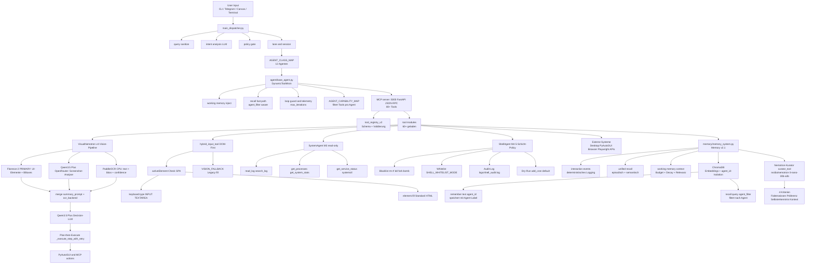

# Timus - Autonomous Multi-Agent Desktop AI

<p align="center">
  
</p>

Timus ist ein autonomes Multi-Agent-System fuer Desktop-Automatisierung, Web-Recherche, Code-Generierung und kreative Aufgaben. Es kombiniert **13 spezialisierte KI-Agenten** mit **80+ Tools** ueber einen zentralen MCP-Server.

Branding:
- Primary Logo: `assets/branding/timus-logo-primary.svg`
- Icon: `assets/branding/timus-icon.svg`
- Glow Logo (PNG): `assets/branding/timus-logo-glow.png`

## Lizenz und Markenhinweis

- Lizenz: Apache License 2.0 (`LICENSE`)
- Copyright: Fatih Altiok und Contributors
- Hinweis: Der Name "Timus" und zugehoerige Branding-Elemente (z. B. Logo) sind nicht durch die Apache-2.0-Lizenz freigegeben.

---

## Aktueller Stand (2026-02-22)

### Agenten-Meilensteine M1–M5 + Memory-Verbesserungen + Bugfixes

Fünf neue Agenten-Meilensteine implementiert, vollständig getestet und zwei Bugfixes eingebaut:

| Meilenstein | Agent | Modell | Beschreibung |
|-------------|-------|--------|--------------|
| **M1** | DataAgent | gpt-4o (OpenAI) | CSV/Excel/JSON Analyse, Datenverarbeitung, statistische Auswertungen |
| **M2** | CommunicationAgent | claude-sonnet-4-5 (Anthropic) | E-Mails, Berichte, Dokument-Erstellung, professionelle Texte |
| **M3** | SystemAgent | qwen3.5-plus-02-15 (OpenRouter) | Log-Analyse, Prozessüberwachung, System-Stats, Service-Status (read-only) |
| **M4** | ShellAgent | claude-sonnet-4-6 (Anthropic) | Shell-Befehle mit 5-Schicht-Sicherheits-Policy |
| **M5** | ImageAgent | qwen3.5-plus-02-15 (OpenRouter) | Hochgeladene Bilder analysieren — automatisches Routing bei Bild-Erweiterungen |

**M5 — ImageAgent (Bild-Analyse):**
- Automatisches Routing: Sobald ein Pfad mit `.jpg`, `.jpeg`, `.png`, `.webp`, `.gif`, `.bmp` etc. in der Anfrage vorkommt → `image`-Agent
- Modell: `qwen/qwen3.5-plus-02-15` (OpenRouter, Vision-fähig, deutlich günstiger als Claude)
- Liest Bilddatei von Disk → Base64-Encoding → OpenAI-kompatibles Vision-Format → Analyse auf Deutsch
- Konfigurierbar via `IMAGE_MODEL` / `IMAGE_MODEL_PROVIDER` in `.env`

**Bugfixes Upload-Pipeline:**
- `file_system_tool`: Relative Pfade wurden fälschlicherweise gegen `$HOME` aufgelöst → jetzt korrekt gegen `project_root`
- `mcp_server.py`: Upload-Response enthält jetzt `abs_path` (absoluter Pfad)
- `canvas_ui.py`: Chat-Input bei Upload-Dateien nutzt jetzt den absoluten Pfad → Agent findet die Datei zuverlässig

**ShellAgent Sicherheits-Policy (5 Schichten):**
1. **Blacklist** — `rm -rf`, `dd if=`, Fork-Bombs, `curl|bash`, `shutdown` etc. blockiert
2. **Whitelist-Modus** — `SHELL_WHITELIST_MODE=1` erlaubt nur explizit gelistete Befehle
3. **Timeout** — 30 Sekunden Default-Timeout (konfigurierbar)
4. **Audit-Log** — jeder Befehl wird in `logs/shell_audit.log` protokolliert
5. **Dry-Run** — `cron`-Einträge standardmäßig nur simuliert (`dry_run=True`)

**Capability-Map Refactoring:**

Jeder Agent sieht nur die für seine Aufgaben relevanten Tools (statt alle 80+):

| Agent | Tools |
|-------|-------|
| shell | 5 (nur Shell-Tools) |
| system | 14 (Log, Prozesse, Stats) |
| communication | 34 |
| development | 39 |
| data | 42 |
| document | 41 |
| executor | 60 |
| meta | 68 (Orchestrator, sieht am meisten) |

**Memory-System Verbesserungen:**
- **Nemotron als Kurator**: `curator_tool` nutzt jetzt `nvidia/nemotron-3-nano-30b-a3b` via OpenRouter statt gpt-4o — strukturierte Entscheidungen zu 4 Kriterien (Faktenwissen, Nutzerpräferenz, Selbsterkenntnis, Kontext)
- **Agent-Isolation in ChromaDB**: `remember(agent_id=...)` speichert die Agent-ID in der Metadaten-Schicht — `recall(agent_filter=...)` filtert Erinnerungen nach Agent — rückwärtskompatibel (ohne Filter = alle Memories)

---

**Canvas v2 + Terminal-Client + Telegram-Erweiterungen:**

### Canvas v2 (`server/canvas_ui.py` + neue MCP-Endpoints)

Die Canvas-Oberfläche wurde vollständig überarbeitet:

| Feature | Beschreibung |
|---|---|
| **Agent-Health-LEDs** | 12 farbige LEDs (idle=grau, thinking=blink-gelb, completed=grün, error=rot) |
| **Thinking-LED** | Blinkt in der Topbar solange ein KI-Modell arbeitet |
| **Interaktiver Chat** | Chat-Panel unten — Nachrichten an Timus, Antwort via SSE in Echtzeit |
| **Datei-Upload** | 📎-Schaltfläche → `data/uploads/` → Pfad automatisch in Chat-Input |
| **SSE-Stream** | `GET /events/stream` pusht Echtzeit-Events ohne Polling |

Neue API-Endpoints:

| Endpoint | Beschreibung |
|---|---|
| `GET /agent_status` | JSON mit allen 12 Agenten-States + thinking-Flag |
| `GET /events/stream` | SSE: agent_status, thinking, chat_reply, chat_error, upload |
| `POST /chat` | Textnachricht → `get_agent_decision()` + `run_agent()` → SSE-Push |
| `GET /chat/history` | In-Memory Chat-Verlauf (letzte 200 Nachrichten) |
| `POST /upload` | multipart/form-data → `data/uploads/` → SSE-Broadcast |

Canvas aufrufen: `http://localhost:5000/canvas/ui`

### Terminal-Client (`timus_terminal.py`)

Separater Terminal-Client der **parallel zum systemd-Service** läuft:
- Verbindet sich mit dem laufenden MCP-Server (Port 5000)
- Startet keine neuen Services (kein Telegram-Bot, kein Runner)
- Eigene Session-ID (`term_XXXXXXXX`)
- `/tasks` zeigt die SQLite-Queue, `/new` startet neue Session

```bash
python timus_terminal.py   # oder ./timus_terminal.py
```

### Telegram-Erweiterungen

- **Autonome Task-Ergebnisse** werden nach Abschluss automatisch per Telegram gesendet:
  - Kurze Ergebnisse (≤ 3800 Zeichen) → Textnachricht
  - Lange Ergebnisse → Vorschau + `.md`-Dokument-Anhang
  - Bilder (DALL-E / lokale `results/`-Dateien) → `send_photo()`
- **Sprachnachrichten** (`timus_hybrid_v2.py`): Whisper STT (OGG → Text) + Inworld.AI TTS (Text → OGG-Reply)

---

## Aktueller Stand (2026-02-21)

**Autonomie-Ausbau M0–M5 + systemd (2026-02-21):**
- **AutonomousRunner** (`orchestration/autonomous_runner.py`): Bridge zwischen Heartbeat-Scheduler und Task-Ausführung — läuft parallel zur CLI-Schleife
- **SQLite Task-Queue** (`orchestration/task_queue.py`): Ersetzt `tasks.json` — thread-safe, Priority-basiert (CRITICAL→LOW), atomare Operationen, Retry-Logik, Erinnerungs-Scheduling via `run_at`
- **Telegram Gateway** (`gateway/telegram_gateway.py`): Bot `@agentustimus_bot` — `/task`, `/tasks`, `/remind`, `/status` — Session-Mapping, Typing-Indikator, 4096-Zeichen-Chunking
- **System Monitor** (`gateway/system_monitor.py`): CPU/RAM/Disk-Überwachung, Telegram-Alerts bei Schwellwert, 30-Minuten-Cooldown
- **Error Classifier** (`utils/error_classifier.py`): Granulare Exception-Klassifizierung (API_ERROR, RATE_LIMIT, TIMEOUT, TOOL_FAIL, …) mit retriable/failover-Flags
- **Model Failover** (`utils/model_failover.py`): Automatische Agenten-Eskalation bei Ausfällen (research→reasoning→meta→executor), exponentieller Backoff
- **systemd Services**: `timus-mcp.service` + `timus-dispatcher.service` — Auto-Start, Restart bei Crash, Daemon-Modus (kein TTY)
- **Import-Bug Fix** (`tools/summarizer/tool.py`): `ensure_browser_initialized` aus korrektem Modul importiert — alle Tool-Module ladbar

Neue Dateien:

| Datei | Beschreibung |
|---|---|
| `orchestration/autonomous_runner.py` | Scheduler↔Agent Bridge |
| `orchestration/task_queue.py` | SQLite Task-Queue (ersetzt tasks.json) |
| `gateway/telegram_gateway.py` | Telegram-Bot (@agentustimus_bot) |
| `gateway/webhook_gateway.py` | HMAC-authentifizierter Webhook-Server |
| `gateway/event_router.py` | Event → Task-Queue Router |
| `gateway/system_monitor.py` | CPU/RAM/Disk Monitor mit Telegram-Alerts |
| `utils/error_classifier.py` | Exception → ErrorType Klassifizierer |
| `utils/model_failover.py` | Automatischer Agenten-Failover |
| `data/task_queue.db` | SQLite Datenbank (Task-Persistenz) |
| `timus-mcp.service` | systemd Unit für MCP-Server |
| `timus-dispatcher.service` | systemd Unit für Dispatcher |

Neue ENV-Variablen:

```bash
HEARTBEAT_ENABLED=true
HEARTBEAT_INTERVAL_MINUTES=15
TELEGRAM_BOT_TOKEN=...
TELEGRAM_ALLOWED_IDS=<deine_telegram_user_id>
WEBHOOK_ENABLED=false
WEBHOOK_PORT=8765
MONITOR_ENABLED=true
MONITOR_INTERVAL_MINUTES=5
MONITOR_CPU_THRESHOLD=85
MONITOR_RAM_THRESHOLD=85
MONITOR_DISK_THRESHOLD=90
```

---

## Aktueller Stand (2026-02-20)

**Qwen3.5 Plus Integration + Plan-then-Execute Architektur:**
- Decision-LLM gewechselt: `nvidia/nemotron-3-nano-30b-a3b` → **`qwen/qwen3.5-plus-02-15`** (OpenRouter, Vision-fähig)
- **Plan-then-Execute**: `_structure_task()` gibt `List[str]` zurück, Agent arbeitet To-Do-Liste Schritt für Schritt ab
- **`_execute_step_with_retry()`**: Bis zu 3 Retries pro Schritt, automatischer UI-Scan bei 0 Aktionen
- **`_execute_plan()`**: Iteriert über Task-Liste, loggt ✅/❌ Fortschritt pro Schritt
- **Qwen3.5 Plus als Vision-Analyse**: `OPENROUTER_VISION_MODEL=qwen/qwen3.5-plus-02-15` — Screenshot-Beschreibung auf Deutsch mit Pixelpositionen
- **Vision-Pipeline erweitert**: Florence-2 (lokal, PRIMARY) → Qwen3.5 Plus (OpenRouter) → GPT-4 Vision → Qwen-VL (lokal)
- **Provider-flexibler NemotronClient**: `REASONING_MODEL_PROVIDER=openrouter|openai` via `.env` wählbar
- **Bug-Fix**: `step_done`-Sicherheitscheck verhindert stille Erledigung ohne Aktion bei Pflicht-Schritten
- **Bug-Fix**: `verification_tool` false-positive `error=True` bei Dict-Results behoben
- **Bug-Fix**: Koordinaten-Extraktion für Debug-Overlays (`action["coordinates"]["x"]` statt `action["x"]`)
- **Bug-Fix**: Automatischer `click_and_focus` vor `type`-Aktion wenn Koordinaten vorhanden

**Florence-2 Vision Integration (Phase 1–7) abgeschlossen (2026-02-19):**
- Florence-2 (microsoft/Florence-2-large-ft, ~3GB VRAM) als primäres Vision-Modell integriert
- Neues MCP-Tool `florence2_tool` mit 6 async Funktionen inkl. `florence2_hybrid_analysis` (Florence-2 + PaddleOCR)
- Hybrid-Pipeline aktiv: Florence-2 für UI-Detection, PaddleOCR für Texte inkl. Confidence und `ocr_backend`-Status
- PaddleOCR Runtime-Härtung für CPU-Setups (`device=cpu`, `enable_hpi=false`, `enable_mkldnn=false`) mit API-Fallbacks
- Feature-Flag `FLORENCE2_ENABLED=true/false` in `.env`
- Vollständige Test-Suite: **184 bestanden, 3 übersprungen**

Abschlussdoku: `docs/ABSCHLUSSBERICHT_VISION_M0_M6_2026-02-20.md`

**Memory-Stabilisierung (Meilenstein 6, 2026-02-17):**
- Deterministisches Interaction-Logging zentral in `run_agent(...)`
- Working-Memory-Layer mit Budget + Prompt-Injektion
- Dynamische Relevanz/Decay-Logik fuer Kurzzeit- und Langzeitkontext
- Runtime-Telemetrie pro Agent-Run in Event-Metadaten
- Quality-Gates + E2E-Readiness Tests
- Unified Recall-Pipeline: episodische `interaction_events` + semantisches Langzeit-Memory
- Session-Kontinuitaet im Dispatcher (eine Chat-Session statt neuer Session-ID pro Turn)

Wichtige Doku-Dateien:
- `docs/MEMORY_ARCHITECTURE.md`
- `docs/MILESTONE6_RUNBOOK.md`
- `docs/RELEASE_NOTES_MILESTONE6.md`
- `docs/SESSION_LOG_2026-02-17_MILESTONES_0_TO_6.md`

Schnelle Verifikation:
```bash
pytest -q tests/
pytest -q tests/test_florence2_hybrid_paddleocr.py
python tools/florence2_tool/setup_florence2.py  # Florence-2 Diagnose
```

CI-Gates (GitHub Actions):
- Workflow: `.github/workflows/ci.yml`
- Abgesicherte Gates:
  - `Gate 1`: Syntax-Compile (`python -m py_compile` auf Kernmodulen)
  - `Gate 2`: Regression-Tests (`tests/test_milestone5_quality_gates.py` + `tests/test_milestone6_e2e_readiness.py`)
  - `Gate 3`: Readiness-Check (`python verify_milestone6.py`)
- CI-Dependencies: `requirements-ci.txt`

---

## Architektur

### Autonomie-Stack (Übersicht)

```
                    ┌──────────────────────────────────────────────────────┐
                    │                TIMUS (Autonomous)                    │
                    │                                                      │
  Telegram ──────→  │  TelegramGateway                                     │
  Webhook  ──────→  │  WebhookServer  → EventRouter                        │
  Heartbeat ─────→  │  ProactiveScheduler                                  │
  CLI       ──────→ │  _cli_loop()  (nur mit TTY)                          │
  Canvas    ──────→ │  /chat  (SSE-Push, 12 Agent-LEDs)                    │
                    │       ↓                                              │
                    │  AutonomousRunner                                    │
                    │       ↓                                              │
                    │  SQLite TaskQueue  ←── /task, /remind                │
                    │       ↓                                              │
                    │  failover_run_agent()                                │
                    │       ↓                                              │
                    │  ┌──────────────────────────────────────────────┐   │
                    │  │ AGENT_CLASS_MAP (12 Agenten)                  │   │
                    │  │  executor  │ research  │ reasoning │ creative │   │
                    │  │  developer │ meta      │ visual               │   │
                    │  │  data  │ document │ communication  (M1/M2)   │   │
                    │  │  system (M3, read-only)                       │   │
                    │  │  shell  (M4, 5-Schicht-Policy)                │   │
                    │  │  image  (M5, Bild-Analyse Qwen3.5+)           │   │
                    │  └──────────────────────────────────────────────┘   │
                    │       ↓                                              │
                    │  MCP Server :5000 (80+ Tools, AGENT_CAPABILITY_MAP) │
                    │       ↓                          ↓                  │
                    │  Memory v2.1              SystemMonitor              │
                    │  ├─ SessionMemory          → Telegram Alert          │
                    │  ├─ SQLite + ChromaDB                               │
                    │  │   (agent_id-Isolation)                           │
                    │  ├─ FTS5 Hybrid-Suche                               │
                    │  ├─ MarkdownStore                                   │
                    │  └─ Nemotron-Kurator                                │
                    │      (nvidia/nemotron-3-nano-30b-a3b)               │
                    └──────────────────────────────────────────────────────┘
```

### Dispatcher-Pipeline (Detail)

```
Benutzer-Input
      |
      v
main_dispatcher.py
  ├─ Query-Sanitizing
  ├─ Intent-Analyse (Keyword + LLM)
  ├─ Policy-Gate (check_query_policy)
  └─ Lane-/Session-Orchestrierung (lane_manager)
      |
      v
Agent-Auswahl (AGENT_CLASS_MAP)
  executor | research | reasoning | creative | development
  meta | visual | data | document | communication | system | shell | image
      |
      v
agent/base_agent.py
  ├─ Working-Memory-Injektion
  ├─ Recall-Fast-Path (session-aware)
  ├─ Tool-Loop-Guard + Runtime-Telemetrie
  └─ Remote-Tool-Registry-Sync (/get_tool_schemas/openai)
      |
      v
MCP-Server :5000 (FastAPI + JSON-RPC)
  ├─ tool_registry_v2 / Schemas
  ├─ Tool-Validierung (serverseitig)
  └─ Tools: Browser, Vision, OCR, Mouse, Search, File, Memory, Voice, System, Shell, ...
      |
      +--> VisualNemotron v4 Vision-Pipeline
      |     ├─ Florence-2 (lokal, PRIMARY): UI-Elemente + BBoxes
      |     ├─ Qwen3.5 Plus (OpenRouter, FALLBACK 1): Screenshot-Analyse
      |     ├─ GPT-4 Vision (OpenAI, FALLBACK 2): Legacy
      |     ├─ Qwen-VL (lokal MCP, FALLBACK 3): letzter Ausweg
      |     └─ Qwen3.5 Plus Decision-LLM -> Plan-then-Execute -> PyAutoGUI/MCP
      |
      +--> Browser-Input-Pipeline (hybrid_input_tool)
      |     ├─ DOM-First (Playwright Locator, höchste Zuverlässigkeit)
      |     ├─ activeElement-Check (SPA-Kompatibilität: React/Vue/Angular)
      |     │   ├─ INPUT/TEXTAREA → page.keyboard.type()
      |     │   └─ sonst          → element.fill()
      |     └─ VISION_FALLBACK → Legacy fill() als letzter Ausweg
      |
      +--> Externe Systeme: Desktop (PyAutoGUI), Browser (Playwright), APIs
      |
      +--> SystemAgent-Pipeline (M3, read-only)
      |     ├─ read_log / search_log  (timus / debug / shell / system)
      |     ├─ get_processes          (psutil Top-Prozesse)
      |     ├─ get_system_stats       (CPU, RAM, Disk, Load-Avg)
      |     └─ get_service_status     (systemctl + journalctl)
      |
      +--> ShellAgent-Pipeline (M4, 5-Schicht-Policy)
      |     ├─ Schicht 1: Blacklist   (rm -rf, dd if=, Fork-Bomb, curl|bash, ...)
      |     ├─ Schicht 2: Whitelist   (SHELL_WHITELIST_MODE=1)
      |     ├─ Schicht 3: Timeout     (30s Default, SHELL_TIMEOUT)
      |     ├─ Schicht 4: Audit-Log   (logs/shell_audit.log)
      |     └─ Schicht 5: Dry-Run     (add_cron default dry_run=True)
      |
      +--> memory/memory_system.py (Memory v2.1)
            ├─ SessionMemory         (RAM, letzte 20 Nachrichten)
            ├─ interaction_events    (deterministisches Logging)
            ├─ unified_recall        (episodisch + semantisch)
            ├─ working_memory_context (Budget + Decay + Relevanz)
            ├─ ChromaDB              (Embeddings + agent_id-Isolation)
            │   ├─ remember(text, agent_id=...)   → speichert mit Agent-Label
            │   └─ recall(query, agent_filter=...) → filtert nach Agent
            └─ Nemotron-Kurator (curator_tool)
                ├─ Modell: nvidia/nemotron-3-nano-30b-a3b (OpenRouter)
                └─ 4 Kriterien: Faktenwissen | Präferenz | Selbsterkenntnis | Kontext
```



---

## Agenten

Timus verfügt über **13 spezialisierte Agenten** in zwei Gruppen: die ursprünglichen Kern-Agenten und die neuen M1–M5-Agenten.

### Kern-Agenten

#### ExecutorAgent
- **Modell:** gpt-5-mini (OpenAI) — via `FAST_MODEL`
- **Aufgabe:** Schnelle einfache Tasks — Dateien lesen/schreiben, Websuche, Zusammenfassungen, einfache Fragen
- **Max Iterationen:** 30 | **Tools:** 60

#### DeepResearchAgent
- **Modell:** deepseek-reasoner (DeepSeek) — via `RESEARCH_MODEL`
- **Aufgabe:** Tiefenrecherche mit These-Antithese-Synthese Framework, Source Quality Rating, akademische Quellenanalyse
- **Max Iterationen:** 8 | **Tools:** 48

#### ReasoningAgent
- **Modell:** nvidia/nemotron-3-nano-30b-a3b (OpenRouter) — via `REASONING_MODEL` + `REASONING_MODEL_PROVIDER`
- **Aufgabe:** Komplexe Multi-Step-Analyse, Debugging, Architektur-Entscheidungen, Root-Cause-Analyse, Pro/Contra-Abwaegungen
- **Besonderheit:** Provider-flexibel (`REASONING_MODEL_PROVIDER=openrouter|openai`), Vision-fähig | **Tools:** 46

#### CreativeAgent
- **Modell:** gpt-5.2 (OpenAI) — via `CREATIVE_MODEL`
- **Aufgabe:** Bildgenerierung (DALL-E), kreative Texte, Gedichte, Songs
- **Besonderheit:** Hybrid-Workflow — GPT-5.2 generiert detaillierten Prompt, Tool-Call für DALL-E | **Tools:** 44

#### DeveloperAgent / DeveloperAgentV2
- **Modell:** mercury-coder-small (Inception Labs) — via `CODE_MODEL`
- **Aufgabe:** Code-Generierung, Refactoring, Skripte, Datei-Operationen
- **V2-Features:** Context-Files Support, Code-Validierung (AST, Style, Security), Multi-Tool Support, Fehler-Recovery | **Tools:** 39

#### MetaAgent
- **Modell:** claude-sonnet-4-5 (Anthropic) — via `PLANNING_MODEL`
- **Aufgabe:** Workflow-Planung, mehrstufige Aufgaben koordinieren, Agent-Orchestrierung
- **Besonderheit:** Skill-System mit automatischer Skill-Auswahl, Progressive Disclosure, Orchestrator-Rolle | **Tools:** 68

#### VisualAgent
- **Modell:** claude-sonnet-4-5 (Anthropic) — via `VISION_MODEL`
- **Aufgabe:** Desktop-/Browser-Automatisierung mit Screenshot-Analyse
- **3-Stufen-Praezision:**
  1. SoM (Set-of-Mark) — Grob-Lokalisierung (±50px)
  2. Mouse Feedback Tool — Fein-Lokalisierung (±5px)
  3. Cursor-Typ als Echtzeit-Feedback (ibeam = Textfeld, hand = klickbar)
- **Features:** ROI-Management, Loop-Recovery, Screen-Change-Gate, Strukturierte Navigation | **Tools:** 43

#### VisualNemotronAgent v4 (Desktop Edition)
- **Decision-LLM:** Qwen3.5 Plus (qwen/qwen3.5-plus-02-15, OpenRouter) — via `REASONING_MODEL` + `REASONING_MODEL_PROVIDER`
- **Vision-Kaskade:** Florence-2 lokal (PRIMARY) → Qwen3.5 Plus via OpenRouter → GPT-4 Vision → Qwen-VL lokal
- **Architektur:** Plan-then-Execute — `_structure_task()` erstellt To-Do-Liste, `_execute_step_with_retry()` mit 3 Retries pro Schritt
- **Aufgabe:** Komplexe mehrstufige Desktop-Automatisierung (Browser, Apps, Formulare)
- **Tech:** PyAutoGUI + SoM fuer echte Maus-Klicks auf dem ganzen Desktop

---

### M1–M5 Agenten (neu)

#### DataAgent *(M1)*
- **Modell:** gpt-4o (OpenAI) — via `DATA_MODEL`
- **Aufgabe:** CSV, Excel, JSON Analyse — Datenverarbeitung, statistische Auswertungen, Diagramme
- **Max Iterationen:** 15 | **Tools:** 42

#### CommunicationAgent *(M2)*
- **Modell:** claude-sonnet-4-5 (Anthropic) — via `COMMUNICATION_MODEL`
- **Aufgabe:** Professionelle Kommunikation — E-Mails verfassen, Berichte erstellen, Dokument-Export (DOCX, TXT)
- **Max Iterationen:** 12 | **Tools:** 34

#### SystemAgent *(M3)*
- **Modell:** qwen/qwen3.5-plus-02-15 (OpenRouter) — via `SYSTEM_MODEL`
- **Aufgabe:** Read-only System-Monitoring — Logs lesen/durchsuchen, Prozesse anzeigen, CPU/RAM/Disk-Stats, Service-Status
- **Besonderheit:** Ausschließlich lesend — kein Schreibzugriff, kein Shell-Ausführen
- **Max Iterationen:** 12 | **Tools:** 14

#### ShellAgent *(M4)*
- **Modell:** claude-sonnet-4-6 (Anthropic) — via `SHELL_MODEL`
- **Aufgabe:** Kontrollierte Shell-Ausführung mit 5-Schicht-Policy (Blacklist, Whitelist, Timeout, Audit, Dry-Run)
- **Besonderheit:** Erklärt Befehle vor der Ausführung, Audit-Log in `logs/shell_audit.log`, Cron-Management nur per Dry-Run
- **Max Iterationen:** 10 | **Tools:** 5

#### ImageAgent *(M5)*
- **Modell:** qwen/qwen3.5-plus-02-15 (OpenRouter) — via `IMAGE_MODEL`
- **Aufgabe:** Hochgeladene Bilder analysieren und auf Deutsch beschreiben
- **Routing:** Automatisch bei Bildpfaden (.jpg, .jpeg, .png, .webp, .gif, .bmp, .tiff, .avif) in der Anfrage — hat höchste Priorität in `quick_intent_check`
- **Technik:** Liest Datei von Disk → Base64-Encoding → OpenAI-kompatibles Vision-Format → direkte Analyse ohne Tool-Loop
- **Max Iterationen:** 1 (direkter LLM-Call, kein Tool-Loop nötig)

---

## Agent-zu-Agent Delegation

Agenten koennen zur Laufzeit andere Agenten um Hilfe bitten — als normalen MCP-Tool-Call ueber `delegate_to_agent`. Ein MetaAgent kann z.B. den ResearchAgent fuer Recherche und den DeveloperAgent fuer Code-Generierung delegieren.

```
Beispiel: "Recherchiere KI-Sicherheit und erstelle einen Plan"

1. Dispatcher         -> MetaAgent
2. MetaAgent          -> delegate_to_agent(research, "Recherchiere KI-Sicherheit")
3.   Registry         -> Lazy-erstellt DeepResearchAgent (holt tools_description)
4.   DeepResearchAgent-> Ergebnis zurueck an MetaAgent
5. MetaAgent          -> nutzt Ergebnis fuer Plan -> Final Answer
```

**Features:**
- **Lazy-Instantiierung:** Agenten werden erst bei erster Delegation erstellt (Factory-Pattern)
- **Loop-Prevention:** Delegation-Stack verhindert zirkulaere Aufrufe (A->B->A)
- **Max Tiefe:** Maximal 3 verschachtelte Delegationen
- **Capability-Suche:** `find_agent_by_capability("vision")` findet den VisualAgent

---

## Tools (50+ Module)

### Vision und UI-Automation

| Tool | Funktionen |
|------|-----------|
| **ocr_tool** | GPU-beschleunigte OCR mit PaddleOCR (`read_text_from_screen`) |
| **som_tool** | Set-of-Mark UI-Element-Erkennung (`describe_screen_elements`, `scan_ui_elements`) |
| **visual_grounding_tool** | Text-Extraktion vom Bildschirm (`get_all_screen_text`, `list_monitors`) |
| **visual_segmentation_tool** | Screenshot-Erfassung (`get_screenshot`) |
| **visual_click_tool** | Praezises Klicken auf UI-Elemente |
| **mouse_tool** | Maus-Steuerung (`click_at`, `move_mouse`, `type_text`, `scroll`) |
| **mouse_feedback_tool** | Cursor-Typ-Feedback fuer Fein-Lokalisierung (`get_mouse_position`) |
| **screen_change_detector** | Optimierung: nur bei Bildschirm-Aenderungen analysieren |
| **hybrid_detection_tool** | Kombiniert DOM + Vision fuer beste Trefferquote |
| **screen_contract_tool** | Screenshot-Optimierung und Komprimierung |
| **annotator_tool** | Screenshot-Beschriftung mit GPT-5.2 |
| **icon_recognition_tool** | Icon-Erkennung auf dem Desktop |
| **verified_vision_tool** | Verifizierte Vision-Ausgaben |
| **cookie_banner_tool** | Cookie-Banner Erkennung und Behandlung |

### Browser und Navigation

| Tool | Funktionen |
|------|-----------|
| **browser_tool** | `open_url`, `click_by_text`, `click_by_selector`, `get_text`, `list_links`, `type_text`, `get_page_content`, `dismiss_overlays`, `browser_session_status`, `browser_save_session`, `browser_close_session`, `browser_cleanup_expired` |
| **hybrid_input_tool** | DOM-First Formular-Eingabe mit SPA-Kompatibilität (`hybrid_click_or_fill`) — activeElement-Check für React/Vue/Angular, `keyboard.type()` vs `fill()` je nach Fokus-Zustand |
| **browser_controller** | DOM-First Browser-Control mit State-Tracking und Session-ID Propagation |
| **smart_navigation_tool** | Webseiten-Analyse (`analyze_current_page`) |
| **visual_browser_tool** | Vision-basierte Browser-Steuerung |
| **application_launcher** | Desktop-Apps starten (`list_applications`, `open_application`) |

### Recherche und Information

| Tool | Funktionen |
|------|-----------|
| **search_tool** | Web-Suche via DataForSEO (Google, Bing, DuckDuckGo, Yahoo) |
| **deep_research** | v5.0 - These-Antithese-Synthese, Source Quality Rating, Multi-Runden-Recherche |
| **document_parser** | Dokumenten-Analyse und Parsing |
| **summarizer** | Text-Zusammenfassung |
| **fact_corroborator** | Fakten-Verifizierung mit Cross-Checks |
| **verification_tool** | Aktions-Verifizierung (`capture_screen_before_action`, `verify_action_result`, `check_for_errors`) |

### Entwicklung

| Tool | Funktionen |
|------|-----------|
| **developer_tool** | Code-Generierung via Inception Labs mercury-coder (`implement_feature`) |
| **inception_tool** | Health-Check fuer Inception-Service |
| **file_system_tool** | Datei-Operationen (`list_directory`, `write_file`, `read_file`, `list_agent_files`) |
| **text_finder_tool** | Text-Suche in Dateien |

### Kreativ

| Tool | Funktionen |
|------|-----------|
| **creative_tool** | Bildgenerierung mit DALL-E 3 (`generate_image`) |
| **voice_tool** | Text-to-Speech Synthese (`voice_list_voices`) |

### System und Administration

| Tool | Funktionen |
|------|-----------|
| **system_tool** *(M3)* | `read_log`, `search_log`, `get_processes`, `get_system_stats`, `get_service_status` — read-only System-Monitoring |
| **shell_tool** *(M4)* | `run_command`, `run_script`, `list_cron`, `add_cron` (dry_run), `read_audit_log` — kontrollierte Shell-Ausführung |
| **system_monitor_tool** | System-Auslastung (CPU, RAM, Festplatte) |
| **maintenance_tool** | Cleanup und Wartung |
| **debug_tool** | Debugging-Utilities |
| **timing_tool** | Performance-Messung |

### Memory und Wissen

| Tool | Funktionen |
|------|-----------|
| **memory_tool** | `remember`, `recall`, `get_memory_context`, `get_known_facts`, `get_memory_stats`, `find_related_memories`, `sync_memory_to_markdown` |
| **reflection_tool** | Selbst-Reflexion des Agenten |
| **reflection_engine** | Automatisierte Post-Task Analyse mit Pattern-Erkennung und Learning-Speicherung |
| **curator_tool** | Kuratierung von Inhalten |

### Planung und Koordination

| Tool | Funktionen |
|------|-----------|
| **delegation_tool** | Agent-zu-Agent Delegation (`delegate_to_agent`, `find_agent_by_capability`) |
| **planner** | Task-Planung (`add_task`, `list_available_skills`) |
| **skill_manager_tool** | Skill-Verwaltung (`list_skills`, `learn_new_skill`, `register_new_tool_in_server`, `create_tool_from_pattern`) |
| **skill_recorder** | Skill-Aufzeichnung (`get_recording_status`, `list_recordings`) |
| **report_generator** | Report-Generierung |
| **save_results** | Ergebnis-Speicherung |
| **decision_verifier** | Entscheidungs-Verifizierung |

### Vision Language Models

| Tool | Funktionen |
|------|-----------|
| **florence2_tool** | Florence-2 Integration (lokal auf GPU) — `florence2_health`, `florence2_full_analysis`, `florence2_hybrid_analysis`, `florence2_detect_ui`, `florence2_ocr`, `florence2_analyze_region` |
| **qwen_vl_tool** | Qwen2-VL Integration (lokal auf GPU, Fallback) |

---

## Memory-System v2.1

Vier-Ebenen-Architektur mit Hybrid-Suche, Nemotron-Kuration, Agent-Isolation und bidirektionalem Sync:

```
Memory System v2.0
|
+-- SessionMemory (Kurzzeit)
|   +-- Letzte N Nachrichten (max 20)
|   +-- Aktuelle Entitaeten (Pronomen-Aufloesung)
|   +-- Current Topic
|
+-- PersistentMemory (Langzeit - SQLite + ChromaDB + Markdown)
|   +-- Fakten mit Vertrauenswert und Quelle
|   +-- Konversations-Zusammenfassungen
|   +-- Benutzer-Profile und Praeferenzen
|   +-- Erkannte Muster und Entscheidungen
|
+-- SemanticMemoryStore (ChromaDB Vektor-Store)
|   +-- Embedding-basierte semantische Suche
|   +-- Hybrid-Suche: ChromaDB (Vektoren) + FTS5 (Keywords)
|   +-- Kategorie-Filter und Relevanz-Ranking
|
+-- MarkdownStore (Bidirektionaler Sync)
|   +-- USER.md - Benutzer-Profil (manuell editierbar)
|   +-- SOUL.md - Behavior Hooks und Persoenlichkeit
|   +-- MEMORY.md - Langzeit-Erinnerungen
|   +-- daily/ - Taegliche Logs
|
+-- ReflectionEngine (Post-Task Analyse)
    +-- Automatische Reflexion nach jeder Aufgabe
    +-- Pattern-Erkennung (was funktioniert, was nicht)
    +-- Speichert Learnings als patterns/decisions/improvements
```

**Features:**
- Automatische Fakten-Extraktion aus Konversationen
- Semantische Hybrid-Suche (ChromaDB Embeddings + FTS5 Keyword-Suche)
- Entity Resolution (er/sie/es → konkrete Entitaet)
- Self-Model: Lernt Benutzer-Muster ueber Zeit
- Post-Task Reflexion mit automatischer Learning-Speicherung
- Bidirektionaler Sync: SQLite ↔ Markdown ↔ ChromaDB
- Manuell editierbare Markdown-Dateien mit automatischer Rueck-Synchronisation
- **Nemotron-Kurator** (`curator_tool`): `nvidia/nemotron-3-nano-30b-a3b` entscheidet nach 4 Kriterien ob eine Information gespeichert wird
- **Agent-Isolation**: ChromaDB Metadaten enthalten `agent_id` — `recall(agent_filter="shell")` gibt nur Shell-Memories zurück

```python
# Agent-isoliertes Speichern und Abrufen
await remember(text="...", source="shell_run", agent_id="shell")
await recall(query="...", agent_filter="shell")   # nur Shell-Memories
await recall(query="...")                          # alle Memories (rückwärtskompatibel)
```

### Browser-Isolation

Session-isolierte Browser-Kontexte mit persistentem State:

```
PersistentContextManager
├── Session-Pool (max 5 parallele Kontexte)
├── LRU Eviction bei Limit ("default" geschuetzt)
├── Cookie/LocalStorage Persistenz via storage_state
├── Session-Timeout Cleanup (60 min)
└── Retry-Handler
    ├── Exponential Backoff (2s, 5s, 10s)
    └── CAPTCHA/Cloudflare-Erkennung
```

```python
# Session-isoliert browsen
result = await open_url("https://example.com", session_id="user_123")
await browser_save_session("user_123")       # State speichern
await browser_close_session("user_123")      # Session schliessen
```

```bash
# Konfiguration via ENV
BROWSER_MAX_CONTEXTS=5
BROWSER_SESSION_TIMEOUT=60
BROWSER_MAX_RETRIES=3
BROWSER_RETRY_DELAYS=2,5,10
```

### Proaktiver Scheduler

Der Heartbeat-Scheduler fuehrt in konfigurierbaren Intervallen autonome Aktionen aus:

| Aktion | Intervall | Beschreibung |
|--------|-----------|--------------|
| Task-Check | Jedes Heartbeat (15 min) | Holt nächsten Task aus SQLite-Queue via `claim_next()` |
| Self-Model Refresh | Alle 60 min | Aktualisiert Self-Model via LLM |
| Memory Sync | Alle 4 Heartbeats | SQLite -> Markdown Sync |

```bash
# Konfiguration via ENV
HEARTBEAT_ENABLED=true
HEARTBEAT_INTERVAL_MINUTES=15
HEARTBEAT_SELF_MODEL_REFRESH_INTERVAL=60
REFLECTION_ENABLED=true
```

---

## Skill-System

Timus verfuegt ueber ein duales Skill-System:

### 1. YAML-Skills (Agent-Workflows)
Skills werden in YAML+Markdown definiert und vom MetaAgent automatisch eingesetzt:

```yaml
---
name: skill-name
description: Wann dieser Skill verwendet wird
tags: [automation, web]
---
# Anweisungen
Schritt-fuer-Schritt Anleitungen fuer den Agenten
```

### 2. Python-Skills (Tool-Generierung)
Automatisch generierte Python-Tools ueber `create_tool_from_pattern`:

- **Quality-Gate:** Duplikat-Check -> Code-Generierung -> AST-Validierung -> Auto-Registrierung
- **Safeguards:** Pattern muss 3x auftreten, 1h Cooldown, Confidence >= 0.7
- **UI-Pattern Templates:** 8 vorgefertigte Templates (calendar_picker, modal_handler, form_filler, infinite_scroll, login_handler, cookie_banner, dropdown_selector, table_extraction)

**Vorhandene Skills:**
- **image_loader_skill** - Bild-Laden mit Groessen-Anpassung
- **terminal_control_skill** - Shell-Befehle mit Safety-Checks
- **skill-creator** - Meta-Skill zum Erstellen neuer Skills

Skills werden vom MetaAgent automatisch erkannt und bei passenden Tasks eingesetzt.

---

## Unterstuetzte LLM-Provider

| Provider | Modelle | Agenten |
|----------|---------|---------|
| **OpenAI** | gpt-5-mini, gpt-5.2, gpt-4o | Executor, Creative, Data |
| **Anthropic** | claude-sonnet-4-5, claude-sonnet-4-6 | Meta, Visual, Document, Communication, Shell |
| **DeepSeek** | deepseek-reasoner | Deep Research |
| **Inception Labs** | mercury-coder-small | Developer |
| **OpenRouter** | qwen/qwen3.5-plus-02-15 | System (M3) + Image (M5) + Vision-Analyse |
| **OpenRouter** | nvidia/nemotron-3-nano-30b-a3b | Reasoning + Memory Kurator |
| **Google** | Gemini | Placeholder |

Jeder Agent kann ueber Environment-Variablen auf ein anderes Modell/Provider umkonfiguriert werden:

```bash
# M3 / M4 Agenten-Modelle überschreiben
SYSTEM_MODEL=qwen/qwen3.5-plus-02-15
SYSTEM_MODEL_PROVIDER=openrouter
SHELL_MODEL=claude-sonnet-4-6
SHELL_MODEL_PROVIDER=anthropic
IMAGE_MODEL=qwen/qwen3.5-plus-02-15
IMAGE_MODEL_PROVIDER=openrouter

# Nemotron Memory-Kurator überschreiben
CURATOR_MODEL=nvidia/nemotron-3-nano-30b-a3b   # via OPENROUTER_API_KEY

# Shell-Agent Sicherheits-Policy
SHELL_WHITELIST_MODE=0         # 1 = nur erlaubte Befehle
SHELL_TIMEOUT=30               # Sekunden
```

---

## Externe Services

| Service | Zweck |
|---------|-------|
| **DataForSEO** | Web-Suche (Google, Bing, DuckDuckGo, Yahoo) |
| **DALL-E 3** | Bildgenerierung |
| **ChromaDB** | Vector-Datenbank fuer Memory |
| **Playwright** | Browser-Automation |
| **PyAutoGUI** | Desktop-Steuerung (Maus/Tastatur) |
| **PaddleOCR** | GPU-beschleunigte Texterkennung |
| **Florence-2** | Primäres lokales Vision-Modell (UI-Detection + OCR, ~3GB VRAM) |
| **Qwen2-VL** | Lokales Vision-Language-Modell (Fallback) |

---

## Installation

### Voraussetzungen

- Python 3.11+
- NVIDIA GPU mit CUDA (empfohlen fuer OCR, Vision Models)
- 16GB+ RAM

### Setup

```bash
git clone https://github.com/fatihaltiok/Agentus-Timus.git
cd Agentus-Timus
pip install -r requirements.txt

# .env erstellen (siehe .env.example)
cp .env.example .env
# API Keys eintragen
```

### Environment-Variablen

```bash
# LLM Provider Keys
OPENAI_API_KEY=sk-...
ANTHROPIC_API_KEY=sk-ant-...
INCEPTION_API_KEY=...
DEEPSEEK_API_KEY=...
OPENROUTER_API_KEY=...

# Services
DATAFORSEO_USER=...
DATAFORSEO_PASS=...

# Konfiguration
VISION_MODEL=claude-sonnet-4-5-20250929
ACTIVE_MONITOR=1
USE_MOUSE_FEEDBACK=1
USE_SCREEN_CHANGE_GATE=false
AUTO_OPEN_FILES=true
TIMUS_LIVE_STATUS=true

# Florence-2 Vision (VisualNemotronAgent v4)
FLORENCE2_ENABLED=true
FLORENCE2_MODEL=microsoft/Florence-2-large-ft

# Decision-LLM (Plan-then-Execute, Browser-Automatisierung)
REASONING_MODEL=qwen/qwen3.5-plus-02-15
REASONING_MODEL_PROVIDER=openrouter      # openrouter | openai

# OpenRouter Vision (Screenshot-Analyse, Fallback nach Florence-2)
OPENROUTER_VISION_MODEL=qwen/qwen3.5-plus-02-15   # leer = kein OpenRouter Vision

LOCAL_LLM_URL=                 # optional: lokaler LLM-Fallback
LOCAL_LLM_MODEL=               # z.B. Qwen/Qwen2.5-7B-Instruct
HF_TOKEN=hf_...                # fuer HuggingFace Modell-Download
```

`TIMUS_LIVE_STATUS=true` zeigt eine aktive Laufzeitanzeige im Terminal:
- Welcher Agent gerade aktiv ist
- In welcher Phase der Agent ist (`thinking`, `tool_active`, `final`, ...)
- Welches Tool gerade laeuft

### Starten

```bash
# Alles in 3 separaten Terminals (MCP + Dispatcher + Hybrid)
./start_timus_three_terminals.sh

# 1. MCP-Server starten
python server/mcp_server.py

# 2. Dispatcher starten
python main_dispatcher.py

# Optional: Hybrid Voice/Text separat
python timus_hybrid_v2.py
```

### systemd (Auto-Start, Produktionsbetrieb)

```bash
# Service-Dateien installieren
sudo cp timus-mcp.service /etc/systemd/system/
sudo cp timus-dispatcher.service /etc/systemd/system/
sudo systemctl daemon-reload
sudo systemctl enable timus-mcp timus-dispatcher

# Starten
sudo systemctl start timus-mcp
sleep 3
sudo systemctl start timus-dispatcher

# Status & Logs
sudo systemctl status timus-mcp timus-dispatcher
journalctl -u timus-dispatcher -f
```

Im systemd-Betrieb (kein TTY) deaktiviert sich die CLI automatisch — Timus wartet auf SIGTERM und ist nur noch über Telegram steuerbar.

**Terminal-Client** (parallel zum laufenden Service):

```bash
# Zweites Terminal öffnen — verbindet sich mit dem laufenden MCP-Server
python timus_terminal.py

# Canvas-Web-UI öffnen (bei laufendem MCP-Server)
xdg-open http://localhost:5000/canvas/ui
```

Hinweis zum Startskript:
- `start_timus_three_terminals.sh` aktiviert standardmäßig automatisch die Conda-Umgebung `timus`.
- Falls der Env-Name anders ist: `TIMUS_CONDA_ENV=<name> ./start_timus_three_terminals.sh`
- Falls du einen eigenen Aktivierungsbefehl brauchst: `TIMUS_ACTIVATE_CMD='source .../conda.sh && conda activate <name>' ./start_timus_three_terminals.sh`

---

## Verwendung

Nach dem Start des Dispatchers koennen Aufgaben in natuerlicher Sprache eingegeben werden:

```
Du> Wie spat ist es?                          -> ExecutorAgent
Du> Recherchiere KI-Sicherheit                -> DeepResearchAgent
Du> asyncio vs threading fuer 100 API-Calls?  -> ReasoningAgent
Du> Male ein Bild von einem Hund im Park      -> CreativeAgent
Du> Schreibe ein Python-Skript fuer...        -> DeveloperAgent
Du> Erstelle einen Plan fuer...               -> MetaAgent
Du> Oeffne Firefox und gehe zu google.com     -> VisualAgent
Du> Analysiere diese CSV-Datei                -> DataAgent    (M1)
Du> Schreibe eine formale E-Mail an...        -> CommunicationAgent (M2)
Du> Zeige mir CPU und RAM Auslastung          -> SystemAgent  (M3)
Du> Liste alle Cron-Jobs auf                  -> ShellAgent   (M4)
Du> Analysiere die hochgeladene Datei: /...foto.jpg -> ImageAgent (M5)
```

Der Dispatcher erkennt automatisch den Intent und waehlt den passenden Agenten.

Session-Hinweise:
- `new session` oder `/new` startet eine neue Chat-Session-ID.
- Ohne Reset bleibt der episodische Kontext ueber mehrere Turns erhalten.

Beispiel fuer Live-Status-Ausgabe:

```text
⏱️ Status [21:22:05] | Agent EXECUTOR | THINKING | Step 2/30
⏱️ Status [21:22:06] | Agent EXECUTOR | TOOL_ACTIVE | Tool search_web | {'query': 'beste grafikkarten 2026'}
⏱️ Status [21:22:08] | Agent EXECUTOR | TOOL_DONE | Tool search_web | ok
```

---

## Projektstruktur

```
timus/
├── agent/
│   ├── shared/              # Shared Utilities (MCP Client, Screenshot, Parser)
│   ├── agents/              # 12 spezialisierte Agenten
│   │   ├── executor.py
│   │   ├── research.py
│   │   ├── reasoning.py
│   │   ├── creative.py
│   │   ├── developer.py
│   │   ├── meta.py
│   │   ├── visual.py
│   │   ├── data.py          # M1: DataAgent
│   │   ├── document.py      # M1: DocumentAgent
│   │   ├── communication.py # M2: CommunicationAgent
│   │   ├── system.py        # M3: SystemAgent (read-only Monitoring)
│   │   ├── shell.py         # M4: ShellAgent (5-Schicht-Policy)
│   │   └── image.py         # M5: ImageAgent (Bild-Analyse, Qwen3.5+)
│   ├── agent_registry.py    # Agent-Registry mit Factory-Pattern + Delegation
│   ├── base_agent.py        # BaseAgent + AGENT_CAPABILITY_MAP (präzise Tool-Sets)
│   ├── providers.py         # LLM Provider-Infrastruktur (7 Provider)
│   ├── prompts.py           # System Prompts (inkl. SYSTEM_PROMPT_TEMPLATE, SHELL_PROMPT_TEMPLATE, IMAGE_PROMPT_TEMPLATE)
│   ├── dynamic_tool_mixin.py  # DynamicToolMixin — filtert Tools nach AGENT_CAPABILITY_MAP
│   ├── visual_agent.py      # Standalone Visual Agent v2.1
│   ├── developer_agent_v2.py
│   ├── visual_nemotron_agent_v4.py
│   └── timus_consolidated.py  # Re-Export Shim
├── tools/                   # 80+ Tool-Module
│   ├── ocr_tool/
│   ├── som_tool/
│   ├── browser_tool/        # Browser mit Session-Isolation + Retry
│   │   ├── persistent_context.py  # PersistentContextManager
│   │   └── retry_handler.py       # Exponential Backoff + CAPTCHA
│   ├── mouse_tool/
│   ├── search_tool/
│   ├── creative_tool/
│   ├── developer_tool/
│   ├── delegation_tool/     # Agent-zu-Agent Delegation (MCP-Tool)
│   ├── florence2_tool/      # Florence-2 Vision (UI-Detection + OCR, Primary)
│   ├── memory_tool/         # Memory v2.1 (agent_id, agent_filter, Nemotron-Kurator)
│   ├── curator_tool/        # Nemotron-Kurator (nvidia/nemotron-3-nano-30b-a3b via OpenRouter)
│   ├── system_tool/         # M3: read_log, search_log, get_processes, get_system_stats, get_service_status
│   ├── shell_tool/          # M4: run_command, run_script, list_cron, add_cron, read_audit_log
│   ├── data_tool/           # M1: CSV/Excel/JSON Analyse
│   ├── document_creator/    # M1: DOCX/TXT Erstellung
│   └── ...                  # 60+ weitere Tools
├── orchestration/
│   ├── scheduler.py            # Proaktiver Heartbeat-Scheduler
│   ├── autonomous_runner.py    # Scheduler↔Agent Bridge (autonome Ausführung)
│   ├── task_queue.py           # SQLite Task-Queue mit Prioritäten + Retry
│   ├── canvas_store.py         # Agent-Run Events (Canvas-Logging)
│   └── lane_manager.py         # Lane-basierte Task-Verwaltung
├── gateway/
│   ├── telegram_gateway.py     # Telegram-Bot (@agentustimus_bot)
│   ├── webhook_gateway.py      # HMAC-authentifizierter Webhook-Server
│   ├── event_router.py         # Event → Task-Queue Router
│   ├── system_monitor.py       # CPU/RAM/Disk Monitor mit Telegram-Alerts
│   └── rss_poller.py           # RSS-Feed Polling
├── server/
│   ├── mcp_server.py        # MCP Server (FastAPI, Port 5000, 80+ Tools, 12 Agent-LEDs)
│   └── canvas_ui.py         # Canvas Web-UI v2 (Chat, 12 LEDs, Upload, SSE)
├── skills/                  # Erlernbare Skills
│   └── templates/           # UI-Pattern Templates (8 Patterns)
├── memory/
│   ├── memory_system.py     # Memory v2.1 (Hybrid-Suche, Nemotron-Kurator, Agent-Isolation)
│   ├── reflection_engine.py # Post-Task Reflexion
│   └── markdown_store/      # USER.md, SOUL.md, MEMORY.md
├── logs/
│   └── shell_audit.log      # Audit-Log aller ShellAgent-Befehle
├── tests/
│   ├── test_milestone5_quality_gates.py
│   ├── test_milestone6_e2e_readiness.py
│   └── ...                  # Weitere Test-Suites
├── verify_milestone6.py     # Go/No-Go Schnellcheck fuer Milestone 6
├── utils/
│   ├── error_classifier.py     # Exception → ErrorType Klassifizierer
│   ├── model_failover.py       # Automatischer Agenten-Failover
│   ├── audit_logger.py         # Security/Compliance-Audit-Trail
│   ├── policy_gate.py          # Policy-Gate (destruktive Anfragen)
│   └── ...
├── data/
│   ├── task_queue.db           # SQLite Task-Persistenz
│   └── uploads/                # Datei-Uploads aus Canvas-Chat
├── config/                     # Personality-System
├── main_dispatcher.py          # Zentral-Dispatcher (v3.5 — 13 Agenten)
├── timus_terminal.py           # Terminal-Client (parallel zu systemd)
├── timus-mcp.service           # systemd Unit für MCP-Server
├── timus-dispatcher.service    # systemd Unit für Dispatcher
└── docs/                       # Dokumentation + Runbooks
    ├── MEMORY_ARCHITECTURE.md
    ├── MILESTONE6_RUNBOOK.md
    ├── RELEASE_NOTES_MILESTONE6.md
    ├── SESSION_LOG_2026-02-17_MILESTONES_0_TO_6.md
    ├── SESSION_LOG_2026-02-21_AUTONOMIE_MILESTONES.md
    ├── SESSION_LOG_2026-02-22_CANVAS_V2_PROFIL.md
    ├── SESSION_LOG_2026-02-22_M1_M4_AGENTS_MEMORY.md
    └── ABSCHLUSSBERICHT_Florence2_Integration_2026-02-19.md
```

---

## Über den Entwickler

**Fatih Altiok** · Offenbach · Raum Frankfurt

Timus ist ein Einzelprojekt — über ein Jahr Entwicklung, ohne formale IT-Ausbildung, mit KI-Modellen als Werkzeug. Die Architektur, die Entscheidungen und die Produktionsreife sind meine Arbeit.

Offen für Freelance-Projekte rund um KI-Automatisierung und LLM-Integration.

📧 fatihaltiok@outlook.com
🔗 [github.com/fatihaltiok](https://github.com/fatihaltiok)

---

## Lizenz

Timus - Autonomous Multi-Agent Desktop AI
