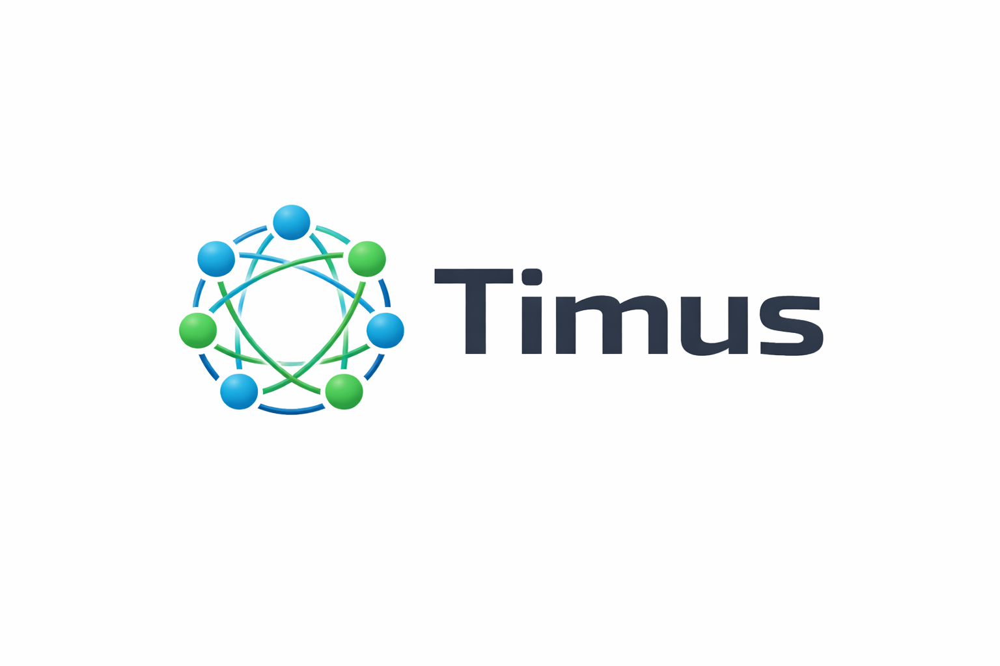
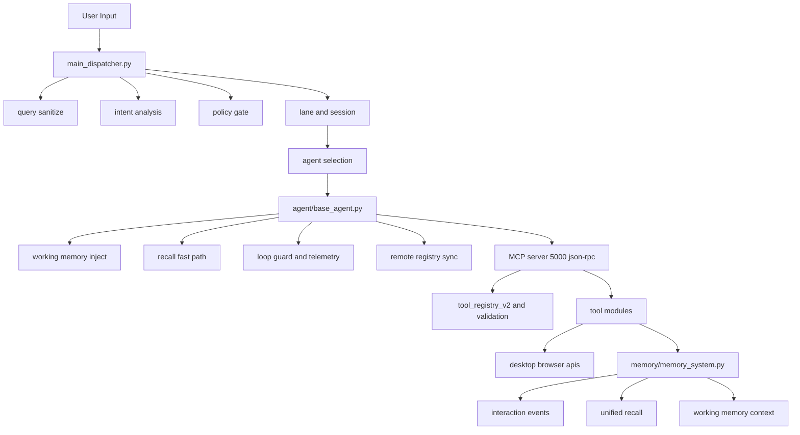

# Timus - Autonomous Multi-Agent Desktop AI

<p align="center">
  
</p>

Timus ist ein autonomes Multi-Agent-System fuer Desktop-Automatisierung, Web-Recherche, Code-Generierung und kreative Aufgaben. Es kombiniert 7 spezialisierte KI-Agenten mit 50+ Tools ueber einen zentralen MCP-Server.

Branding:
- Primary Logo: `assets/branding/timus-logo-primary.svg`
- Icon: `assets/branding/timus-icon.svg`
- Glow Logo (PNG): `assets/branding/timus-logo-glow.png`

## Lizenz und Markenhinweis

- Lizenz: Apache License 2.0 (`LICENSE`)
- Copyright: Fatih Altiok und Contributors
- Hinweis: Der Name "Timus" und zugehoerige Branding-Elemente (z. B. Logo) sind nicht durch die Apache-2.0-Lizenz freigegeben.

---

## Aktueller Stand (2026-02-19)

**Florence-2 Vision Integration (Phase 1–7) abgeschlossen:**
- Florence-2 (microsoft/Florence-2-large-ft, ~3GB VRAM) als primäres Vision-Modell integriert
- `VisionClient` im `VisualNemotronAgent v4`: Florence-2 (PRIMARY) → GPT-4 Vision → Qwen-VL
- Neues MCP-Tool `florence2_tool` mit 5 async Funktionen (UI-Detection, OCR, Region-Analyse)
- NemotronClient mit LLM-Fallback (LOCAL_LLM via `LOCAL_LLM_URL`)
- Feature-Flag `FLORENCE2_ENABLED=true/false` in `.env`
- Pre-existing Bug in `utils/skill_types.py` behoben (falsche `@property`-Dekoration)
- Vollständige Test-Suite: **184 bestanden, 3 übersprungen**

Abschlussdoku: `docs/ABSCHLUSSBERICHT_Florence2_Integration_2026-02-19.md`

**Memory-Stabilisierung (Meilenstein 6, 2026-02-17):**
- Deterministisches Interaction-Logging zentral in `run_agent(...)`
- Working-Memory-Layer mit Budget + Prompt-Injektion
- Dynamische Relevanz/Decay-Logik fuer Kurzzeit- und Langzeitkontext
- Runtime-Telemetrie pro Agent-Run in Event-Metadaten
- Quality-Gates + E2E-Readiness Tests
- Unified Recall-Pipeline: episodische `interaction_events` + semantisches Langzeit-Memory
- Session-Kontinuitaet im Dispatcher (eine Chat-Session statt neuer Session-ID pro Turn)

Wichtige Doku-Dateien:
- `docs/MEMORY_ARCHITECTURE.md`
- `docs/MILESTONE6_RUNBOOK.md`
- `docs/RELEASE_NOTES_MILESTONE6.md`
- `docs/SESSION_LOG_2026-02-17_MILESTONES_0_TO_6.md`

Schnelle Verifikation:
```bash
pytest -q tests/
python tools/florence2_tool/setup_florence2.py  # Florence-2 Diagnose
```

CI-Gates (GitHub Actions):
- Workflow: `.github/workflows/ci.yml`
- Abgesicherte Gates:
  - `Gate 1`: Syntax-Compile (`python -m py_compile` auf Kernmodulen)
  - `Gate 2`: Regression-Tests (`tests/test_milestone5_quality_gates.py` + `tests/test_milestone6_e2e_readiness.py`)
  - `Gate 3`: Readiness-Check (`python verify_milestone6.py`)
- CI-Dependencies: `requirements-ci.txt`

---

## Architektur

``` 
Benutzer-Input
      |
      v
main_dispatcher.py
  ├─ Query-Sanitizing
  ├─ Intent-Analyse (Keyword + LLM)
  ├─ Policy-Gate (check_query_policy)
  └─ Lane-/Session-Orchestrierung (lane_manager)
      |
      v
Agent-Auswahl (AGENT_CLASS_MAP)
  executor | research | reasoning | creative
  development | meta | visual | vision_qwen | visual_nemotron
      |
      v
agent/base_agent.py
  ├─ Working-Memory-Injektion
  ├─ Recall-Fast-Path (session-aware)
  ├─ Tool-Loop-Guard + Runtime-Telemetrie
  └─ Remote-Tool-Registry-Sync (/get_tool_schemas/openai)
      |
      v
MCP-Server :5000 (FastAPI + JSON-RPC)
  ├─ tool_registry_v2 / Schemas
  ├─ Tool-Validierung (serverseitig)
  └─ Tools: Browser, Vision, OCR, Mouse, Search, File, Memory, Voice, ...
      |
      +--> Externe Systeme: Desktop (PyAutoGUI), Browser (Playwright), APIs
      |
      +--> memory/memory_system.py (kanonischer Memory-Kern)
            ├─ interaction_events (deterministisches Logging)
            ├─ unified_recall (episodisch + semantisch)
            ├─ working_memory_context (Budget + Decay + Relevanz)
            └─ runtime memory snapshots
```



---

## Agenten

### ExecutorAgent
- **Modell:** gpt-5-mini (OpenAI)
- **Aufgabe:** Schnelle einfache Tasks - Dateien lesen/schreiben, Websuche, Zusammenfassungen, einfache Fragen
- **Max Iterationen:** 30

### DeepResearchAgent
- **Modell:** deepseek-reasoner (DeepSeek)
- **Aufgabe:** Tiefenrecherche mit These-Antithese-Synthese Framework, Source Quality Rating, akademische Quellenanalyse
- **Max Iterationen:** 8

### ReasoningAgent
- **Modell:** nvidia/nemotron-3-nano-30b-a3b (OpenRouter)
- **Aufgabe:** Komplexe Multi-Step-Analyse, Debugging, Architektur-Entscheidungen, Root-Cause-Analyse, Pro/Contra-Abwaegungen
- **Besonderheit:** enable_thinking-Steuerung fuer Nemotron Reasoning

### CreativeAgent
- **Modell:** gpt-5.2 (OpenAI)
- **Aufgabe:** Bildgenerierung (DALL-E), kreative Texte, Gedichte, Songs
- **Besonderheit:** Hybrid-Workflow - GPT-5.1 generiert detaillierten Prompt, Nemotron strukturiert den Tool-Call

### DeveloperAgent / DeveloperAgentV2
- **Modell:** mercury-coder-small (Inception Labs)
- **Aufgabe:** Code-Generierung, Refactoring, Skripte, Datei-Operationen
- **V2-Features:** Context-Files Support, Code-Validierung (AST, Style, Security), Multi-Tool Support, Fehler-Recovery

### MetaAgent
- **Modell:** claude-sonnet-4-5 (Anthropic)
- **Aufgabe:** Workflow-Planung, mehrstufige Aufgaben koordinieren, Agent-Orchestrierung
- **Besonderheit:** Skill-System mit automatischer Skill-Auswahl und Progressive Disclosure

### VisualAgent
- **Modell:** claude-sonnet-4-5 (Anthropic)
- **Aufgabe:** Desktop-/Browser-Automatisierung mit Screenshot-Analyse
- **3-Stufen-Praezision:**
  1. SoM (Set-of-Mark) - Grob-Lokalisierung (+-50px)
  2. Mouse Feedback Tool - Fein-Lokalisierung (+-5px)
  3. Cursor-Typ als Echtzeit-Feedback (ibeam = Textfeld, hand = klickbar)
- **Features:** ROI-Management, Loop-Recovery, Screen-Change-Gate, Strukturierte Navigation

### VisualNemotronAgent v4 (Desktop Edition)
- **Modell:** Nemotron + Florence-2 (PRIMARY) / GPT-4 Vision / Qwen2-VL
- **Aufgabe:** Komplexe mehrstufige Desktop-Automatisierung
- **Tech:** PyAutoGUI + SoM fuer echte Maus-Klicks auf dem ganzen Desktop
- **Vision-Kaskade:** Florence-2 lokal (3GB VRAM) → GPT-4 Vision API → Qwen-VL lokal
- **LLM-Fallback:** Nemotron (OpenRouter) → LOCAL_LLM (konfigurierbar via `LOCAL_LLM_URL`)

---

## Agent-zu-Agent Delegation

Agenten koennen zur Laufzeit andere Agenten um Hilfe bitten — als normalen MCP-Tool-Call ueber `delegate_to_agent`. Ein MetaAgent kann z.B. den ResearchAgent fuer Recherche und den DeveloperAgent fuer Code-Generierung delegieren.

```
Beispiel: "Recherchiere KI-Sicherheit und erstelle einen Plan"

1. Dispatcher         -> MetaAgent
2. MetaAgent          -> delegate_to_agent(research, "Recherchiere KI-Sicherheit")
3.   Registry         -> Lazy-erstellt DeepResearchAgent (holt tools_description)
4.   DeepResearchAgent-> Ergebnis zurueck an MetaAgent
5. MetaAgent          -> nutzt Ergebnis fuer Plan -> Final Answer
```

**Features:**
- **Lazy-Instantiierung:** Agenten werden erst bei erster Delegation erstellt (Factory-Pattern)
- **Loop-Prevention:** Delegation-Stack verhindert zirkulaere Aufrufe (A->B->A)
- **Max Tiefe:** Maximal 3 verschachtelte Delegationen
- **Capability-Suche:** `find_agent_by_capability("vision")` findet den VisualAgent

---

## Tools (50+ Module)

### Vision und UI-Automation

| Tool | Funktionen |
|------|-----------|
| **ocr_tool** | GPU-beschleunigte OCR mit PaddleOCR (`read_text_from_screen`) |
| **som_tool** | Set-of-Mark UI-Element-Erkennung (`describe_screen_elements`, `scan_ui_elements`) |
| **visual_grounding_tool** | Text-Extraktion vom Bildschirm (`get_all_screen_text`, `list_monitors`) |
| **visual_segmentation_tool** | Screenshot-Erfassung (`get_screenshot`) |
| **visual_click_tool** | Praezises Klicken auf UI-Elemente |
| **mouse_tool** | Maus-Steuerung (`click_at`, `move_mouse`, `type_text`, `scroll`) |
| **mouse_feedback_tool** | Cursor-Typ-Feedback fuer Fein-Lokalisierung (`get_mouse_position`) |
| **screen_change_detector** | Optimierung: nur bei Bildschirm-Aenderungen analysieren |
| **hybrid_detection_tool** | Kombiniert DOM + Vision fuer beste Trefferquote |
| **screen_contract_tool** | Screenshot-Optimierung und Komprimierung |
| **annotator_tool** | Screenshot-Beschriftung mit GPT-5.2 |
| **icon_recognition_tool** | Icon-Erkennung auf dem Desktop |
| **verified_vision_tool** | Verifizierte Vision-Ausgaben |
| **cookie_banner_tool** | Cookie-Banner Erkennung und Behandlung |

### Browser und Navigation

| Tool | Funktionen |
|------|-----------|
| **browser_tool** | `open_url`, `click_by_text`, `click_by_selector`, `get_text`, `list_links`, `type_text`, `get_page_content`, `dismiss_overlays`, `browser_session_status`, `browser_save_session`, `browser_close_session`, `browser_cleanup_expired` |
| **browser_controller** | DOM-First Browser-Control mit State-Tracking und Session-ID Propagation |
| **smart_navigation_tool** | Webseiten-Analyse (`analyze_current_page`) |
| **visual_browser_tool** | Vision-basierte Browser-Steuerung |
| **application_launcher** | Desktop-Apps starten (`list_applications`, `open_application`) |

### Recherche und Information

| Tool | Funktionen |
|------|-----------|
| **search_tool** | Web-Suche via DataForSEO (Google, Bing, DuckDuckGo, Yahoo) |
| **deep_research** | v5.0 - These-Antithese-Synthese, Source Quality Rating, Multi-Runden-Recherche |
| **document_parser** | Dokumenten-Analyse und Parsing |
| **summarizer** | Text-Zusammenfassung |
| **fact_corroborator** | Fakten-Verifizierung mit Cross-Checks |
| **verification_tool** | Aktions-Verifizierung (`capture_screen_before_action`, `verify_action_result`, `check_for_errors`) |

### Entwicklung

| Tool | Funktionen |
|------|-----------|
| **developer_tool** | Code-Generierung via Inception Labs mercury-coder (`implement_feature`) |
| **inception_tool** | Health-Check fuer Inception-Service |
| **file_system_tool** | Datei-Operationen (`list_directory`, `write_file`, `read_file`, `list_agent_files`) |
| **text_finder_tool** | Text-Suche in Dateien |

### Kreativ

| Tool | Funktionen |
|------|-----------|
| **creative_tool** | Bildgenerierung mit DALL-E 3 (`generate_image`) |
| **voice_tool** | Text-to-Speech Synthese (`voice_list_voices`) |

### System und Administration

| Tool | Funktionen |
|------|-----------|
| **system_monitor_tool** | System-Auslastung (CPU, RAM, Festplatte) |
| **maintenance_tool** | Cleanup und Wartung |
| **debug_tool** | Debugging-Utilities |
| **timing_tool** | Performance-Messung |

### Memory und Wissen

| Tool | Funktionen |
|------|-----------|
| **memory_tool** | `remember`, `recall`, `get_memory_context`, `get_known_facts`, `get_memory_stats`, `find_related_memories`, `sync_memory_to_markdown` |
| **reflection_tool** | Selbst-Reflexion des Agenten |
| **reflection_engine** | Automatisierte Post-Task Analyse mit Pattern-Erkennung und Learning-Speicherung |
| **curator_tool** | Kuratierung von Inhalten |

### Planung und Koordination

| Tool | Funktionen |
|------|-----------|
| **delegation_tool** | Agent-zu-Agent Delegation (`delegate_to_agent`, `find_agent_by_capability`) |
| **planner** | Task-Planung (`add_task`, `list_available_skills`) |
| **skill_manager_tool** | Skill-Verwaltung (`list_skills`, `learn_new_skill`, `register_new_tool_in_server`, `create_tool_from_pattern`) |
| **skill_recorder** | Skill-Aufzeichnung (`get_recording_status`, `list_recordings`) |
| **report_generator** | Report-Generierung |
| **save_results** | Ergebnis-Speicherung |
| **decision_verifier** | Entscheidungs-Verifizierung |

### Vision Language Models

| Tool | Funktionen |
|------|-----------|
| **florence2_tool** | Florence-2 Integration (lokal auf GPU) — `florence2_health`, `florence2_full_analysis`, `florence2_detect_ui`, `florence2_ocr`, `florence2_analyze_region` |
| **qwen_vl_tool** | Qwen2-VL Integration (lokal auf GPU, Fallback) |

---

## Memory-System v2.0

Drei-Ebenen-Architektur mit Hybrid-Suche, automatisierter Reflexion und bidirektionalem Sync:

```
Memory System v2.0
|
+-- SessionMemory (Kurzzeit)
|   +-- Letzte N Nachrichten (max 20)
|   +-- Aktuelle Entitaeten (Pronomen-Aufloesung)
|   +-- Current Topic
|
+-- PersistentMemory (Langzeit - SQLite + ChromaDB + Markdown)
|   +-- Fakten mit Vertrauenswert und Quelle
|   +-- Konversations-Zusammenfassungen
|   +-- Benutzer-Profile und Praeferenzen
|   +-- Erkannte Muster und Entscheidungen
|
+-- SemanticMemoryStore (ChromaDB Vektor-Store)
|   +-- Embedding-basierte semantische Suche
|   +-- Hybrid-Suche: ChromaDB (Vektoren) + FTS5 (Keywords)
|   +-- Kategorie-Filter und Relevanz-Ranking
|
+-- MarkdownStore (Bidirektionaler Sync)
|   +-- USER.md - Benutzer-Profil (manuell editierbar)
|   +-- SOUL.md - Behavior Hooks und Persoenlichkeit
|   +-- MEMORY.md - Langzeit-Erinnerungen
|   +-- daily/ - Taegliche Logs
|
+-- ReflectionEngine (Post-Task Analyse)
    +-- Automatische Reflexion nach jeder Aufgabe
    +-- Pattern-Erkennung (was funktioniert, was nicht)
    +-- Speichert Learnings als patterns/decisions/improvements
```

**Features:**
- Automatische Fakten-Extraktion aus Konversationen
- Semantische Hybrid-Suche (ChromaDB Embeddings + FTS5 Keyword-Suche)
- Entity Resolution (er/sie/es -> konkrete Entitaet)
- Self-Model: Lernt Benutzer-Muster ueber Zeit
- Post-Task Reflexion mit automatischer Learning-Speicherung
- Bidirektionaler Sync: SQLite <-> Markdown <-> ChromaDB
- Manuell editierbare Markdown-Dateien mit automatischer Rueck-Synchronisation

### Browser-Isolation

Session-isolierte Browser-Kontexte mit persistentem State:

```
PersistentContextManager
├── Session-Pool (max 5 parallele Kontexte)
├── LRU Eviction bei Limit ("default" geschuetzt)
├── Cookie/LocalStorage Persistenz via storage_state
├── Session-Timeout Cleanup (60 min)
└── Retry-Handler
    ├── Exponential Backoff (2s, 5s, 10s)
    └── CAPTCHA/Cloudflare-Erkennung
```

```python
# Session-isoliert browsen
result = await open_url("https://example.com", session_id="user_123")
await browser_save_session("user_123")       # State speichern
await browser_close_session("user_123")      # Session schliessen
```

```bash
# Konfiguration via ENV
BROWSER_MAX_CONTEXTS=5
BROWSER_SESSION_TIMEOUT=60
BROWSER_MAX_RETRIES=3
BROWSER_RETRY_DELAYS=2,5,10
```

### Proaktiver Scheduler

Der Heartbeat-Scheduler fuehrt in konfigurierbaren Intervallen autonome Aktionen aus:

| Aktion | Intervall | Beschreibung |
|--------|-----------|--------------|
| Task-Check | Jedes Heartbeat (15 min) | Prueft `tasks.json` auf pending/in_progress |
| Self-Model Refresh | Alle 60 min | Aktualisiert Self-Model via LLM |
| Memory Sync | Alle 4 Heartbeats | SQLite -> Markdown Sync |

```bash
# Konfiguration via ENV
HEARTBEAT_ENABLED=true
HEARTBEAT_INTERVAL_MINUTES=15
HEARTBEAT_SELF_MODEL_REFRESH_INTERVAL=60
REFLECTION_ENABLED=true
```

---

## Skill-System

Timus verfuegt ueber ein duales Skill-System:

### 1. YAML-Skills (Agent-Workflows)
Skills werden in YAML+Markdown definiert und vom MetaAgent automatisch eingesetzt:

```yaml
---
name: skill-name
description: Wann dieser Skill verwendet wird
tags: [automation, web]
---
# Anweisungen
Schritt-fuer-Schritt Anleitungen fuer den Agenten
```

### 2. Python-Skills (Tool-Generierung)
Automatisch generierte Python-Tools ueber `create_tool_from_pattern`:

- **Quality-Gate:** Duplikat-Check -> Code-Generierung -> AST-Validierung -> Auto-Registrierung
- **Safeguards:** Pattern muss 3x auftreten, 1h Cooldown, Confidence >= 0.7
- **UI-Pattern Templates:** 8 vorgefertigte Templates (calendar_picker, modal_handler, form_filler, infinite_scroll, login_handler, cookie_banner, dropdown_selector, table_extraction)

**Vorhandene Skills:**
- **image_loader_skill** - Bild-Laden mit Groessen-Anpassung
- **terminal_control_skill** - Shell-Befehle mit Safety-Checks
- **skill-creator** - Meta-Skill zum Erstellen neuer Skills

Skills werden vom MetaAgent automatisch erkannt und bei passenden Tasks eingesetzt.

---

## Unterstuetzte LLM-Provider

| Provider | Modelle | Verwendung |
|----------|---------|------------|
| **OpenAI** | gpt-5, gpt-5.2, gpt-5-mini, gpt-4o | Executor, Creative |
| **Anthropic** | claude-sonnet-4-5, claude-opus-4-6 | Meta, Visual |
| **DeepSeek** | deepseek-reasoner | Deep Research |
| **Inception Labs** | mercury-coder-small | Developer |
| **NVIDIA / OpenRouter** | nemotron-3-nano-30b-a3b | Reasoning |
| **Google** | Gemini | Placeholder |

Jeder Agent kann ueber Environment-Variablen auf ein anderes Modell/Provider umkonfiguriert werden.

---

## Externe Services

| Service | Zweck |
|---------|-------|
| **DataForSEO** | Web-Suche (Google, Bing, DuckDuckGo, Yahoo) |
| **DALL-E 3** | Bildgenerierung |
| **ChromaDB** | Vector-Datenbank fuer Memory |
| **Playwright** | Browser-Automation |
| **PyAutoGUI** | Desktop-Steuerung (Maus/Tastatur) |
| **PaddleOCR** | GPU-beschleunigte Texterkennung |
| **Florence-2** | Primäres lokales Vision-Modell (UI-Detection + OCR, ~3GB VRAM) |
| **Qwen2-VL** | Lokales Vision-Language-Modell (Fallback) |

---

## Installation

### Voraussetzungen

- Python 3.11+
- NVIDIA GPU mit CUDA (empfohlen fuer OCR, Vision Models)
- 16GB+ RAM

### Setup

```bash
git clone https://github.com/fatihaltiok/Agentus-Timus.git
cd Agentus-Timus
pip install -r requirements.txt

# .env erstellen (siehe .env.example)
cp .env.example .env
# API Keys eintragen
```

### Environment-Variablen

```bash
# LLM Provider Keys
OPENAI_API_KEY=sk-...
ANTHROPIC_API_KEY=sk-ant-...
INCEPTION_API_KEY=...
DEEPSEEK_API_KEY=...
OPENROUTER_API_KEY=...

# Services
DATAFORSEO_USER=...
DATAFORSEO_PASS=...

# Konfiguration
VISION_MODEL=claude-sonnet-4-5-20250929
ACTIVE_MONITOR=1
USE_MOUSE_FEEDBACK=1
USE_SCREEN_CHANGE_GATE=false
AUTO_OPEN_FILES=true
TIMUS_LIVE_STATUS=true

# Florence-2 Vision (VisualNemotronAgent v4)
FLORENCE2_ENABLED=true
FLORENCE2_MODEL=microsoft/Florence-2-large-ft
LOCAL_LLM_URL=                 # optional: lokaler LLM-Fallback fuer Nemotron
LOCAL_LLM_MODEL=               # z.B. Qwen/Qwen2.5-7B-Instruct
HF_TOKEN=hf_...                # fuer HuggingFace Modell-Download
```

`TIMUS_LIVE_STATUS=true` zeigt eine aktive Laufzeitanzeige im Terminal:
- Welcher Agent gerade aktiv ist
- In welcher Phase der Agent ist (`thinking`, `tool_active`, `final`, ...)
- Welches Tool gerade laeuft

### Starten

```bash
# Alles in 3 separaten Terminals (MCP + Dispatcher + Hybrid)
./start_timus_three_terminals.sh

# 1. MCP-Server starten
python server/mcp_server.py

# 2. Dispatcher starten
python main_dispatcher.py

# Optional: Hybrid Voice/Text separat
python timus_hybrid_v2.py
```

Hinweis zum Startskript:
- `start_timus_three_terminals.sh` aktiviert standardmäßig automatisch die Conda-Umgebung `timus`.
- Falls der Env-Name anders ist: `TIMUS_CONDA_ENV=<name> ./start_timus_three_terminals.sh`
- Falls du einen eigenen Aktivierungsbefehl brauchst: `TIMUS_ACTIVATE_CMD='source .../conda.sh && conda activate <name>' ./start_timus_three_terminals.sh`

---

## Verwendung

Nach dem Start des Dispatchers koennen Aufgaben in natuerlicher Sprache eingegeben werden:

```
Du> Wie spat ist es?                          -> ExecutorAgent
Du> Recherchiere KI-Sicherheit                -> DeepResearchAgent
Du> asyncio vs threading fuer 100 API-Calls?  -> ReasoningAgent
Du> Male ein Bild von einem Hund im Park      -> CreativeAgent
Du> Schreibe ein Python-Skript fuer...        -> DeveloperAgent
Du> Erstelle einen Plan fuer...               -> MetaAgent
Du> Oeffne Firefox und gehe zu google.com     -> VisualAgent
```

Der Dispatcher erkennt automatisch den Intent und waehlt den passenden Agenten.

Session-Hinweise:
- `new session` oder `/new` startet eine neue Chat-Session-ID.
- Ohne Reset bleibt der episodische Kontext ueber mehrere Turns erhalten.

Beispiel fuer Live-Status-Ausgabe:

```text
⏱️ Status [21:22:05] | Agent EXECUTOR | THINKING | Step 2/30
⏱️ Status [21:22:06] | Agent EXECUTOR | TOOL_ACTIVE | Tool search_web | {'query': 'beste grafikkarten 2026'}
⏱️ Status [21:22:08] | Agent EXECUTOR | TOOL_DONE | Tool search_web | ok
```

---

## Projektstruktur

```
timus/
├── agent/
│   ├── shared/              # Shared Utilities (MCP Client, Screenshot, Parser)
│   ├── agents/              # 7 spezialisierte Agenten
│   ├── agent_registry.py    # Agent-Registry mit Factory-Pattern + Delegation
│   ├── base_agent.py        # BaseAgent mit Multi-Provider Support
│   ├── providers.py         # LLM Provider-Infrastruktur
│   ├── prompts.py           # System Prompts
│   ├── visual_agent.py      # Standalone Visual Agent v2.1
│   ├── developer_agent_v2.py
│   ├── visual_nemotron_agent_v4.py
│   └── timus_consolidated.py  # Re-Export Shim
├── tools/                   # 50+ Tool-Module
│   ├── ocr_tool/
│   ├── som_tool/
│   ├── browser_tool/        # Browser mit Session-Isolation + Retry
│   │   ├── persistent_context.py  # PersistentContextManager
│   │   └── retry_handler.py       # Exponential Backoff + CAPTCHA
│   ├── mouse_tool/
│   ├── search_tool/
│   ├── creative_tool/
│   ├── developer_tool/
│   ├── delegation_tool/     # Agent-zu-Agent Delegation (MCP-Tool)
│   ├── florence2_tool/      # Florence-2 Vision (UI-Detection + OCR, Primary)
│   ├── memory_tool/
│   └── ...
├── orchestration/
│   ├── scheduler.py         # Proaktiver Heartbeat-Scheduler
│   └── lane_manager.py      # Lane-basierte Task-Verwaltung
├── server/
│   └── mcp_server.py        # MCP Server (FastAPI, Port 5000)
├── skills/                  # Erlernbare Skills
│   └── templates/           # UI-Pattern Templates (8 Patterns)
├── memory/
│   ├── memory_system.py     # Memory v2.0 (Hybrid-Suche, Sync)
│   ├── reflection_engine.py # Post-Task Reflexion
│   └── markdown_store/      # USER.md, SOUL.md, MEMORY.md
├── tests/
│   ├── test_milestone5_quality_gates.py
│   ├── test_milestone6_e2e_readiness.py
│   └── ...                  # Weitere Test-Suites
├── verify_milestone6.py     # Go/No-Go Schnellcheck fuer Milestone 6
├── utils/                   # Hilfsfunktionen
├── config/                  # Personality-System
├── main_dispatcher.py       # Zentral-Dispatcher
└── docs/                    # Dokumentation + Runbooks
    ├── MEMORY_ARCHITECTURE.md
    ├── MILESTONE6_RUNBOOK.md
    ├── RELEASE_NOTES_MILESTONE6.md
    ├── SESSION_LOG_2026-02-17_MILESTONES_0_TO_6.md
    └── ABSCHLUSSBERICHT_Florence2_Integration_2026-02-19.md
```

---

## Lizenz

Timus - Autonomous Multi-Agent Desktop AI
