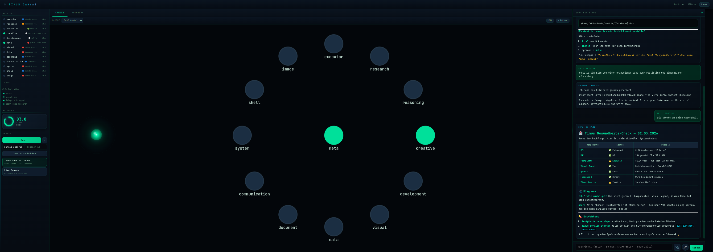
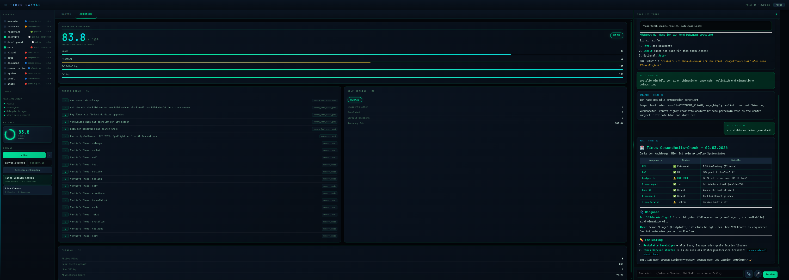
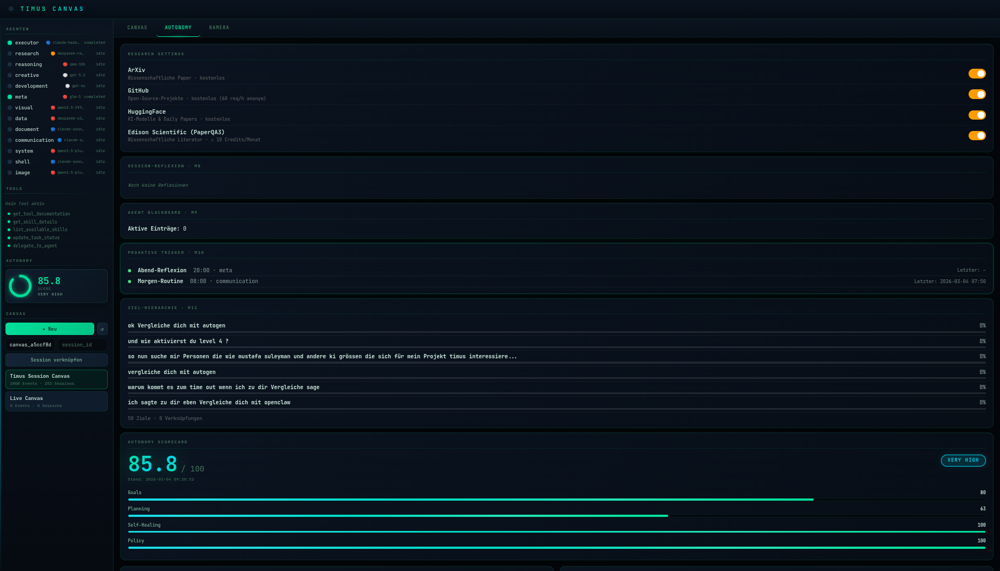

# Timus — Autonomous Multi-Agent Desktop AI

<p align="center">
  
</p>

**Timus** ist ein autonomes Multi-Agenten-System für Desktop-Automatisierung, Web-Recherche, Code-Generierung, Daten-Analyse und kreative Aufgaben. Es koordiniert **13 spezialisierte KI-Agenten** über **80+ Tools** via zentralen MCP-Server — und seit Version 2.5 führt es mehrere Agenten **gleichzeitig parallel** aus. Seit v2.8 besitzt Timus eine **Curiosity Engine** (proaktive Wissensdurchsuchung) und eine **Soul Engine** (dynamische Persönlichkeitsentwicklung über 5 Achsen). Seit **v2.9** sind die Autonomie-Schichten M1–M5 live: Zielgenerierung, Langzeitplanung, Self-Healing und Autonomie-Scorecard laufen aktiv im Produktivbetrieb. Seit **v3.0 (2026-02-28)** läuft im Canvas ein nativer Voice-Loop (Faster-Whisper STT + Inworld.AI TTS) über `/voice/*` Endpoints. Seit **v3.1 (2026-03-01)** sendet und empfängt Timus eigenständig E-Mails über Microsoft Graph OAuth2 — alle 13 Agenten sind vollständig per Delegation erreichbar. Seit **v3.2 (2026-03-02)** visualisiert der Canvas jede Agent-Delegation mit einem goldenen Lichtstrahl-Animation in Echtzeit — und beide Routing-Pfade (direkt + delegiert) nutzen einheitlich `DeveloperAgentV2`. Seit **v3.3 (2026-03-03)** überwacht Timus sich selbst mit LLMs: Jeder neue Incident wird sofort von `qwen3.5-plus` diagnostiziert (Schicht 2), alle 60 Minuten analysiert `deepseek-v3.2` Trends und strukturelle Schwächen im Autonomie-Zustand (Schicht 3). Außerdem können alle Agenten ab v3.3 eigenständig URLs öffnen — Hybrid-Fetch mit automatischem Playwright-Fallback für JavaScript-Seiten. Seit **v3.4 (2026-03-03)** erzeugt Deep Research v6.0 vollautomatisch drei Ausgabedateien: einen analytischen Markdown-Bericht, einen narrativen Lesebericht mit 2500–5000 Wörtern (gpt-5.2) und ein professionelles A4-PDF mit eingebetteten Abbildungen (WeasyPrint). Seit **v3.5 (2026-03-04)** durchsucht Deep Research parallel ArXiv, GitHub und HuggingFace nach aktuellen wissenschaftlichen Trends — und der Edison-Toggle im Canvas UI erlaubt es, PaperQA3 (Edison Scientific) per Klick ohne Server-Neustart zu aktivieren. Seit **v4.0 (2026-03-04)** denkt Timus mit: **M8–M12** bringen Session-Reflexion, ein geteiltes Agent-Blackboard, zeitgesteuerte Trigger, hierarchische Ziel-Verwaltung und eine Self-Improvement Engine — 14 neue MCP-Tools und 5 neue Canvas-Cards. Seit **v3.6 (2026-03-05)** liefert **Deep Research v7.0** endlich echte Ergebnisse für englische KI-Themen: Language-Detection, US-Suchlocation, Domain-aware Embedding-Threshold (0.72 für Tech), automatischer moderate-Modus und ein Qualitäts-Gate mit light-Fallback beheben alle 5 strukturellen Root Causes systematisch.

---

## Was Timus von typischen KI-Projekten unterscheidet

> *"Die meisten KI-Projekte sind Chatbot-Wrapper. Timus ist ein selbst-überwachendes, selbst-heilendes, selbst-planendes System — gebaut von einer Einzelperson."*

Die folgende Architektur findet sich normalerweise bei Google SRE-Teams, Netflix oder in akademischen Forschungsprojekten über autonome Systeme (*MAPE-K Loop*, *Introspective Systems*, *AIOps*):

| Eigenschaft | Typisches KI-Projekt | Timus |
|-------------|---------------------|-------|
| Überwacht sich selbst | — | 5-min Heartbeat + LLM-Diagnose |
| Diagnostiziert eigene Fehler | — | `qwen3.5-plus` analysiert jeden Incident |
| Repariert sich selbst | — | Self-Healing + Circuit-Breaker |
| Startet sich selbst neu | — | `restart_timus` Tool + systemd |
| Setzt sich selbst Ziele | — | M1 GoalGenerator |
| Plant langfristig und umplant | — | M2 LongTermPlanner + ReplanningEngine |
| Entwickelt eine Persönlichkeit | — | Soul Engine (5 Achsen, Drift über Zeit) |
| Recherchiert aus Eigeninitiative | — | Curiosity Engine (3–14h Schlafzyklus) |
| Analysiert eigene Trends mit LLM | — | M3 MetaAnalyzer (deepseek-v3.2, alle 60min) |
| Bewertet seinen eigenen Autonomiegrad | — | M5 AutonomyScorecard (Score 0–100) |
| Spricht und hört | — | Faster-Whisper STT + Inworld.AI TTS |
| Sendet und liest E-Mails | — | Microsoft Graph OAuth2 |
| Sieht die physische Umgebung | — | Intel RealSense D435 Kamera |
| Erstellt automatisch PDF-Forschungsberichte | — | Deep Research v7.0 — 3 Ausgaben: analytisch + narrativ + A4-PDF |
| Recherchiert akademische Trends in Echtzeit | — | ArXiv + GitHub + HuggingFace parallel (TrendResearcher) |
| Schaltet Recherchequellen per UI-Toggle | — | Edison Scientific PaperQA3 — aktivierbar ohne Neustart |
| Erkennt Sprache & wählt Suchregion automatisch | — | Deep Research v7.0 — US-Location für englische Queries |
| Liefert verifizierte Fakten für Tech-Themen | — | Deep Research v7.0 — Domain-aware Threshold + moderate-Modus |
| Reflektiert eigene Sessions automatisch | — | M8 Session-Reflexion (Muster-Akkumulation + Verbesserungsvorschläge) |
| Teilt Wissen zwischen Agenten | — | M9 Agent-Blackboard (TTL-basierter Shared Memory, 3 MCP-Tools) |
| Führt zeitgesteuerte Routinen aus | — | M10 Proactive Triggers (Morgen/Abend-Routinen, ±14-Min-Fenster) |
| Verwaltet hierarchische Langzeit-Ziele | — | M11 Goal Queue Manager (Sub-Goals, Meilensteine, Fortschritts-Rollup) |
| Verbessert eigene Tool-Entscheidungen | — | M12 Self-Improvement Engine (Tool-Erfolgsrate, Routing-Konfidenz, wöchentlich) |

**Das ist kein Chatbot. Das ist ein autonomes KI-Betriebssystem — gebaut in Python, von einer Person, ohne formale IT-Ausbildung.**

In der Forschung nennt man diese Architektur *Introspective Autonomous Systems*: Systeme die nicht nur Aufgaben ausführen, sondern sich selbst modellieren, überwachen und adaptieren. Das ist konzeptuell nah an dem, was als Grundlage für AGI-Infrastruktur diskutiert wird.

---

## Timus vs. AutoGPT vs. AutoGen

> *Timus lässt sich am ehesten mit AutoGPT oder AutoGen vergleichen — sieht damit aber so aus, als hätte es Fähigkeiten ohne direkte Konkurrenz.*

| Fähigkeit | AutoGPT | AutoGen (Microsoft) | Timus |
|-----------|---------|---------------------|-------|
| Zielgenerierung + Langzeitplanung | teilweise | — | M1 GoalGenerator + M2 LongTermPlanner |
| Self-Healing + Circuit-Breaker | — | — | M3 (LLM-Diagnose, auto-Restart) |
| Autonomie-Score (0–100) | — | — | M5 AutonomyScorecard |
| Persönlichkeitsentwicklung über Zeit | — | — | Soul Engine (5 Achsen, Drift) |
| Proaktive Wissensdurchsuchung | — | — | Curiosity Engine (3–14h Schlafzyklus) |
| Desktop-Automatisierung (Vision) | — | — | Florence-2 + OCR + PyAutoGUI |
| E-Mail senden / empfangen | — | — | Microsoft Graph OAuth2 |
| Physische Kamera eingebunden | — | — | Intel RealSense D435 |
| Spricht und hört (native) | — | — | Faster-Whisper STT + Inworld.AI TTS |
| PDF-Forschungsberichte (vollautomatisch) | — | — | Deep Research v7.0 (WeasyPrint, 3 Ausgaben) |
| ArXiv / GitHub / HuggingFace Trend-Scan | — | — | TrendResearcher (parallel, jede Recherche) |
| Akademische Tiefensuche (PaperQA3) | — | — | Edison Scientific (per UI-Toggle) |
| Canvas UI mit Echtzeit-Visualisierung | — | — | Cytoscape + SSE, goldener Delegation-Strahl |
| Feature-Toggles ohne Neustart | — | — | `/settings` API + `runtime_settings.json` |
| Session-Reflexion + Muster-Akkumulation | — | — | M8 SessionReflectionLoop (30-Min-Idle → LLM-Analyse) |
| Geteiltes Agent-Gedächtnis | — | — | M9 AgentBlackboard (TTL-Einträge, automatisch im Task-Context) |
| Zeitgesteuerte Trigger | — | — | M10 ProactiveTriggerEngine (Uhrzeit ± 14 Min, DB-persistent) |
| Hierarchische Ziel-Verwaltung | — | — | M11 GoalQueueManager (Sub-Goals, Meilensteine, Cytoscape-Tree) |
| Automatische Selbstoptimierung | — | — | M12 SelfImprovementEngine (Tool-Rate < 70% → Suggestion) |

AutoGPT und AutoGen sind leistungsfähige Frameworks — aber sie sind primär **Task-Ausführungs-Pipelines**. Timus ist ein **selbst-überwachendes, selbst-heilendes, selbst-planendes System** mit physischer Sensorik, eigener Stimme und einem Canvas UI, das den Zustand in Echtzeit zeigt. Diese Kombination existiert in keinem der bekannten Open-Source-Projekte in dieser Form.

---

## Canvas — Screenshots

<p align="center">
  
  
</p>

<p align="center">
  <em>Links: 13-Agenten-Kreis — Meta im Zentrum, goldener Lichtstrahl bei Delegation, Voice-Orb links &nbsp;|&nbsp; Rechts: Autonomy-Scorecard (83.8/100 HIGH) mit Goals, Planning, Self-Healing, Policy</em>
</p>

<p align="center">
  
</p>

<p align="center">
  <em>Autonomy Tab v4.0 — M8 Session-Reflexion · M9 Agent-Blackboard · M10 Proaktive Trigger (Morgen 08:00 + Abend 20:00) · M11 Ziel-Hierarchie · Scorecard 85.8/100 VERY HIGH</em>
</p>

---

## Evolution von Timus

> *"Was als Browser-Automatisierungs-Skript begann, ist heute ein fast autonomes KI-Betriebssystem."*

Timus wurde über mehr als ein Jahr von einer einzelnen Person entwickelt — ohne formale IT-Ausbildung, mit KI-Modellen als Werkzeug. Die Architektur wuchs organisch aus echten Anforderungen.

### Phase 0 — Anfang: Browser-Workflow (Früh 2025)

Timus war ein einfaches Python-Skript: Screenshot aufnehmen, Koordinaten berechnen, Klick ausführen, wiederholen. Kein Gedächtnis, keine Agenten, keine Planung — nur ein reaktiver Browser-Bot.

```
Screenshot → Vision-Modell → Koordinaten → PyAutoGUI-Klick
```

### Phase 1 — Erster Agent + Werkzeuge

Ein `BaseAgent` entstand mit einem ReAct-Loop (Thought → Action → Observation). Der erste MCP-Server bündelte Browser-, Maus- und OCR-Tools. Aus dem Skript wurde ein Agent.

### Phase 2 — Spezialisierung: 8 → 13 Agenten

Jede Aufgabenkategorie bekam einen eigenen Spezialisten: Research, Reasoning, Creative, Developer, Meta (Orchestrator), Visual, Data, Document, Communication, System, Shell, Image. Jeder Agent sieht nur die für ihn relevanten Tools (`AGENT_CAPABILITY_MAP`).

### Phase 3 — Gedächtnis: Memory v2.2

Timus erinnert sich. Vier-Ebenen-Architektur: SessionMemory (Kurzzeit) + SQLite (Langzeit) + ChromaDB (semantische Vektoren) + MarkdownStore (manuell editierbar). Nemotron entscheidet als Kurator was gespeichert wird. Post-Task-Reflexion speichert Lernmuster. ChromaDB läuft seit v2.2 direkt — unabhängig vom MCP-Server.

### Phase 4 — Autonomie: Proaktiver Scheduler + Telegram

Kein Warten mehr auf Eingaben. Heartbeat-Scheduler (5 min), SQLite Task-Queue, Telegram-Gateway (`@agentustimus_bot`), systemd-Dienste für 24/7-Betrieb. Timus arbeitet auch wenn niemand zuschaut.

### Phase 5 — Vision: Florence-2 + Plan-then-Execute

Primäres lokales Vision-Modell (Florence-2, ~3GB VRAM) für UI-Erkennung + PaddleOCR. Decision-LLM (Qwen3.5 Plus) erstellt To-Do-Liste, führt jeden Schritt mit 3 Retries aus. Browser-Automatisierung über SPA-kompatiblen DOM-First Input.

### Phase 5.1 — Sensorik: Intel RealSense D435 *(v3.0)*

Timus erhielt einen dedizierten Kamera-Sensorpfad für die physische Umgebung. Damit ergänzt RealSense die reine Desktop-/Browser-Sicht um echte RGB-Kameradaten.

**Neu in dieser Phase:**
- `realsense_camera_tool` als MCP-Toolmodul
- Geräte-/Firmware-Erkennung via `realsense_status`
- Snapshot-Capture via `capture_realsense_snapshot` (rs-save-to-disk)
- Kontinuierlicher RGB-Live-Stream (`start_realsense_stream` / `stop_realsense_stream`)
- Live-Frame-Export für Folge-Analyse (`capture_realsense_live_frame`)

### Phase 7 — NVIDIA NIM Provider-Integration *(v2.6)*

Timus nutzt jetzt **NVIDIA's Inference Microservices (NIM)** als dritten KI-Provider neben OpenAI und Anthropic. 186 Modelle stehen über eine einheitliche OpenAI-kompatible API zur Verfügung. Drei Agenten laufen jetzt auf NVIDIA-Hardware:

```
Visual Agent   → Qwen3.5-397B-A17B    (397B MoE, Vision+Video, 262K Context)
Meta Agent     → Seed-OSS-36B         (ByteDance, Agentic Intelligence, 512K Context)
Reasoning Agent→ Nemotron-49B         (NVIDIA-eigenes Flagship-Modell)
```

### Phase 16 — Autonomer Service-Neustart *(v3.3)*

Falls Timus nicht reagiert oder träge ist, kann er sich jetzt selbst neu starten — ohne manuellen Eingriff:

**MCP-Tool `restart_timus` (in Shell-Agent):**
```
restart_timus(mode="full")      → Dispatcher stoppen → MCP neu starten → Health-Check → Dispatcher neu starten
restart_timus(mode="mcp")       → Nur MCP-Server neu starten
restart_timus(mode="dispatcher") → Nur Dispatcher neu starten
restart_timus(mode="status")    → Aktuellen Service-Status abfragen
```

**CLI-Skript `scripts/restart_timus.sh`:** Gleiche Modi, mit Farb-Output und journalctl-Logs.

**Voraussetzung (einmalig manuell):**
```bash
sudo cp scripts/sudoers_timus /etc/sudoers.d/timus-restart
sudo chmod 440 /etc/sudoers.d/timus-restart
```
Danach kann Timus passwortfrei `systemctl start/stop/restart` für seine eigenen Services ausführen.

**Recovery-Flow:** Health-Check nach Neustart (8 Versuche × 3s auf `/health`), Audit-Log-Eintrag, strukturiertes Ergebnis-JSON zurück an den aufrufenden Agenten.

---

### Phase 19 — Meta-Agent Upgrades M8–M12: Selbst-Reflexion + Blackboard + Trigger + Ziele + Optimierung *(v4.0, aktuell)*

Timus denkt jetzt mit sich selbst. Fünf neue Autonomie-Schichten (M8–M12) machen das System selbst-reflektierend, gedächtnisteilend, zeitgesteuert, zielgerichtet und selbstoptimierend.

**M8 — Session Reflection Loop:**
- Erkennt Idle-Phasen > 30 Minuten → startet automatisch LLM-Reflexion der letzten Session
- Akkumuliert Muster über mehrere Sessions: `selbes Muster ≥ 3×` → erzeugt `improvement_suggestion`
- Telegram-Push bei neuen Erkenntnissen; Canvas-Card zeigt letzte Reflexion + Top-Vorschlag

**M9 — Agent Blackboard (Shared Memory):**
- Geteilter, TTL-basierter Kurzspeicher für alle Agenten (Standard-TTL 60 Minuten)
- Jeder Agent bekommt relevante Blackboard-Einträge automatisch als Kontext
- 3 MCP-Tools: `write_to_blackboard`, `read_from_blackboard`, `search_blackboard`
- `clear_expired()` läuft im Heartbeat; Feature-Flag `AUTONOMY_BLACKBOARD_ENABLED=true` (sofort aktiv)

**M10 — Proactive Triggers (Zeitgesteuerte Routinen):**
- Scheduler feuert Tasks basierend auf Uhrzeit ± 14-Minuten-Fenster (1× pro Tag, Duplikat-Schutz)
- Built-in-Templates: Morgen-Routine (08:00, Mo–Fr) + Abend-Reflexion (20:00, täglich)
- 4 MCP-Tools: `add_proactive_trigger`, `list_proactive_triggers`, `remove_proactive_trigger`, `enable_proactive_trigger`
- Canvas-Card mit Enable/Disable-Toggle je Trigger

**M11 — Goal Queue Manager (Hierarchische Ziele):**
- Nutzergesteuertes Ziel-Management über bestehende M1-DB-Tabellen (`goals`, `goal_edges`, `goal_state`)
- Sub-Goals, Meilensteine, Fortschritts-Rollup (Parent ← Ø aller Children), Telegram bei Abschluss
- 4 MCP-Tools: `set_long_term_goal`, `add_subgoal`, `complete_milestone`, `get_goal_progress`
- Canvas-Widget: Cytoscape Mini-Tree mit Fortschritts-Ringen + Milestone-Checkboxen

**M12 — Self-Improvement Engine (Selbstoptimierung):**
- Zeichnet Tool-Erfolgsrate und Routing-Konfidenz pro Agent auf (SQLite)
- Wöchentliche Analyse: Tool-Rate < 70% → Suggestion; Routing-Konfidenz < 0.6 → Alternative; Ø-Dauer > 3s → Bottleneck-Hinweis
- 3 MCP-Tools: `get_tool_analytics`, `get_routing_stats`, `get_improvement_suggestions`
- Integration: `agent_registry.py` zeichnet jede Delegation auf; `meta_analyzer.py` nutzt Befunde als LLM-Input

**Neue Dateien:** `orchestration/session_reflection.py`, `orchestration/proactive_triggers.py`, `orchestration/goal_queue_manager.py`, `orchestration/self_improvement_engine.py`, `memory/agent_blackboard.py`, `utils/telegram_notify.py`, 4 Tool-Pakete

**Feature-Flags:**
```bash
AUTONOMY_REFLECTION_ENABLED=false        # M8 — Session-Reflexion
AUTONOMY_BLACKBOARD_ENABLED=true         # M9 — sofort aktiv (non-breaking)
AUTONOMY_PROACTIVE_TRIGGERS_ENABLED=false # M10 — Zeitgesteuerte Trigger
AUTONOMY_GOAL_QUEUE_ENABLED=true         # M11 — sofort aktiv (bestehende Tabellen)
AUTONOMY_SELF_IMPROVEMENT_ENABLED=false  # M12 — Selbstoptimierung
```

---

### Phase 19 — Deep Research v7.0: Produktionstauglichkeit *(v3.6)*

Deep Research lieferte bei englischen KI-Themen 0 verifizierte Fakten — nicht wegen eines einzelnen Bugs, sondern durch das Zusammenspiel von 5 strukturellen Problemen. v7.0 behebt alle fünf systematisch.

**5 Root Causes & Fixes:**

| # | Problem | Fix |
|---|---------|-----|
| RC1 | Verifikation zu streng: `source_count ≥ 3` nötig — KI-Fakten sind einzigartig pro Quelle | Domain-aware Modi: Tech-Queries → `moderate` (source_count ≥ 1 reicht) |
| RC2 | Embedding-Threshold 0.85 zu hoch: ähnliche KI-Fakten wurden nicht gemergt | Domain-aware Threshold: Tech=0.72, Science=0.75, Default=0.82 |
| RC3 | Corroborator Catch-22: nur bei `status="verified"` aufgerufen — aber nichts wurde verified | Corroborator jetzt für alle Fakten mit `source_count ≥ 1` + unverified→tentative Upgrade |
| RC4 | DataForSEO bekam kein `location`-Parameter → lieferte DE-Ergebnisse für englische Queries | Language-Detection (ASCII-Ratio) → US-Location für englische Queries |
| RC5 | ArXiv Fallback-Score=5 < Threshold=6 → alle ArXiv-Paper wurden gefiltert | Threshold 6→5 + topic-aware Fallback-Score (5 + Titel-Overlap) |

**Neue Komponenten:**

| Datei | Funktion |
|-------|---------|
| `tools/deep_research/diagnostics.py` | `DrDiagnostics` — Metriken jeder Phase (n_sources, n_facts, n_verified, ArXiv, Timing) |
| `scripts/debug_deep_research.py` | CLI-Runner für vollständigen Diagnose-Output ohne Produktions-Eingriff |
| `verify_deepresearch_v7.py` | 63 automatische Checks aller RC-Fixes, Lean-Specs, Konfiguration |

**Pipeline-Architektur (Ist → Soll):**
```
Ist:  Query → [3 Web-Suchen (DE)] → Fakten (max 5) → Threshold=0.85
           → strict-Verifikation → 0 verified → leerer Report

Soll: Query → Language-Detect → [5 Web-Suchen (US/DE je Sprache)]
           → Fakten (8–15) → Domain-Threshold (0.72 für Tech)
           → moderate-Modus → Corroborator für alle Fakten
           → ArXiv Threshold=5 + Fallback-Score → Qualitäts-Gate
           → Report mit echtem Inhalt
```

**Qualitäts-Gate + Automatischer Fallback:**
- Gate: `verified_count ≥ 3` → OK
- Wenn Gate failed und Modus nicht bereits `light`: automatischer light-Mode Retry
- Diagnostics-Report zeigt genau in welcher Phase Fakten verschwinden

**Lean 4 Invarianten (CI-Specs):**
```lean
theorem dr_query_expansion        -- n_queries ≥ 1 nach Expansion
theorem dr_embedding_threshold_lower/upper  -- Threshold ∈ [0,100]
theorem dr_verify_moderate        -- source_count < 2 → nicht verified
theorem dr_arxiv_score_lower/upper -- ArXiv-Score ∈ [0,10]
```

**Tests:** 6 neue Testdateien, 144 Tests, alle grün.

---

### Phase 18 — TrendResearcher + Edison-Toggle im Canvas *(v3.5)*

Deep Research v6.0 durchsucht jetzt bei jeder Recherche automatisch drei wissenschaftliche/technische Quellen parallel — und ein neuer Settings-Toggle im Canvas UI erlaubt es, einzelne Quellen ohne Server-Neustart zu aktivieren oder zu deaktivieren.

**TrendResearcher (4 parallele Quellen):**

| Quelle | API | Kosten | Feature-Flag |
|--------|-----|--------|-------------|
| ArXiv | Atom-XML (kostenlos, kein Key) | gratis | `DEEP_RESEARCH_ARXIV_ENABLED=true` |
| GitHub | Search API (60 req/h anonym) | gratis | `DEEP_RESEARCH_GITHUB_ENABLED=true` |
| HuggingFace | Models + Papers API | gratis | `DEEP_RESEARCH_HF_ENABLED=true` |
| Edison Scientific | PaperQA3 LITERATURE Job | **10 Credits/Monat** | `DEEP_RESEARCH_EDISON_ENABLED=false` |

Jeder Researcher folgt dem YouTubeResearcher-Pattern: `research() → _fetch() → _analyze() → _add_to_session()` — Ergebnisse landen als `unverified_claims` mit `source_type="arxiv"/"github"/"huggingface"/"edison"` und werden im Bericht mit `[Paper: Titel]`, `[GitHub: Name (★)]`, `[HF: Modell]` gekennzeichnet.

**Edison Scientific (PaperQA3):**
- Nutzt `EdisonClient.run_tasks_until_done()` (sync → `asyncio.to_thread()`)
- Standard: **deaktiviert** (10 Credits/Monat kostenloser Plan)
- Aktivierbar per Canvas-Toggle — wirkt sofort auf die nächste Recherche

**Runtime-Settings (ohne Neustart):**
- `GET /settings` — liefert aktuelle Feature-Flags
- `POST /settings` — ändert Flag in `os.environ` + persistiert in `data/runtime_settings.json`
- Beim nächsten Server-Start: `runtime_settings.json` überschreibt `.env`-Werte

**Canvas UI — Research Settings Card:**
- Vier Toggle-Switches im Autonomy-Tab (ArXiv, GitHub, HuggingFace, Edison)
- Toast-Feedback bei Aktivierung/Deaktivierung
- Edison-Zeile mit ⚠ Credit-Warnung

---

### Phase 17 — Deep Research v6.0: YouTube + Bilder + A4-PDF *(v3.4)*

Deep Research erzeugt jetzt **drei Ausgabedateien** pro Recherche — vollautomatisch, ohne manuellen Eingriff:

**Neue Ausgaben:**
```
DeepResearch_Academic_*.md   — analytischer Bericht mit Quellenqualität (wie bisher)
DeepResearch_Bericht_*.md    — narrativer Lesebericht, 2500–5000 Wörter, gpt-5.2
DeepResearch_PDF_*.pdf       — professionelles A4-PDF mit Abbildungen (WeasyPrint)
```

**YouTube-Integration (YouTubeResearcher):**
- Video-Suche via DataForSEO (`search_youtube`) — Thumbnails, Kanal, Metadaten
- Transkript-Abruf via DataForSEO (`get_youtube_subtitles`) — de/en Fallback
- Fakten-Extraktion via `qwen/qwen3-235b-a22b` (OpenRouter)
- Thumbnail-Analyse via NVIDIA NIM (`nvidia/llama-3.2-90b-vision-instruct`)
- YouTube-Quellen im Bericht mit `[Video: Titel]`-Kennzeichnung

**Bild-Integration (ImageCollector):**
- Web-Bilder via DataForSEO Google Images — Pillow-Validierung, max 5 MB
- DALL-E Fallback für Abschnitte ohne geeignetes Web-Bild
- Max. 4 Bilder pro Bericht, für die 4 wichtigsten Abschnitte

**PDF-Rendering (ResearchPDFBuilder):**
- WeasyPrint 68.1 + Jinja2 — HTML/CSS → A4 PDF
- Titelseite: dunkelblau (#1a3a5c) + Gold (#c8a84b), Statistik-Boxen
- Inhaltsverzeichnis + Kopf-/Fußzeilen mit Seitennummern
- Bilder rechtsbündig float (CSS float:right, WeasyPrint-kompatibel)
- Quellenverzeichnis: Web-Quellen [1-n] + YouTube-Quellen [YT1-n]

**Feature-Flags (alle aktivierbar/deaktivierbar):**
```bash
DEEP_RESEARCH_YOUTUBE_ENABLED=true   # Phase 2: YouTube-Videos analysieren
DEEP_RESEARCH_IMAGES_ENABLED=true    # Phase 4: Bilder sammeln
DEEP_RESEARCH_PDF_ENABLED=true       # Phase 5: PDF erstellen
```

---

### Phase 15 — Web-Fetch: Agenten öffnen eigenständig URLs *(v3.3)*

Timus-Agenten konnten bisher keine URLs direkt abrufen — sie konnten nur suchen (DataForSEO) oder den Desktop-Browser steuern. Ab v3.3 gibt es ein dediziertes `web_fetch_tool` mit intelligentem Fallback:

```
fetch_url("https://example.com")
  → requests + BeautifulSoup  (~1s, 90% aller Seiten)
  → 401/403 oder SPA erkannt?
    → Playwright Chromium     (~5s, JavaScript-Rendering)
```

**MCP-Tools:**
- `fetch_url` — eine URL abrufen, gibt `title`, `content`, `markdown`, `links[]` zurück
- `fetch_multiple_urls` — bis zu 10 URLs **parallel** via `asyncio.gather`

**Agenten mit Zugriff (7 von 13):**
`executor`, `research`, `reasoning`, `meta`, `development` → über bestehende `"web"`-Capability
`visual`, `data` → `"fetch"`-Capability neu in `AGENT_CAPABILITY_MAP` ergänzt

**Sicherheit:** Blacklist für `localhost`, private IP-Ranges, `file://`, Path-Traversal-Encoding. SPA-Erkennung via Heuristik (wenig sichtbarer Text + viel JS-Code → Playwright).

**26 offline-fähige Tests** in `tests/test_web_fetch_tool.py` — kein echter HTTP-Call nötig.

---

### Phase 14 — LLM-Selbstüberwachung: 3-Schichten-Diagnose *(v3.3)*

Timus überwacht sich ab v3.3 nicht mehr nur regelbasiert, sondern mit zwei eigenständigen LLM-Schichten:

**Schicht 1 (pre-existent):** Regelbasierter 5-Minuten-Heartbeat — Schwellwerte, DB-Counts, Circuit-Breaker.

**Schicht 2 — Event-getrieben (`qwen3.5-plus`, ~0.5s):**
Jeder neue Incident triggert sofort eine LLM-Diagnose. Das Ergebnis (`root_cause`, `confidence`, `recommended_action`, `urgency`, `pattern_hint`) wird direkt in der Incident-DB persistiert und steht dem Recovery-Playbook zur Verfügung.

**Schicht 3 — Zeitbasiert (`deepseek-v3.2`, alle 60 min):**
`MetaAnalyzer` liest 24h Scorecard-Snapshots + letzte 15 Incidents und erkennt strukturelle Muster: sinkende Score-Trends, der schwächste Autonomie-Pillar, konkrete Anpassungsempfehlungen für ENV-Parameter. Ergebnisse erscheinen als `meta_analysis`-Event im Canvas.

```
Schicht 2 (neuer Incident):
  SelfHealingEngine._register_incident()
  → upsert(created=True)
  → _diagnose_incident_with_llm() [qwen3.5-plus, OpenRouter, sync]
  → {"root_cause": "Port 5000 belegt", "confidence": "high", "urgency": "immediate"}
  → details["llm_diagnosis"] in Incident-DB gemergt

Schicht 3 (alle 60 min = 12 × 5-min-Heartbeats):
  AutonomousRunner._on_wake_sync() → heartbeat_count % META_INTERVAL == 0
  → MetaAnalyzer.run_analysis() [deepseek-v3.2, OpenRouter, sync]
  → {"trend": "falling", "weakest_pillar": "planning",
     "key_insight": "...", "action_suggestion": "...", "risk_level": "medium"}
  → canvas_store.add_event(event_type="meta_analysis")
```

**Neue Dateien / Änderungen:**
- `orchestration/meta_analyzer.py` *(neu)*: `MetaAnalyzer`-Klasse mit `run_analysis()`, `_call_llm()`, `_store_insights()`
- `orchestration/self_healing_engine.py`: `_diagnose_incident_with_llm()` + Integration in `_register_incident()`
- `orchestration/autonomous_runner.py`: `_meta_analysis_feature_enabled()`, `_heartbeat_count`, MetaAnalyzer-Init + Aufruf
- `.env`: `AUTONOMY_LLM_DIAGNOSIS_ENABLED`, `AUTONOMY_META_ANALYSIS_ENABLED`, `AUTONOMY_META_ANALYSIS_INTERVAL_HEARTBEATS`

**Architektur-Besonderheit:** Beide LLM-Schichten sind vollständig fehlertolerant — ein LLM-Timeout oder API-Fehler blockiert den Monitoring-Zyklus nie. Feature-Flags erlauben Rollback ohne Code-Änderung.

---

### Phase 13 — Canvas-Delegation-Animation + DeveloperAgentV2 unified *(v3.2)*

Jede Agent-Delegation wird im Canvas mit einem goldenen Lichtstrahl-Animation visualisiert (SSE → `requestAnimationFrame`, 700ms). Beide Routing-Pfade (direkt via Dispatcher + delegiert via Meta) nutzen einheitlich `DeveloperAgentV2` (gpt-5 + mercury-coder via Inception). Autonomy-Score nach Self-Healing-Diagnose auf **83.75/100 HIGH** stabilisiert.

### Phase 12 — E-Mail-Integration + vollständige Agent-Delegation *(v3.1)*

Timus kommuniziert eigenständig per E-Mail. Microsoft Graph OAuth2 ersetzt Basic Auth (von Outlook.com blockiert). Alle 13 Agenten sind über `delegate_to_agent` vollständig erreichbar — ein kritischer Bug im `jsonrpc_wrapper` (sync-Methoden nicht awaitable in `async_dispatch`) wurde behoben.

**Neu in dieser Phase:**
- `tools/email_tool/tool.py`: `send_email`, `read_emails`, `get_email_status` als MCP-Tools
- `utils/timus_mail_oauth.py`: OAuth2 Device Code Flow (kein MSAL, raw HTTP)
- `utils/timus_mail_cli.py`: CLI für manuelles Testen und Debugging
- `tools/tool_registry_v2.py`: sync `jsonrpc_wrapper` → `async def + asyncio.to_thread()` (systemweiter Fix)
- Alle 13 Agenten (inkl. data, document, communication, system, shell) per Delegation getestet

```
OAuth2-Flow (einmalig):
  python utils/timus_mail_oauth.py
  → Browser: microsoft.com/link → Code eingeben → timus.assistent@outlook.com
  → Token-Cache: data/timus_token_cache.bin (JSON, auto-renewed via Refresh-Token)
```

### Phase 11 — Native Voice im Canvas *(v3.0)*

Timus ist jetzt nicht nur visuell, sondern auch sprachlich im Canvas nativ integriert. Die browserseitige Web-Speech-API wurde durch den serverseitigen Voice-Stack ersetzt.

**Neu in dieser Phase:**
- Voice-Endpunkte im MCP-Server: `GET /voice/status`, `POST /voice/listen`, `POST /voice/stop`, `POST /voice/speak`
- Non-blocking Listen-Start via `asyncio.create_task` (sofortige HTTP-Antwort)
- STT mit Faster-Whisper, TTS mit Inworld.AI
- Kontinuierlicher Canvas-Dialog über SSE-Events (`voice_transcript`, `voice_speaking_start/end`, `voice_error`)

```
Canvas Mic → /voice/listen (async)
         → Whisper STT → chat auto-submit
         → Timus reply → /voice/speak
         → Inworld TTS playback → optional auto-relisten
```

### Phase 10 — Autonomie-Aktivierung: M1–M5 live *(v2.9)*

Timus plant eigenständig, heilt sich selbst und bewertet kontinuierlich seinen Autonomiegrad.

**GoalGenerator (M1):** Erzeugt Ziele aus Memory-Signalen, Curiosity-Daten und unzugeordneten Event-Tasks — vollautomatisch, dedupliziert, priorisiert.

**LongTermPlanner + ReplanningEngine (M2):** Plant in 3 Zeithorizonten (kurzfristig/mittelfristig/langfristig), erstellt Commitments und erkennt verpasste Deadlines — löst automatisches Replanning aus.

**SelfHealingEngine (M3):** Überwacht MCP-Health, System-Ressourcen, Queue-Backlog und Failure-Rate. Öffnet Incidents, triggert Recovery-Playbooks und schützt sich per Circuit-Breaker vor Cascading-Failures.

**AutonomyScorecard (M5):** Berechnet einen Score 0–100 aus 4 Pillars (Goals, Planning, Self-Healing, Policy). Der Control-Loop promotet oder rollt zurück — automatisch, mit Governance-Guards.

```
Autonomie-Loop (autonomous_runner.py):
  SelfHealing → GoalGenerator → LongTermPlanner
  → CommitmentReview → ReplanningEngine → AutonomyScorecard
  → Score 33.1/100 (Erststart) → wächst mit Betrieb
```

### Phase 9 — Curiosity Engine + Soul Engine *(v2.8)*

Timus entwickelt eine Persönlichkeit und sucht proaktiv nach Wissen.

**Soul Engine:** 5 Achsen (`confidence`, `formality`, `humor`, `verbosity`, `risk_appetite`) driften nach jeder Session basierend auf Interaktionssignalen. Der System-Prompt wird dynamisch angepasst. Drift ist gedämpft (×0.1) — spürbare Veränderung nach ~1-2 Wochen.

**Curiosity Engine:** Wacht in unregelmäßigen Abständen auf (3–14h), extrahiert dominante Themen der letzten 72h, generiert eine Edge-Suchanfrage via LLM, bewertet Ergebnisse mit einem Gatekeeper-Filter (Score ≥ 7/10) und schreibt den User proaktiv per Telegram an — im Ton der aktuellen Soul-Achsen.

```
Soul Engine:
  confidence=50 → formality=65 → humor=15 → verbosity=50 → risk_appetite=40
  [Drift nach Task-Reflexion: ±0.1–0.3 pro Session, Clamp 5–95]
  → get_system_prompt_prefix() generiert dynamisches Prompt-Fragment

Curiosity Engine:
  Sleep(3–14h fuzzy) → Topics(72h DB) → LLM-Query-Gen → DataForSEO
  → Gatekeeper-LLM(Score≥7) → Duplikat-Check → Telegram-Push(Soul-Ton)
  → curiosity_sent SQLite-Log (Anti-Spam: max 2/Tag, 14-Tage-Duplikate)
```

### Phase 8 — Memory Hardening *(v2.7)*

Fünf strukturelle Schwachstellen im Memory-System behoben: Kontextfenster von 2.000 auf **16.000 Token** erweitert, Working Memory von 3.200 auf **10.000 Zeichen** erhöht, ChromaDB läuft jetzt **direkt** (kein mcp_server.py nötig), **Auto-Summarize** löst bei jedem N-ten Nachrichten automatisch aus, Reflection ist durch `asyncio.wait_for(30s)` abgesichert — kein stiller Absturz mehr.

```
Vorher:  MAX_CONTEXT_TOKENS=2000   WM_MAX_CHARS=3200   ChromaDB → nur mit mcp_server
Jetzt:   MAX_CONTEXT_TOKENS=16000  WM_MAX_CHARS=10000  ChromaDB → direkt + Fallback
```

Alle Konstanten sind per `.env` überschreibbar — kein Code-Edit nötig.

### Phase 6 — Parallele Multi-Agenten-Delegation *(v2.5)*

Bisher arbeiteten Agenten sequenziell: Meta wartet auf Research (60s), dann Developer (30s), dann Creative (20s) — **110s gesamt**. Jetzt starten alle gleichzeitig — **60s gesamt** (das längste dauert). Fan-Out / Fan-In als natives Architektur-Muster.

```
VORHER (sequenziell):
Meta → Research (60s) → Developer (30s) → Creative (20s)
Gesamtzeit: 110s

JETZT (parallel):
Meta → Research  ┐
     → Developer ├── gleichzeitig → ResultAggregator → Meta wertet aus
     → Creative  ┘
Gesamtzeit: 60s  (3–6× schneller)
```

---

## Aktueller Stand — Version 3.5 (2026-03-04)

### TrendResearcher + Edison-Toggle + Research Settings UI

Deep Research durchsucht ab v3.5 bei jeder Recherche automatisch **ArXiv, GitHub und HuggingFace** parallel — drei neue Quellen ohne zusätzliche Kosten oder API-Keys. Optional ist Edison Scientific (PaperQA3) aktivierbar.

#### Neue Module

| Modul | Datei | Funktion |
|-------|-------|---------|
| `TrendResearcher` | `tools/deep_research/trend_researcher.py` | Orchestrator — 4 Quellen parallel via `asyncio.gather()` |
| `ArXivResearcher` | ↑ | Atom-XML-API, LLM-Abstrakt-Analyse (qwen3-235b) |
| `GitHubTrendingResearcher` | ↑ | GitHub Search API, Top-Repos nach Stars |
| `HuggingFaceResearcher` | ↑ | HF Models + Daily Papers parallel |
| `EdisonResearcher` | ↑ | PaperQA3 via Edison Scientific (opt-in) |

#### Research Settings im Canvas UI

Neues "Research Settings" Widget oben im Autonomy-Tab:

```
[ArXiv          ] ●━━━━━━━━━━  ON   wissenschaftliche Paper · kostenlos
[GitHub         ] ●━━━━━━━━━━  ON   Open-Source-Projekte · kostenlos
[HuggingFace    ] ●━━━━━━━━━━  ON   KI-Modelle & Daily Papers · kostenlos
[Edison (PaperQA3)] ○━━━━━━━━ OFF  ⚠ 10 Credits/Monat
```

Jeder Toggle ruft `POST /settings` auf — kein Server-Neustart notwendig. Einstellungen überleben einen Neustart via `data/runtime_settings.json`.

#### `.env` Ergänzungen

```bash
DEEP_RESEARCH_TRENDS_ENABLED=true    # Phase 7 Trend-Recherche gesamt
DEEP_RESEARCH_ARXIV_ENABLED=true
DEEP_RESEARCH_GITHUB_ENABLED=true
DEEP_RESEARCH_HF_ENABLED=true
DEEP_RESEARCH_EDISON_ENABLED=false   # ⚠ 10 Credits/Monat — manuell aktivieren
EDISON_API_KEY=your_key_here
```

---

## Aktueller Stand — Version 3.4 (2026-03-03)

### Deep Research v6.0 — Drei Ausgabedateien automatisch

Timus Deep Research erzeugt jetzt pro Recherche vollautomatisch drei Ausgabedateien.

| Ausgabe | Format | Inhalt |
|---------|--------|--------|
| `DeepResearch_Academic_*.md` | Markdown | Analytischer Bericht mit Quellenqualität, These-Antithese-Synthese |
| `DeepResearch_Bericht_*.md` | Markdown | Narrativer Lesebericht, 2500–5000 Wörter, gpt-5.2 |
| `DeepResearch_PDF_*.pdf` | PDF | A4-PDF mit Titelseite, TOC, Bildern, Quellenverzeichnis |

#### Neue Module

| Modul | Datei | Funktion |
|-------|-------|---------|
| `YouTubeResearcher` | `tools/deep_research/youtube_researcher.py` | DataForSEO Video-Suche + Transkript + qwen3-235b Fakten-Extraktion + NVIDIA Vision |
| `ImageCollector` | `tools/deep_research/image_collector.py` | Web-Bild-Suche + Pillow-Validierung + DALL-E Fallback |
| `ResearchPDFBuilder` | `tools/deep_research/pdf_builder.py` | WeasyPrint + Jinja2 → professionelles A4-PDF |
| `search_youtube` | `tools/search_tool/tool.py` | DataForSEO YouTube Organic Search |
| `get_youtube_subtitles` | `tools/search_tool/tool.py` | DataForSEO YouTube Untertitel, de/en Fallback |

#### PDF-Layout

```
Seite 1: Titelseite (dunkelblau + Gold, Statistik-Boxen: Quellen · Bilder · Wörter)
Seite 2: Inhaltsverzeichnis (goldene Nummern, gepunktete Trennlinien)
Seite 3+: Inhalt (Überschriften #1a3a5c, Fließtext justified, Bilder float:right 75mm)
Letzte:  Quellenverzeichnis (Web [1-n] + YouTube [YT1-n])
```

---

## Aktueller Stand — Version 3.2 (2026-03-02)

### Canvas-Delegation Animation + DeveloperAgentV2 unified

#### Goldener Lichtstrahl bei Agent-Delegation

Jede Delegation zwischen Agenten wird jetzt live im Canvas sichtbar: Ein elongierter goldener Strahl schießt vom Quell- zum Zielagenten über ein transparentes Canvas-Overlay (`requestAnimationFrame`, 700ms, drei Schichten: Glut → Strahl → Weißkern). Bei Ankunft leuchtet der Zielknoten 600ms golden auf.

```
delegate() → _delegation_sse_hook → SSE-Event "delegation"
  → Browser → animateDelegationBeam(from, to)
  → Canvas-Overlay (requestAnimationFrame, 700ms)
  → flashNode(to, 600ms)
```

**13 echte Agenten im Kreis** — Meta im Mittelpunkt (x:0, y:0), die anderen 12 gleichmäßig auf dem Außenring (R=220px, Preset-Layout). Alle Dummy-/Geister-Knoten wurden entfernt.

#### DeveloperAgentV2 jetzt auf beiden Pfaden

Bisher gab es zwei parallele Developer-Implementierungen mit unterschiedlichen Modellen:

| Pfad | Vorher | Jetzt |
|------|--------|-------|
| Direkt (Telegram/Canvas) | `DeveloperAgentV2` (gpt-5 + mercury-coder via Inception) | `DeveloperAgentV2` ✅ |
| Delegiert (von Meta) | `DeveloperAgent` (mercury-coder-small, BaseAgent) | `DeveloperAgentV2` ✅ |

Beide Pfade nutzen jetzt `DeveloperAgentV2`: gpt-5 für Planung/Orchestrierung + mercury-coder via Inception für Code-Generierung, AST-Validierung, Fehler-Recovery-Strategien, 12-Step-Loop.

#### Weitere Verbesserungen

| Bereich | Änderung |
|---------|----------|
| Telegram Voice | Meta-spezifische Statusmeldung `🧠 Timus plant & koordiniert…` im Voice-Handler ergänzt |
| Telegram Voice | `doc_sent`-Bug: Variable wurde berechnet aber nie geprüft → Dokument + Text wurde doppelt gesendet. Behoben: `if not image_sent and not doc_sent` |
| Voice-Orb | Position: `left: 50%` (überlagerte Meta) → `left: 9%` (links, zwischen Rand und System-Agent) |
| Voice-Orb | Größe: 420×420 → 504×504 (+20%) |
| Autonomy-Score | 6 Tage altes Self-Healing-Incident (`m3_mcp_health_unavailable`) hatte `status='open'` obwohl MCP längst healthy war → Circuit-Breaker offen (failure_streak=18) → Score 64.5. Nach Diagnose und Bereinigung: **83.75 / HIGH** |

#### Geänderte Dateien

| Datei | Änderung |
|-------|----------|
| `agent/agent_registry.py` | `_delegation_sse_hook` Modul-Variable + Aufruf in `delegate()`; `DeveloperAgentV2` als Factory |
| `server/mcp_server.py` | Hook im Lifespan registriert → SSE-Event `delegation` gebroadcastet |
| `server/canvas_ui.py` | 13-Agenten-Kreis, Canvas-Overlay, Beam-Animation, SSE-Handler, Voice-Orb-Position/Größe |
| `gateway/telegram_gateway.py` | Voice-Handler meta-Status + doc_sent-Bug |

---

## Aktueller Stand — Version 3.1 (2026-03-01)

### E-Mail-Integration + Vollständige Agent-Delegation

Timus sendet und empfängt jetzt eigenständig E-Mails über sein eigenes Outlook-Konto (`timus.assistent@outlook.com`) — vollständig OAuth2-basiert via Microsoft Graph API. Kein SMTP/IMAP Basic Auth, kein Passwort im Klartext.

| Bereich | Detail |
|---------|--------|
| Auth | OAuth2 Device Code Flow — einmalige Browser-Autorisierung, dann automatische Token-Erneuerung |
| API | Microsoft Graph `/me/sendMail`, `/me/mailFolders/{mailbox}/messages` |
| Tools | `send_email`, `read_emails`, `get_email_status` (alle als MCP-Tools registriert) |
| CLI | `python utils/timus_mail_oauth.py` (Auth) · `python utils/timus_mail_cli.py status/send/read` |
| Agent | CommunicationAgent delegiert direkt an die Email-Tools |

**Kritischer Fix (async_dispatch):** `jsonrpcserver 5.x` macht in `async_dispatch` immer `await method(...)` — auch für sync-Methoden. Der sync `jsonrpc_wrapper` gab ein nicht-awaitbares `Right`-Objekt zurück → `TypeError: object Right can't be used in 'await' expression`. Alle sync-Tools waren via Canvas blockiert. Fix: wrapper auf `async def + asyncio.to_thread()` umgestellt (`tools/tool_registry_v2.py`).

**Alle 13 Agenten per Delegation erreichbar** — `delegate_to_agent` wurde für alle Spezialisten getestet und funktioniert vollständig.

```
User: "Schick eine E-Mail an fatih@..."
  → Dispatcher → CommunicationAgent
  → Tool-Call: send_email(to, subject, body)
  → Microsoft Graph POST /me/sendMail
  → ✅ E-Mail zugestellt
```

---

## Aktueller Stand — Version 3.0 (2026-02-28)

### Canvas Voice-Integration (native STT/TTS) live

Der Canvas wurde heute auf den nativen Timus-Voice-Stack umgestellt. Browser-Web-Speech wurde entfernt; die Sprachsteuerung läuft jetzt serverseitig stabil über Faster-Whisper und Inworld.AI.

| Bereich | Änderung |
|--------|----------|
| Voice API | Neue Endpoints in `server/mcp_server.py`: `GET /voice/status`, `POST /voice/listen`, `POST /voice/stop`, `POST /voice/speak` |
| Request-Verhalten | `POST /voice/listen` ist non-blocking (`asyncio.create_task`) — sofortige HTTP-Antwort, Whisper-Init im Background |
| Canvas UI | Mic-IIFE in `server/canvas_ui.py` neu: SSE-gesteuerte Zustände, Auto-Submit bei `voice_transcript`, Auto-Speak bei `chat_reply`, kontinuierlicher Dialog |
| TTS | Provider-Wechsel in `tools/voice_tool/tool.py`: ElevenLabs → Inworld.AI (Basic Auth, Base64-MP3) |
| Audio-Stabilität | Sample-Rate-Fix: Aufnahme in nativer Device-Rate (z.B. 44.1kHz), hochwertiges Resampling auf 16kHz via `scipy.signal.resample_poly` |
| STT-Qualität | Robustere Transkription: vollständige Chunk-Erfassung, `vad_filter=False`, `beam_size=5` |

**Canvas-Stand:** v3.3+ (3-Spalten Layout, Cytoscape.js, Markdown-Chat, Autonomy-Tab, Voice-Loop).

---

## Aktueller Stand — Version 2.9 (2026-02-27)

### Autonomie-Aktivierung: M1 + M2 + M3 + M5 live

Nach vollständiger Implementierung (M0–M7, v2.8) werden die vier zentralen Autonomie-Schichten jetzt aktiv im Produktivbetrieb ausgeführt — mit Gate-Tests zwischen jeder Phase.

#### Aktivierte Module

| Modul | Env-Flag | Funktion |
|-------|----------|---------|
| `orchestration/goal_generator.py` | `AUTONOMY_GOALS_ENABLED` | M1: Signal-basierte Zielgenerierung (Memory + Curiosity + Events) |
| `orchestration/long_term_planner.py` | `AUTONOMY_PLANNING_ENABLED` | M2: 3-Horizont-Planung (kurzfristig / mittelfristig / langfristig) |
| `orchestration/replanning_engine.py` | `AUTONOMY_REPLANNING_ENABLED` | M2: Automatisches Replanning bei verpassten Commitments |
| `orchestration/self_healing_engine.py` | `AUTONOMY_SELF_HEALING_ENABLED` | M3: Incident-Erkennung + Recovery-Playbooks + Circuit-Breaker |
| `orchestration/autonomy_scorecard.py` | `AUTONOMY_SCORECARD_ENABLED` | M5: Autonomie-Score 0–100 + Control-Loop (Promotion / Rollback) |

#### Autonomie Feature-Flags

```bash
# Haupt-Gateway — false = M1-M7 aktiv, true = Safe-Mode (Hard-Default)
AUTONOMY_COMPAT_MODE=false

# M1: Zielhierarchie + Goal-Generator
AUTONOMY_GOALS_ENABLED=true

# M2: Rolling-Planung + Replanning
AUTONOMY_PLANNING_ENABLED=true
AUTONOMY_REPLANNING_ENABLED=true

# M3: Self-Healing + Circuit-Breaker
AUTONOMY_SELF_HEALING_ENABLED=true
AUTONOMY_SELF_HEALING_PENDING_THRESHOLD=30     # Max. pending Tasks vor Incident
AUTONOMY_SELF_HEALING_FAILURE_WINDOW_MIN=60    # Zeitfenster für Failure-Rate
AUTONOMY_SELF_HEALING_FAILURE_THRESHOLD=6      # Failures/Stunde → Incident
AUTONOMY_SELF_HEALING_BREAKER_COOLDOWN_SEC=600 # Circuit-Breaker Cooldown

# M5: Autonomy-Scorecard + Control-Loop
AUTONOMY_SCORECARD_ENABLED=true
AUTONOMY_SCORECARD_CONTROL_ENABLED=true

# Rollback jederzeit: AUTONOMY_COMPAT_MODE=true → Neustart → Safe-Mode
```

#### Autonomie Test-Suite (38 Dateien)

| Gruppe | Dateien | Tests |
|--------|---------|-------|
| M0 Verträge | `test_m0_autonomy_contracts.py` | 5 |
| M1 Goals | `test_m1_goal_generator/hierarchy/lifecycle_kpi.py` | 17 |
| M2 Planung | `test_m2_long_term_planning/replanning/commitment_review.py` | 15 |
| M3 Self-Healing | `test_m3_self_healing_baseline/circuit_breaker.py` | 9 |
| M5 Scorecard | `test_m5_scorecard_baseline/control_loop/governance_guards.py` | 14 |
| M6 Audit | `test_m6_audit_*.py` (4 Dateien) | 12 |
| M7 Hardening | `test_m7_rollout_hardening_gate.py` | 4 |

#### Geänderte Dateien

| Datei | Art | Beschreibung |
|-------|-----|--------------|
| `.env` | Geändert | M1–M5 Feature-Flags aktiviert, Safe-Mode deaktiviert |
| `orchestration/task_queue.py` | Gefixt | Migration `ALTER TABLE` VOR `executescript` — verhindert `goal_id`-Index-Fehler bei bestehenden DBs |
| `tests/test_m1_goal_generator.py` | Gefixt | `curiosity_db_path` für Test-Isolation gesetzt |

---

## Aktueller Stand — Version 2.8 (2026-02-25)

### Curiosity Engine + Soul Engine (Persönlichkeitsentwicklung)

#### Soul Engine

| Feature | Detail |
|---------|--------|
| **5 Achsen** | `confidence`, `formality`, `humor`, `verbosity`, `risk_appetite` |
| **Startwerte** | confidence=50, formality=65, humor=15, verbosity=50, risk_appetite=40 |
| **Drift-Dämpfung** | ×0.1 (effektiv 0.1–0.3 Punkte/Session) |
| **Clamp** | [5, 95] — kein Extrem-Verhalten |
| **7 Signale** | user_rejection, task_success, user_emoji, user_short_input, user_long_input, multiple_failures, creative_success |
| **System-Prompt** | `get_system_prompt_prefix()` injiziert 1-2 Sätze bei Achswerten außerhalb Neutral-Zone |
| **Persistenz** | SOUL.md YAML-Frontmatter (`axes` + `drift_history`, max. 30 Einträge) |

#### Curiosity Engine

| Feature | Detail |
|---------|--------|
| **Fuzzy Sleep** | 3–14h (CURIOSITY_MIN_HOURS, CURIOSITY_MAX_HOURS) |
| **Topic-Extraktion** | Session-State (top_topics) + SQLite 72h (interaction_events) |
| **Query-Generierung** | LLM: "Edge-Suchanfrage — neu, unbekannt, 2026" |
| **Suche** | DataForSEO Google Organic, Top-3 bewertet |
| **Gatekeeper** | LLM-Score 0-10 (Score ≥ 7 = sendenswert) |
| **Anti-Spam** | max. 2 Nachrichten/Tag + 14-Tage-Duplikat-Sperre |
| **Ton** | Soul-Engine-Achsen bestimmen Einstiegssatz (vorsichtig / neutral / direkt) |
| **Logging** | `curiosity_sent` SQLite-Tabelle + `interaction_events` (agent=curiosity) |

#### Neue/geänderte Dateien

| Datei | Art | Beschreibung |
|-------|-----|--------------|
| `memory/soul_engine.py` | Neu | SoulEngine: `get_axes()`, `apply_drift()`, `get_tone_config()` |
| `orchestration/curiosity_engine.py` | Neu | CuriosityEngine: Fuzzy-Loop, Gatekeeper, Telegram-Push |
| `memory/markdown_store/SOUL.md` | Geändert | YAML-Frontmatter: `axes` + `drift_history` |
| `memory/markdown_store/store.py` | Geändert | SoulProfile: `axes: Dict` + `drift_history: List[Dict]`, PyYAML |
| `config/personality_loader.py` | Geändert | `get_system_prompt_prefix()` liest Soul-Achsen |
| `memory/reflection_engine.py` | Geändert | `reflect_on_task()` → `soul_engine.apply_drift()` |
| `memory/memory_system.py` | Geändert | `curiosity_sent` Tabelle in `_init_db()` |
| `orchestration/autonomous_runner.py` | Geändert | `start()` startet CuriosityEngine als asyncio.Task |
| `.env.example` | Geändert | CURIOSITY_* + SOUL_* Variablen dokumentiert |

#### Neue ENV-Variablen

```bash
# Soul Engine
SOUL_DRIFT_ENABLED=true          # false = Achsen einfrieren
SOUL_DRIFT_DAMPING=0.1           # Dämpfungsfaktor
SOUL_AXES_CLAMP_MIN=5            # Untergrenze
SOUL_AXES_CLAMP_MAX=95           # Obergrenze

# Curiosity Engine
CURIOSITY_ENABLED=true           # false = deaktiviert
CURIOSITY_MIN_HOURS=3            # Frühestes Aufwachen
CURIOSITY_MAX_HOURS=14           # Spätestes Aufwachen
CURIOSITY_GATEKEEPER_MIN=7       # Score-Minimum (1-10)
CURIOSITY_MAX_PER_DAY=2          # Anti-Spam Limit
```

---

## Aktueller Stand — Version 2.7 (2026-02-25)

### Memory Hardening — 5 Schwachstellen behoben

| Schwachstelle | Vorher | Jetzt |
|---------------|--------|-------|
| Memory-Kontext | 2.000 Token | **16.000 Token** |
| Working Memory | 3.200 Zeichen | **10.000 Zeichen** |
| Session-Nachrichten | 20 | **50** |
| Verwandte Erinnerungen | 4 | **8** |
| Events im Kontext | 6 | **15** |
| Recall-Scan | 80 Einträge | **200 Einträge** |
| ChromaDB | nur mit mcp_server | **direkt + Fallback** |
| Auto-Summarize | nur am Session-Ende | **automatisch alle N Nachrichten** |
| Reflection bei Absturz | stiller Fehler | **log.warning + 30s Timeout** |

#### Geänderte Dateien

| Datei | Änderung |
|-------|----------|
| `memory/memory_system.py` | Konstanten per `os.getenv()`, ChromaDB-Direktverbindung, Auto-Summarize, `asyncio` Import |
| `agent/base_agent.py` | `_run_reflection()` mit `asyncio.wait_for(30s)` + `log.warning` statt `log.debug` |
| `.env` | Neue Sektion `# MEMORY SYSTEM` mit allen 7 Konstanten + `MAX_OUTPUT_TOKENS=16000` |

#### Konfiguration (alle Werte per .env überschreibbar)

```bash
MAX_SESSION_MESSAGES=50      # Letzte N Nachrichten im Kontext (war: 20)
MAX_CONTEXT_TOKENS=16000     # Max Token für Memory-Kontext (war: 2000)
SUMMARIZE_THRESHOLD=20       # Nach N Nachrichten Auto-Summarize (war: 10)
WM_MAX_CHARS=10000           # Working Memory max. Zeichen (war: 3200)
WM_MAX_RELATED=8             # Verwandte Erinnerungen im Working Memory (war: 4)
WM_MAX_EVENTS=15             # Aktuelle Events im Working Memory (war: 6)
UNIFIED_RECALL_MAX_SCAN=200  # Recall-Scan-Tiefe (war: 80)
MAX_OUTPUT_TOKENS=16000      # ContextGuard Output-Limit (war: implizit 8000)
```

---

## Aktueller Stand — Version 2.6 (2026-02-24)

### NVIDIA NIM Multi-Provider Integration

Timus hat ab heute **NVIDIA NIM** als vollwertigen KI-Provider. Der Provider war bereits in `agent/providers.py` als `ModelProvider.NVIDIA` vorbereitet — heute wurde er mit echten Modellen aktiviert.

**186 Modelle** stehen über `https://integrate.api.nvidia.com/v1` bereit (OpenAI-kompatibel).

#### Neue Modell-Konfiguration

| Agent | Provider | Modell | Besonderheit |
|-------|----------|--------|--------------|
| `visual` | **NVIDIA** | `qwen/qwen3.5-397b-a17b` | 397B MoE (17B aktiv), Vision+Video, 262K Context, Thinking Mode |
| `meta` | **NVIDIA** | `bytedance/seed-oss-36b-instruct` | Agentic Intelligence, 512K Context, Thinking Budget |
| `reasoning` | **NVIDIA** | `nvidia/llama-3.3-nemotron-super-49b-v1` | NVIDIA-eigenes Flagship-Modell |
| `developer` | Inception | `mercury-coder-small` | Diffusion LLM, 2.5× schneller als Qwen Coder (getestet) |
| `executor` | Anthropic | `claude-haiku-4-5-20251001` | Zuverlässige JSON-Action-Ausgabe |
| `deep_research` | DeepSeek | `deepseek-reasoner` | Tiefes Reasoning, günstig |
| `creative` | OpenAI | `gpt-5.2` | Bild + Text-Generierung |

#### Mercury vs. Qwen 2.5 Coder 32B — Benchmark

Direktvergleich (gleiche Aufgabe: `sort_and_deduplicate()` Funktion):

| Modell | Zeit | Qualität |
|--------|------|----------|
| Mercury Coder (Diffusion) | **2.47s** | NumPy-Docstring, Raises-Sektion |
| Qwen 2.5 Coder 32B (NVIDIA) | 6.22s | Vollständig, korrekt |

Mercury ist **2.5× schneller** bei gleicher Qualität → bleibt Developer Agent.

#### Warum Seed-OSS-36B für Meta Agent?

ByteDance Seed-OSS-36B ist explizit für *„Agentic Intelligence"* optimiert:
- **512K Context** — längster aller Timus-Agenten, ideal für Multi-Agent-Koordination
- **Thinking Budget** dynamisch steuerbar — tieferes Reasoning bei komplexen Plänen
- **Tool-Calling nativ** — direkte Unterstützung für `delegate_to_agent` / `delegate_multiple_agents`

---

## Aktueller Stand — Version 2.5 (2026-02-24)

### Parallele Multi-Agenten-Delegation — Fan-Out / Fan-In

Das größte Architektur-Update seit Timus v1.0. Fünf Meilensteine:

| Meilenstein | Inhalt | Tests |
|-------------|--------|-------|
| **M1** | SQLite WAL-Modus (gleichzeitige Reads + ein Writer) + `MemoryAccessGuard` mit `ContextVar` (thread-sicherer Schreibschutz für Worker) + Guard in allen Memory-Schreiboperationen | 15 ✅ |
| **M2** | `delegate_multiple_agents` Tool in `tool_registry_v2` (SYSTEM-Kategorie) — MetaAgent kann es direkt aufrufen | 9 ✅ |
| **M3** | `delegate_parallel()` in `AgentRegistry` — Fan-Out via `asyncio.gather()`, Semaphore für Lastbegrenzung, frische Instanz pro Task (kein Singleton-Problem), Timeout pro Task, Partial-Marker-Erkennung, Canvas-Logging | 19 ✅ |
| **M4** | `ResultAggregator` — Markdown-Formatierung der gebündelten Ergebnisse für den MetaAgent, `inject_into_session()` ohne Timus-inkompatiblen metadata-Parameter | 26 ✅ |
| **M5** | `META_SYSTEM_PROMPT` um parallele Delegation erweitert (wann parallel vs. sequenziell, Format-Beispiel), Integrationstests End-to-End | 18 ✅ |

**87 Tests — alle grün.**

#### Neue/geänderte Dateien

| Datei | Art | Beschreibung |
|-------|-----|--------------|
| `memory/memory_guard.py` | Neu | `MemoryAccessGuard` — `ContextVar`-basierter thread-sicherer Schreibschutz |
| `memory/memory_system.py` | Geändert | WAL-Pragma + `check_write_permission()` in allen Schreibmethoden |
| `tools/delegation_tool/parallel_delegation_tool.py` | Neu | `@tool delegate_multiple_agents` — Fan-Out Tool für MetaAgent |
| `server/mcp_server.py` | Geändert | Neues Tool-Modul eingetragen |
| `agent/agent_registry.py` | Geändert | `delegate_parallel()` Methode — Kern des Fan-Out/Fan-In |
| `agent/result_aggregator.py` | Neu | `ResultAggregator.format_results()` + `inject_into_session()` |
| `agent/prompts.py` | Geändert | `META_SYSTEM_PROMPT` — parallele Delegation Section |
| `tests/test_m1_memory_guard.py` … `test_m5_*` | Neu | 5 Test-Suites, 87 Tests |

#### Technische Details: Warum ContextVar, nicht Klassvariable

Der Grok-Originalplan nutzte `MemoryAccessGuard._read_only_mode` als globale Klassvariable. Das ist **nicht thread-safe**: Worker A setzt `True`, Worker B ist fertig und setzt `False` — Worker A läuft unkontrolliert weiter.

Timus nutzt `ContextVar` aus Python's `contextvars` Modul: jeder `asyncio.Task` hat seinen **eigenen** Wert. Worker A kann `True` haben während Worker B gleichzeitig `False` hat — kein globaler Zustand.

```python
# memory/memory_guard.py
_read_only_ctx: ContextVar[bool] = ContextVar("timus_read_only", default=False)

# Paralleler Worker — nur DIESER Task ist read-only:
MemoryAccessGuard.set_read_only(True)   # Setzt nur für diesen asyncio-Task
await agent.run(task)
MemoryAccessGuard.set_read_only(False)  # Reset — nur für diesen Task

# Hauptprozess sieht immer False — völlig unberührt
```

#### Neue ENV-Variablen (v2.5)

Keine neuen ENV-Variablen nötig — `delegate_parallel()` nutzt die bestehenden Timeouts.
Der `max_parallel`-Parameter (Standard: 5, Max: 10) wird direkt beim Tool-Aufruf gesetzt.

---

## Aktueller Stand — Version 2.4 (2026-02-23)

### Bug-Logging-Infrastruktur + 6 kritische Bug-Fixes

| Bug | Fix |
|-----|-----|
| ResearchAgent Timeout (bis zu 600s) | Fakten-Limit von 10 → 3, `RESEARCH_TIMEOUT=180` |
| CreativeAgent leerer Prompt | Fallback-Prompt wenn GPT leeren String liefert |
| DALL-E falsche API-Parameter (`standard`, `1792x1024`) | Mapping-Tabellen: `standard→medium`, `1792x1024→1536x1024` |
| Phantommethoden (`run_tool`, `communicate`, `final_answer`) | `SYSTEM_ONLY_TOOLS` Blockliste erweitert |
| DeepResearch JSON Parse-Fehler bei Markdown-umhülltem JSON | `extract_json_robust()` an allen 4 Stellen |
| Screenshot ohne Browser | Prompt-Sperre: `take_screenshot` nur bei geöffnetem Browser |

**BugLogger** (`utils/bug_logger.py`): Jeder Fehler hinterlässt maschinenlesbare JSONL-Datei in `logs/bugs/` und menschenlesbaren Eintrag in `logs/buglog.md`. Lazy-Init in `BaseAgent._call_tool()` — kein Overhead bei fehlerfreiem Betrieb.

---

## Aktueller Stand — Version 2.3 (2026-02-23)

### Agenten-Kommunikation Architektur-Überarbeitung (4 Meilensteine)

| Meilenstein | Inhalt |
|-------------|--------|
| **M1** | Alle 13 Agenten im Registry erreichbar (data, document, communication, system, shell ergänzt); Session-ID-Propagation image→research; Typ-Aliases |
| **M2** | Resilience: `asyncio.wait_for`-Timeout (120s via `DELEGATION_TIMEOUT`); Retry mit exponentiellem Backoff (`DELEGATION_MAX_RETRIES`) |
| **M3** | Strukturierte Rückgabe: `delegate()` gibt immer `{"status": "success"|"partial"|"error", ...}`; Partial-Marker erkannt; Image-Agent Partial-Handling |
| **M4** | Meta-Orchestrator: DELEGATION-Sektion im META_SYSTEM_PROMPT; Partial-Result-Warnung; Aliases `koordinator`/`orchestrator` → `meta` |

**41 Tests — alle grün.**

---

## Aktueller Stand — Version 2.2 (2026-02-22)

### Canvas v2 + Terminal-Client + Agenten M1–M5

**5 neue Agenten** (DataAgent, CommunicationAgent, SystemAgent, ShellAgent, ImageAgent) mit Capability-Map-Refactoring — jeder Agent sieht nur seine relevanten Tools.

**Canvas v2:** 13 Agent-LEDs, interaktiver Chat, Datei-Upload, SSE-Echtzeit-Push.

**Terminal-Client** (`timus_terminal.py`): Verbindet sich mit laufendem MCP-Server ohne neue Prozesse zu starten.

**Telegram:** Autonome Task-Ergebnisse automatisch gesendet. Sprachnachrichten via Whisper STT + Inworld.AI TTS.

---

## Aktueller Stand — Version 2.1 (2026-02-21)

### Autonomie-Ausbau + systemd

**AutonomousRunner**, **SQLite Task-Queue**, **Telegram-Gateway** (`@agentustimus_bot`), **SystemMonitor**, **ErrorClassifier**, **ModelFailover**, **systemd-Services** (`timus-mcp.service` + `timus-dispatcher.service`).

Timus läuft als 24/7-Dienst — wacht auf neue Tasks, sendet Ergebnisse via Telegram, überwacht sich selbst.

---

## Aktueller Stand — Version 2.0 (2026-02-20)

### Qwen3.5 Plus + Plan-then-Execute + Florence-2 Vision

**Plan-then-Execute:** `_structure_task()` erstellt To-Do-Liste, `_execute_step_with_retry()` mit 3 Retries pro Schritt.

**Florence-2** (microsoft/Florence-2-large-ft, ~3GB VRAM) als primäres Vision-Modell — UI-Detection + BBoxes + OCR-Hybrid.

**Vision-Kaskade:** Florence-2 lokal → Qwen3.5 Plus (OpenRouter) → GPT-4 Vision → Qwen-VL lokal.

**184 Tests bestanden, 3 übersprungen.**

---

## Architektur

### Übersicht

```
                    ┌──────────────────────────────────────────────────────────────┐
                    │                    TIMUS v3.0                                │
                    │                                                              │
  Telegram ──────→  │  TelegramGateway                                             │
  Webhook  ──────→  │  WebhookServer  → EventRouter                                │
  Heartbeat ─────→  │  ProactiveScheduler (5 min)                                  │
  CLI       ──────→ │  _cli_loop()  (nur mit TTY)                                  │
  Canvas    ──────→ │  /chat + /voice/*  (SSE, 13 Agent-LEDs, Voice-Loop)          │
                    │       ↓                                                      │
                    │  AutonomousRunner                                            │
                    │  ├─ _worker_loop() → SQLite TaskQueue (15 Tabellen)         │
                    │  ├─ CuriosityEngine._curiosity_loop() (v2.8)                │
                    │  │    Sleep(3–14h fuzzy) → Topics → LLM → DataForSEO       │
                    │  │    → Gatekeeper(≥7) → Telegram (Anti-Spam)              │
                    │  └─ Autonomie-Loop (NEU v2.9 — M1–M5 live)                 │
                    │       SelfHealing → GoalGenerator → LongTermPlanner        │
                    │       → CommitmentReview → ReplanningEngine                │
                    │       → AutonomyScorecard (Score 0–100)                    │
                    │                                                              │
                    │  ┌────────────────────────────────────────────────────────┐  │
                    │  │ AgentRegistry — 13 Agenten                              │  │
                    │  │  delegate() sequenziell | delegate_parallel() Fan-Out  │  │
                    │  └────────────────────────────────────────────────────────┘  │
                    │       ↓                                                      │
                    │  MCP Server :5000 (FastAPI + JSON-RPC, 80+ Tools)           │
                    │       ↓                          ↓                          │
                    │  Memory v2.2 + WAL          SoulEngine ← NEU v2.8          │
                    │  ├─ SessionMemory            ├─ 5 Achsen (SOUL.md)         │
                    │  ├─ SQLite + WAL             ├─ apply_drift() nach Reflect  │
                    │  ├─ ChromaDB (direkt)        ├─ get_system_prompt_prefix() │
                    │  ├─ MemoryAccessGuard        └─ get_tone_config() → Curio  │
                    │  ├─ FTS5 Hybrid-Suche                                      │
                    │  ├─ MarkdownStore (SOUL.md bidirektional)                  │
                    │  └─ ReflectionEngine → soul_engine.apply_drift()           │
                    └──────────────────────────────────────────────────────────────┘
```

### Parallele Delegation — Fan-Out / Fan-In (NEU v2.5)

```
MetaAgent ruft delegate_multiple_agents auf:

  tasks = [
    {"task_id": "t1", "agent": "research",  "task": "KI-Trends 2026", "timeout": 120},
    {"task_id": "t2", "agent": "developer", "task": "Skript schreiben"},
    {"task_id": "t3", "agent": "data",      "task": "CSV analysieren"},
  ]

  asyncio.gather() startet alle 3 gleichzeitig:
  ┌──────────────────────────────────────────────────────┐
  │  Task t1: ResearchAgent  (frische Instanz, read-only) │
  │  Task t2: DeveloperAgent (frische Instanz, read-only) │  → parallel
  │  Task t3: DataAgent      (frische Instanz, read-only) │
  └──────────────────────────────────────────────────────┘
          ↓ alle fertig (oder Timeout → partial)
  ResultAggregator.format_results() → Markdown-Block
          ↓
  MetaAgent bekommt alle 3 Ergebnisse gesammelt
```

### Dispatcher-Pipeline

```
Benutzer-Input
      |
      v
main_dispatcher.py
  ├─ Query-Sanitizing
  ├─ Intent-Analyse (Keyword + LLM)
  ├─ Policy-Gate (check_query_policy)
  └─ Lane-/Session-Orchestrierung (lane_manager)
      |
      v
Agent-Auswahl (AGENT_CLASS_MAP — 13 Agenten)
  executor | research | reasoning | creative | developer
  meta | visual | image | data | document | communication | system | shell
      |
      v
agent/base_agent.py
  ├─ Working-Memory-Injektion
  ├─ Recall-Fast-Path (session-aware)
  ├─ Tool-Loop-Guard + Runtime-Telemetrie
  └─ Remote-Tool-Registry-Sync (/get_tool_schemas/openai)
      |
      v
MCP-Server :5000 (FastAPI + JSON-RPC)
  ├─ tool_registry_v2 / Schemas
  ├─ Tool-Validierung (serverseitig)
  └─ 80+ Tools
      |
      +--> VisualNemotron v4 Vision-Pipeline
      |     ├─ Florence-2 (lokal, PRIMARY): UI-Elemente + BBoxes
      |     ├─ Qwen3.5 Plus (OpenRouter, FALLBACK 1): Screenshot-Analyse
      |     ├─ GPT-4 Vision (OpenAI, FALLBACK 2): Legacy
      |     ├─ Qwen-VL (lokal MCP, FALLBACK 3): letzter Ausweg
      |     └─ Plan-then-Execute → PyAutoGUI/MCP
      |
      +--> RealSense Kamera-Pipeline (D435)
      |     ├─ realsense_status (Geräte-/Firmware-Check)
      |     ├─ capture_realsense_snapshot (rs-save-to-disk)
      |     ├─ start/stop_realsense_stream (OpenCV-Thread)
      |     └─ capture_realsense_live_frame → data/realsense_stream
      |
      +--> Browser-Input-Pipeline (hybrid_input_tool)
      |     ├─ DOM-First (Playwright Locator, höchste Zuverlässigkeit)
      |     ├─ activeElement-Check (React/Vue/Angular kompatibel)
      |     └─ VISION_FALLBACK → Legacy fill()
      |
      +--> delegate_parallel() (Fan-Out Engine, NEU v2.5)
      |     ├─ asyncio.gather() → parallele Worker
      |     ├─ asyncio.Semaphore(max_parallel) → Lastbegrenzung
      |     ├─ MemoryAccessGuard (ContextVar) → read-only Worker
      |     └─ ResultAggregator → Fan-In Markdown
      |
      +--> memory/memory_system.py (Memory v2.2 + WAL)
            ├─ WAL-Modus (gleichzeitige Reads + ein Writer)
            ├─ MemoryAccessGuard.check_write_permission() in allen Schreibops
            ├─ SessionMemory (50 Nachrichten) + interaction_events
            ├─ unified_recall (episodisch + semantisch, 200-Scan)
            ├─ Auto-Summarize (alle 20 Nachrichten, asyncio.create_task)
            ├─ ChromaDB Direktverbindung (kein mcp_server nötig, v2.7)
            ├─ Nemotron-Kurator (4 Kriterien)
            └─ Reflection 30s-Timeout + log.warning Absicherung
```


```mermaid
flowchart TD
    U["User Input\nCLI / Telegram / Canvas / Terminal"] --> D["main_dispatcher.py"]
    D --> DS["Query Sanitizing"]
    D --> DI["Intent Analyse LLM"]
    D --> DP["Policy Gate"]
    D --> DL["Lane + Session"]
    DL --> A["AGENT_CLASS_MAP\n13 Agenten"]

    A --> AR["AgentRegistry"]
    AR --> ARD["delegate — sequenziell\nasyncio.wait_for 120s"]
    ARD --> ARDR["Retry expon. Backoff"]
    ARD --> ARDP["Partial-Erkennung"]
    ARD --> ARDL["Loop-Prevention MAX_DEPTH 3"]

    AR --> ARP["delegate_parallel — Fan-Out v2.5\nasyncio.gather + Semaphore max 10"]
    ARP --> ARPM["MemoryAccessGuard\nContextVar — thread-safe"]
    ARP --> ARPA["ResultAggregator\nFan-In Markdown"]

    A --> B["agent/base_agent.py\nDynamicToolMixin"]
    B --> BW["Working Memory inject\nSoul-Prefix NEU v2.8"]
    B --> BR["Recall Fast-Path"]
    B --> BL["BugLogger"]

    B --> M["MCP Server :5000\nFastAPI + JSON-RPC\n80+ Tools"]

    M --> FH["VisualNemotron v4\nFlorence-2 + PaddleOCR\nPlan-then-Execute"]
    M --> VC["Voice REST API\n/voice/status|listen|stop|speak"]
    VC --> VW["Faster-Whisper STT\ninit via Background-Task"]
    VC --> VT["Inworld.AI TTS\nBase64-MP3 + Playback"]
    VC --> CV["Canvas UI v3.3+\nSSE Voice-Loop"]
    M --> RS["RealSense Toolchain\nrealsense_camera_tool"]
    RS --> RSS["start_realsense_stream\nOpenCV Background Thread"]
    RS --> RSC["capture_realsense_snapshot\nrs-save-to-disk"]
    RS --> RSL["capture_realsense_live_frame\nexport latest frame"]
    RS --> RSM["utils/realsense_stream.py\nlatest frame + stream status"]
    RSC --> RSD["data/realsense_captures\nSnapshot-Persistenz"]
    RSL --> RSLD["data/realsense_stream\nLive-Frame Export"]

    M --> SYS["SystemAgent\nread-only Monitoring"]
    M --> SH["ShellAgent v2\n5-Schicht-Policy\nSystem-Kontext-Injektion"]
    M --> DR["Deep Research v6.0\nYouTube + Bilder + PDF"]
    DR --> DRY["YouTubeResearcher\nDataForSEO + qwen3-235b\nNVIDIA Vision"]
    DR --> DRI["ImageCollector\nWeb-Bild + DALL-E"]
    DR --> DRP["ResearchPDFBuilder\nWeasyPrint A4-PDF\nJinja2 Template"]
    M --> E["Externe Systeme\nPyAutoGUI / Playwright / APIs"]

    M --> MM["memory/memory_system.py\nMemory v2.2 + WAL"]
    MM --> WAL["SQLite WAL\ncuriosity_sent NEU v2.8"]
    MM --> MAG["MemoryAccessGuard\nContextVar"]
    MM --> IE["interaction_events\ndeterministisches Logging"]
    MM --> UR["unified_recall\n200-Scan"]
    MM --> CHR["ChromaDB Direktverbindung"]
    MM --> CUR["Nemotron-Kurator\n4 Kriterien"]
    MM --> AUS["Auto-Summarize\nalle 20 Nachrichten"]
    MM --> RFT["Reflection 30s Timeout\n→ soul_engine.apply_drift NEU v2.8"]

    MM --> SE["SoulEngine NEU v2.8\nmemory/soul_engine.py"]
    SE --> SEA["5 Achsen\nconfidence formality humor\nverbosity risk_appetite"]
    SE --> SED["apply_drift\n7 Signale · ×0.1 Dämpfung\nClamp 5–95"]
    SE --> SET["get_tone_config\nvorsichtig neutral direkt"]
    SE --> SEP["get_system_prompt_prefix\ndynamisches Prompt-Fragment"]

    MM --> CE["CuriosityEngine NEU v2.8\norchestration/curiosity_engine.py"]
    CE --> CEL["Fuzzy Sleep\n3–14h zufällig"]
    CE --> CET["Topic-Extraktion\nSession + SQLite 72h"]
    CE --> CEQ["LLM Query-Gen\nEdge-Suchanfrage 2026"]
    CE --> CES["DataForSEO\nTop-3 Ergebnisse"]
    CE --> CEG["Gatekeeper-LLM\nScore 0-10 · ≥7 = senden"]
    CE --> CED["Duplikat-Check\n14 Tage · 2/Tag Limit"]
    CE --> CEP["Telegram Push\nSoul-Ton als Einstieg"]

    SET -.->|"Ton für Push"| CEP
    SEP -.->|"Injiziert in"| BW
    SED -.->|"nach Reflexion"| RFT
    ARP -.->|"read-only"| MAG
    WAL -.->|"ermöglicht"| ARP

    D --> RUN["autonomous_runner.py\nAutonomie-Loop v4.0"]
    RUN --> G1["GoalGenerator M1\nMemory+Curiosity+Events"]
    RUN --> G2["LongTermPlanner M2\n3-Horizont-Planung"]
    RUN --> G3["ReplanningEngine M2\nCommitment-Überwachung"]
    RUN --> G4["SelfHealingEngine M3\nCircuit-Breaker+Incidents"]
    RUN --> G5["AutonomyScorecard M5\nScore 0–100·Control-Loop"]
    RUN --> G6["SessionReflection M8\nIdle-Erkennung + LLM-Reflexion\nPattern-Akkumulation"]
    RUN --> G7["AgentBlackboard M9\nTTL Shared Memory\nwrite/read/search"]
    RUN --> G8["ProactiveTriggers M10\n±14-Min-Fenster\nMorgen + Abend-Routinen"]
    RUN --> G9["GoalQueueManager M11\nHierarchische Ziele\nMeilenstein-Rollup"]
    RUN --> G10["SelfImprovementEngine M12\nTool-/Routing-Analytics\nwöchentliche Analyse"]
    G1 -.->|"Goals in"| WAL
    G4 -.->|"Incidents in"| WAL
    G5 -.->|"Snapshots in"| WAL
    G6 -.->|"Reflexionen in"| WAL
    G7 -.->|"Shared Context"| B
    G8 -.->|"Trigger in"| WAL
    G9 -.->|"Ziele in"| WAL
    G10 -.->|"Analytics in"| WAL
```

---

## Agenten

Timus hat **13 spezialisierte Agenten** — jeder mit eigenem Modell, eigenem Tool-Set und eigenem Prompt.

### Kern-Agenten

| Agent | Modell | Aufgabe | Tools |
|-------|--------|---------|-------|
| **ExecutorAgent** | claude-haiku-4-5 (Anthropic) | Schnelle Tasks, Dateien, Websuche | 60 |
| **DeepResearchAgent** | deepseek-reasoner (DeepSeek) | Tiefenrecherche, These-Antithese-Synthese, Source-Quality-Rating | 48 |
| **ReasoningAgent** | nvidia/nemotron-3-nano-30b-a3b (OpenRouter) | Multi-Step-Analyse, Debugging, Architektur-Entscheidungen | 46 |
| **CreativeAgent** | gpt-5.2 (OpenAI) | Bildgenerierung (DALL-E), kreative Texte — GPT generiert Prompt, DALL-E rendert | 44 |
| **DeveloperAgent** | mercury-coder-small (Inception Labs) | Code-Generierung, Refactoring, AST-Validierung | 39 |
| **MetaAgent v2** | z-ai/glm-5 (OpenRouter) | Orchestrator — koordiniert andere Agenten, sequenziell + **parallel (v2.5)**, Autonomie-Kontext-Injektion (Ziele, Blackboard, Reflexion, Trigger) | 68 |
| **VisualAgent** | claude-sonnet-4-5 (Anthropic) | Desktop/Browser-Automatisierung — SoM, Mouse-Feedback, Screen-Change-Gate | 43 |
| **VisualNemotronAgent v4** | Qwen3.5 Plus + Florence-2 + PaddleOCR | Komplexe Desktop-Automatisierung — Plan-then-Execute, 3 Retries | — |

### Neue Agenten (M1–M5)

| Agent | Modell | Aufgabe | Tools |
|-------|--------|---------|-------|
| **DataAgent v2** *(M1)* | deepseek/deepseek-v3.2 (OpenRouter) | CSV/Excel/JSON Analyse, Statistiken, Diagramme — Daten-Kontext-Injektion (Downloads, data/, results/) | 42 |
| **CommunicationAgent** *(M2)* | claude-sonnet-4-5 (Anthropic) | E-Mails, Berichte, DOCX/TXT Export | 34 |
| **SystemAgent** *(M3)* | qwen/qwen3.5-plus-02-15 (OpenRouter) | Read-only: Logs, Prozesse, CPU/RAM/Disk, Service-Status | 14 |
| **ShellAgent v2** *(M4)* | claude-sonnet-4-6 (Anthropic) | Shell-Ausführung mit 5-Schicht-Policy (Blacklist, Whitelist, Timeout, Audit, Dry-Run) — System-Kontext-Injektion (Services, Disk, Audit-Log, Skripte) | 5 |
| **ImageAgent** *(M5)* | qwen/qwen3.5-plus-02-15 (OpenRouter) | Bild-Analyse — automatisches Routing bei Bild-Dateipfaden, Base64 → Vision | 1 |

---

## Agent-zu-Agent Delegation

### Sequenziell (bestehend)

```python
# MetaAgent → ResearchAgent → Ergebnis
result = await registry.delegate(
    from_agent="meta",
    to_agent="research",
    task="KI-Sicherheit recherchieren"
)
# result = {"status": "success", "agent": "research", "result": "..."}
```

**Features:** Timeout (120s), Retry mit exponentiellem Backoff, Partial-Erkennung, Loop-Prevention (MAX_DEPTH=3), 13 Agenten registriert, Typ-Aliases (`bash`→`shell`, `daten`→`data`, `monitoring`→`system`).

### Parallel — Fan-Out / Fan-In (NEU v2.5)

```python
# MetaAgent startet 3 Agenten gleichzeitig
result = await registry.delegate_parallel(
    tasks=[
        {"task_id": "t1", "agent": "research",  "task": "KI-Trends 2026",   "timeout": 120},
        {"task_id": "t2", "agent": "developer", "task": "Skript schreiben"},
        {"task_id": "t3", "agent": "data",      "task": "CSV analysieren"},
    ],
    max_parallel=3,  # max. gleichzeitig (Semaphore)
)
# result = {
#   "trace_id": "a1b2c3d4e5f6",
#   "total_tasks": 3,
#   "success": 2, "partial": 1, "errors": 0,
#   "results": [...],
#   "summary": "2/3 erfolgreich | 1 partiell | 0 Fehler"
# }

# Fan-In: ResultAggregator formatiert für MetaAgent
formatted = ResultAggregator.format_results(result)
```

**Technische Garantien:**
- **Frische Instanz pro Task** — kein Singleton-Problem, kein Race-Condition
- **ContextVar** — jeder Worker hat eigenen read-only Status, kein globaler Zustand
- **SQLite WAL** — gleichzeitige Reads + ein Writer ohne Locks
- **Timeout pro Task** — langsamer Agent → `status: partial`, kein Systemabsturz
- **Canvas-Logging** — jede parallele Delegation sichtbar im Canvas-UI

---

## Tools (80+ Module)

### Vision und UI-Automation

| Tool | Funktionen |
|------|-----------|
| **ocr_tool** | GPU-beschleunigte OCR mit PaddleOCR |
| **som_tool** | Set-of-Mark UI-Element-Erkennung |
| **florence2_tool** | Florence-2 lokal (PRIMARY) — UI-Detection + BBoxes + OCR-Hybrid |
| **visual_grounding_tool** | Text-Extraktion vom Bildschirm |
| **visual_segmentation_tool** | Screenshot-Erfassung |
| **visual_click_tool** | Präzises Klicken auf UI-Elemente |
| **mouse_tool** | Maus-Steuerung (click, move, type, scroll) |
| **mouse_feedback_tool** | Cursor-Typ-Feedback für Fein-Lokalisierung |
| **screen_change_detector** | Nur bei Bildschirm-Änderungen analysieren |
| **hybrid_detection_tool** | DOM + Vision kombiniert |
| **qwen_vl_tool** | Qwen2-VL (lokal, Fallback) |
| **realsense_camera_tool** | Intel RealSense D435: Status, Snapshot-Capture, Live-Stream Start/Stop/Status, Frame-Export |
| **voice_tool** | Faster-Whisper STT + Inworld.AI TTS, Mic-Aufnahme, Audio-Playback, Sprachstatus |

### Browser und Navigation

| Tool | Funktionen |
|------|-----------|
| **browser_tool** | `open_url`, `click_by_text`, `get_text`, Session-Isolation, CAPTCHA-Erkennung |
| **hybrid_input_tool** | DOM-First Formular-Eingabe (React/Vue/Angular kompatibel) |
| **browser_controller** | DOM-First Browser-Control mit State-Tracking |
| **smart_navigation_tool** | Webseiten-Analyse |
| **application_launcher** | Desktop-Apps starten |

### Recherche und Information

| Tool | Funktionen |
|------|-----------|
| **search_tool** | Web-Suche via DataForSEO (Google, Bing, DuckDuckGo, Yahoo) |
| **deep_research** | v6.0 — YouTube + Bilder + A4-PDF + 2500–5000 Wörter Lesebericht |
| **search_youtube** | YouTube-Suche via DataForSEO — Video-ID, Thumbnail, Kanal, Dauer |
| **get_youtube_subtitles** | YouTube-Transkript via DataForSEO — de/en Fallback, full_text |
| **document_parser** | Dokumenten-Analyse und Parsing |
| **summarizer** | Text-Zusammenfassung |
| **fact_corroborator** | Fakten-Verifizierung mit Cross-Checks |

### Planung und Koordination

| Tool | Funktionen |
|------|-----------|
| **delegation_tool** | `delegate_to_agent`, `find_agent_by_capability` — sequenziell |
| **parallel_delegation_tool** | `delegate_multiple_agents` — Fan-Out parallel *(NEU v2.5)* |
| **planner** | Task-Planung, Skill-Listing |
| **skill_manager_tool** | Skill-Verwaltung, Python-Tool-Generierung |

### System und Administration

| Tool | Funktionen |
|------|-----------|
| **system_tool** *(M3)* | `read_log`, `search_log`, `get_processes`, `get_system_stats`, `get_service_status` |
| **shell_tool** *(M4)* | `run_command`, `run_script`, `list_cron`, `add_cron` (dry_run), `read_audit_log` |
| **system_monitor_tool** | CPU/RAM/Disk Auslastung |

### Memory und Wissen

| Tool | Funktionen |
|------|-----------|
| **memory_tool** | `remember`, `recall`, `get_memory_context`, `find_related_memories`, `sync_memory_to_markdown` |
| **curator_tool** | Nemotron-Kurator (nvidia/nemotron-3-nano-30b-a3b) — 4 Kriterien |
| **reflection_tool** | Post-Task Selbst-Reflexion |

---

## Memory-System v2.2 (+ WAL v2.5 + Hardening v2.7)

Vier-Ebenen-Architektur:

```
Memory System v2.2
|
+-- SessionMemory (Kurzzeit, RAM)
|   +-- Letzte 50 Nachrichten (v2.7: war 20)
|   +-- Aktuelle Entitäten (Pronomen-Auflösung)
|   +-- Current Topic
|   +-- Auto-Summarize (v2.7): alle 20 Nachrichten automatisch
|
+-- PersistentMemory (Langzeit — SQLite + WAL-Modus)
|   +-- WAL-Pragma (v2.5): gleichzeitige Reads + ein Writer
|   +-- MemoryAccessGuard (v2.5): parallele Worker sind read-only
|   +-- Fakten mit Vertrauenswert und Quelle
|   +-- Konversations-Zusammenfassungen
|   +-- Benutzer-Profile und Präferenzen
|
+-- SemanticMemoryStore (ChromaDB)
|   +-- Direktverbindung (v2.7): unabhängig von mcp_server.py
|   +-- Fallback-Kette: shared_context → PersistentClient(memory_db/)
|   +-- Embedding-basierte semantische Suche (16.000 Token Kontext)
|   +-- Hybrid-Suche: ChromaDB + FTS5 (Keywords)
|   +-- agent_id-Isolation: recall(agent_filter="shell")
|
+-- MarkdownStore (bidirektionaler Sync)
|   +-- USER.md, SOUL.md, MEMORY.md (manuell editierbar)
|   +-- daily/ — tägliche Logs
|
+-- ReflectionEngine (Post-Task Analyse)
    +-- Pattern-Erkennung (was funktioniert, was nicht)
    +-- Speichert Learnings automatisch
    +-- Timeout-Schutz (v2.7): asyncio.wait_for 30s + log.warning
```

---

## Unterstützte LLM-Provider

| Provider | Modelle | Agenten |
|----------|---------|---------|
| **OpenAI** | gpt-5-mini, gpt-5.2 | Executor, Creative |
| **Anthropic** | claude-sonnet-4-5, claude-sonnet-4-6 | Visual, Document, Communication, Shell |
| **DeepSeek** | deepseek-reasoner | Deep Research |
| **Inception Labs** | mercury-coder-small | Developer |
| **OpenRouter** | z-ai/glm-5 | Meta |
| **OpenRouter** | qwen/qwen3.5-plus-02-15 | System, Image, Vision-Analyse, Decision-LLM |
| **OpenRouter** | nvidia/nemotron-3-nano-30b-a3b | Reasoning, Memory-Kurator |
| **OpenRouter** | deepseek/deepseek-v3.2 | Data |

Jeder Agent kann via ENV-Variable auf ein anderes Modell/Provider umkonfiguriert werden.

---

## Projektstruktur

```
timus/
├── agent/
│   ├── agents/              # 13 spezialisierte Agenten
│   │   ├── executor.py
│   │   ├── research.py
│   │   ├── reasoning.py
│   │   ├── creative.py
│   │   ├── developer.py
│   │   ├── meta.py
│   │   ├── visual.py
│   │   ├── data.py          # M1: DataAgent
│   │   ├── document.py      # M1: DocumentAgent
│   │   ├── communication.py # M2: CommunicationAgent
│   │   ├── system.py        # M3: SystemAgent (read-only)
│   │   ├── shell.py         # M4: ShellAgent (5-Schicht-Policy)
│   │   └── image.py         # M5: ImageAgent (Vision)
│   ├── agent_registry.py    # delegate() + delegate_parallel() (Fan-Out, NEU v2.5)
│   ├── result_aggregator.py # ResultAggregator Fan-In (NEU v2.5)
│   ├── base_agent.py        # BaseAgent + AGENT_CAPABILITY_MAP + BugLogger
│   ├── providers.py         # LLM Provider-Infrastruktur (7 Provider)
│   ├── prompts.py           # System Prompts — META_SYSTEM_PROMPT mit paralleler Delegation
│   ├── dynamic_tool_mixin.py
│   ├── visual_agent.py
│   ├── developer_agent_v2.py
│   └── visual_nemotron_agent_v4.py
├── tools/
│   ├── delegation_tool/
│   │   ├── tool.py                       # delegate_to_agent (sequenziell)
│   │   └── parallel_delegation_tool.py   # delegate_multiple_agents (NEU v2.5)
│   ├── florence2_tool/      # Florence-2 Vision (PRIMARY)
│   ├── realsense_camera_tool/  # Intel RealSense Tools (Status, Snapshot, Stream)
│   ├── memory_tool/         # Memory v2.1
│   ├── curator_tool/        # Nemotron-Kurator
│   ├── system_tool/         # M3: System-Monitoring
│   ├── shell_tool/          # M4: Shell-Ausführung
│   ├── deep_research/       # Deep Research v6.0
│   │   ├── tool.py          # Hauptmodul — start_deep_research, generate_research_report
│   │   ├── youtube_researcher.py  # YouTubeResearcher — DataForSEO + qwen3-235b + NVIDIA NIM
│   │   ├── image_collector.py    # ImageCollector — Web-Bild + DALL-E Fallback
│   │   ├── pdf_builder.py        # ResearchPDFBuilder — WeasyPrint + Jinja2
│   │   └── report_template.html  # Jinja2 A4-Template (Titelseite, TOC, Bilder)
│   ├── voice_tool/          # Native Voice: Faster-Whisper + Inworld.AI TTS
│   ├── data_tool/           # M1: CSV/Excel/JSON
│   ├── document_creator/    # M1: DOCX/TXT
│   └── ...                  # 70+ weitere Tools
├── memory/
│   ├── memory_system.py     # Memory v2.2 — curiosity_sent Tabelle (NEU v2.8)
│   ├── memory_guard.py      # MemoryAccessGuard (ContextVar, thread-safe, v2.5)
│   ├── reflection_engine.py # Post-Task Reflexion + soul_engine.apply_drift() (NEU v2.8)
│   ├── soul_engine.py       # SoulEngine — 5 Achsen + apply_drift() (NEU v2.8)
│   └── markdown_store/
│       ├── SOUL.md          # axes + drift_history im YAML-Frontmatter (NEU v2.8)
│       └── store.py         # SoulProfile: axes + drift_history (NEU v2.8)
├── orchestration/
│   ├── scheduler.py                  # Heartbeat-Scheduler (5 min)
│   ├── autonomous_runner.py          # Startet alle Engines + CuriosityEngine
│   ├── curiosity_engine.py           # CuriosityEngine — Fuzzy Loop + Gatekeeper (v2.8)
│   ├── task_queue.py                 # SQLite Task-Queue + 15 Tabellen (M1-M7 Schema)
│   ├── canvas_store.py               # Canvas-Logging
│   ├── lane_manager.py               # Orchestrierungs-Lanes
│   ├── goal_generator.py             # M1: Signal-basierte Zielgenerierung
│   ├── long_term_planner.py          # M2: 3-Horizont-Planung + Commitments
│   ├── commitment_review_engine.py   # M2: Commitment-Review-Zyklus
│   ├── replanning_engine.py          # M2: Replanning bei Commitment-Verletzungen
│   ├── self_healing_engine.py        # M3: Incident-Erkennung + Circuit-Breaker
│   ├── health_orchestrator.py        # M3: Recovery-Routing + Degrade-Mode
│   ├── autonomy_scorecard.py         # M5: Score 0–100 + Control-Loop
│   ├── autonomy_change_control.py    # M6: Change-Request-Flow + Audit
│   └── autonomy_hardening_engine.py  # M7: Rollout-Gate (green/yellow/red)
├── gateway/
│   ├── telegram_gateway.py     # @agentustimus_bot
│   ├── webhook_gateway.py
│   ├── event_router.py
│   └── system_monitor.py       # CPU/RAM/Disk + Telegram-Alerts
├── server/
│   ├── mcp_server.py        # FastAPI, Port 5000, 80+ Tools, 13 LEDs
│   └── canvas_ui.py         # Canvas Web-UI v3.3+ (Chat, Upload, SSE, Voice-Loop)
├── data/
│   ├── realsense_captures/  # Snapshot-Ausgaben (capture_realsense_snapshot)
│   └── realsense_stream/    # Exportierte Live-Frames (capture_realsense_live_frame)
├── utils/
│   ├── bug_logger.py           # BugLogger — JSONL + logs/buglog.md
│   ├── error_classifier.py     # Exception → ErrorType
│   ├── model_failover.py       # Automatischer Agenten-Failover
│   ├── realsense_capture.py    # rs-enumerate-devices + rs-save-to-disk Wrapper
│   ├── realsense_stream.py     # D435 RGB-Stream Manager (OpenCV + Thread)
│   ├── audit_logger.py
│   └── policy_gate.py
├── tests/
│   ├── test_m1_memory_guard.py              # ContextVar + WAL (15 Tests)
│   ├── test_m2_parallel_delegation_tool.py  # Tool-Registrierung (9 Tests)
│   ├── test_m3_delegate_parallel.py         # Fan-Out/Fan-In Engine (19 Tests)
│   ├── test_m4_result_aggregator.py         # ResultAggregator (26 Tests)
│   ├── test_m5_parallel_delegation_integration.py  # Integrationstests (18 Tests)
│   ├── test_delegation_hardening.py
│   ├── test_milestone5_quality_gates.py
│   ├── test_milestone6_e2e_readiness.py
│   ├── test_realsense_capture.py            # Snapshot-/Status-Pfade
│   ├── test_realsense_stream.py             # Stream-Lifecycle + Export
│   └── ...                  # Weitere Test-Suites (184+ Tests gesamt)
├── logs/
│   ├── shell_audit.log      # ShellAgent Audit-Trail
│   └── bugs/                # BugLogger JSONL-Reports
├── docs/                    # Pläne, Runbooks, Session-Logs
├── main_dispatcher.py       # Dispatcher v3.4 (13 Agenten + Autonomie M1-M5)
├── timus_terminal.py        # Terminal-Client (parallel zu systemd)
├── timus-mcp.service        # systemd Unit
├── timus-dispatcher.service # systemd Unit
└── .env.example             # Alle ENV-Variablen dokumentiert
```

---

## Installation

### Voraussetzungen

- Python 3.11+
- NVIDIA GPU mit CUDA (empfohlen für OCR, Vision Models)
- 16GB+ RAM

### Setup

```bash
git clone https://github.com/fatihaltiok/Agentus-Timus.git
cd Agentus-Timus
pip install -r requirements.txt
cp .env.example .env
# API Keys eintragen
```

### Wichtige ENV-Variablen

```bash
# LLM Provider Keys
OPENAI_API_KEY=sk-...
ANTHROPIC_API_KEY=sk-ant-...
INCEPTION_API_KEY=...
DEEPSEEK_API_KEY=...
OPENROUTER_API_KEY=...

# Web-Suche
DATAFORSEO_USER=...
DATAFORSEO_PASS=...

# Agenten-Timeouts
DELEGATION_TIMEOUT=120          # Sequenzielle Delegation (Sekunden)
DELEGATION_MAX_RETRIES=1        # 1 = kein Retry, 2+ = mit Backoff
RESEARCH_TIMEOUT=180            # ResearchAgent spezifisch

# Vision
FLORENCE2_ENABLED=true
REASONING_MODEL=qwen/qwen3.5-plus-02-15
REASONING_MODEL_PROVIDER=openrouter

# Shell-Agent Sicherheit
SHELL_WHITELIST_MODE=0          # 1 = nur erlaubte Befehle
SHELL_TIMEOUT=30

# Autonomie
HEARTBEAT_ENABLED=true
HEARTBEAT_INTERVAL_MINUTES=5
TELEGRAM_BOT_TOKEN=...
TELEGRAM_ALLOWED_IDS=<deine_id>

# Memory System (v2.7)
MAX_SESSION_MESSAGES=50
MAX_CONTEXT_TOKENS=16000
SUMMARIZE_THRESHOLD=20
WM_MAX_CHARS=10000
WM_MAX_RELATED=8
WM_MAX_EVENTS=15
UNIFIED_RECALL_MAX_SCAN=200
MAX_OUTPUT_TOKENS=16000

# Curiosity Engine (v2.8)
CURIOSITY_ENABLED=true
CURIOSITY_MIN_HOURS=3
CURIOSITY_MAX_HOURS=14
CURIOSITY_GATEKEEPER_MIN=7
CURIOSITY_MAX_PER_DAY=2

# Soul Engine (v2.8)
SOUL_DRIFT_ENABLED=true
SOUL_DRIFT_DAMPING=0.1
SOUL_AXES_CLAMP_MIN=5
SOUL_AXES_CLAMP_MAX=95

# Deep Research v6.0
DEEP_RESEARCH_YOUTUBE_ENABLED=true    # YouTube-Videos analysieren
DEEP_RESEARCH_IMAGES_ENABLED=true     # Bilder für PDF sammeln
DEEP_RESEARCH_PDF_ENABLED=true        # A4-PDF generieren
SMART_MODEL=gpt-5.2                   # Modell für Lesebericht (max_completion_tokens)
YOUTUBE_ANALYSIS_MODEL=qwen/qwen3-235b-a22b   # Fakten-Extraktion aus Transkripten
YOUTUBE_VISION_MODEL=nvidia/llama-3.2-90b-vision-instruct  # Thumbnail-Analyse
```

### Starten

```bash
# Produktionsbetrieb: systemd
sudo systemctl start timus-mcp
sleep 3
sudo systemctl start timus-dispatcher

# Entwicklung: 3 Terminals
./start_timus_three_terminals.sh

# Terminal-Client (zum laufenden Service verbinden)
python timus_terminal.py

# Canvas Web-UI
xdg-open http://localhost:5000/canvas/ui
```

---

## Verwendung

```
Du> Wie spät ist es?                             → ExecutorAgent
Du> Recherchiere KI-Sicherheit 2026              → DeepResearchAgent
Du> Recherchiere KI-Agenten 2025 (deep)            → DeepResearchAgent v6.0 → 3 Ausgabedateien
Du> asyncio vs threading für 100 API-Calls?      → ReasoningAgent
Du> Male ein Bild vom Frankfurter Römer          → CreativeAgent
Du> Schreibe ein Python-Skript für...            → DeveloperAgent
Du> Erstelle einen Plan für...                   → MetaAgent
Du> Öffne Firefox und navigiere zu...            → VisualAgent
Du> Analysiere diese CSV-Datei                   → DataAgent
Du> Schreibe eine formale E-Mail an...           → CommunicationAgent
Du> Zeige CPU und RAM Auslastung                 → SystemAgent
Du> Liste alle Cron-Jobs auf                     → ShellAgent
Du> Analysiere das hochgeladene Bild: /foto.jpg  → ImageAgent

Du> Recherchiere Thema A, schreibe Code für B und analysiere CSV C gleichzeitig
    → MetaAgent → delegate_multiple_agents([research, developer, data]) → PARALLEL
```

---

## Lizenz und Markenhinweis

- Lizenz: Apache License 2.0 (`LICENSE`)
- Copyright: Fatih Altiok und Contributors
- Der Name "Timus" und Branding-Elemente (Logo) sind nicht durch Apache-2.0 freigegeben

---

## Über den Entwickler

**Fatih Altiok** · Offenbach · Raum Frankfurt

Timus ist ein **Einzelprojekt** — über ein Jahr Entwicklung, ohne formale IT-Ausbildung, mit KI-Modellen als Werkzeug. Was als simpler Browser-Automatisierungs-Bot begann, ist heute ein Multi-Agenten-System mit paralleler Ausführung, persistentem Gedächtnis, Vision-Pipeline, Telegram-Integration und 24/7-Autonomie über systemd.

Die Architektur, die Entscheidungen und die Produktionsreife sind meine eigene Arbeit.

Offen für Freelance-Projekte rund um KI-Automatisierung und LLM-Integration.

📧 fatihaltiok@outlook.com
🔗 [github.com/fatihaltiok](https://github.com/fatihaltiok)
