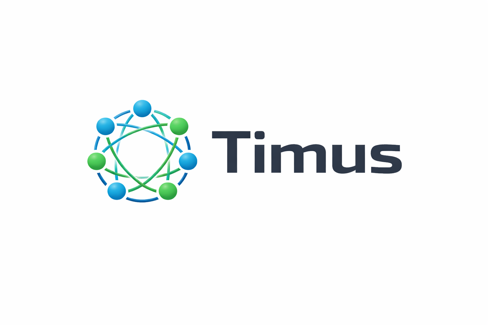

# Timus — Autonomous Multi-Agent Desktop AI

<p align="center">
  
</p>

**Timus** ist ein autonomes Multi-Agenten-System für Desktop-Automatisierung, Web-Recherche, Code-Generierung, Daten-Analyse und kreative Aufgaben. Es koordiniert **13 spezialisierte KI-Agenten** über **80+ Tools** via zentralen MCP-Server — und seit Version 2.5 führt es mehrere Agenten **gleichzeitig parallel** aus.

---

## Evolution von Timus

> *"Was als Browser-Automatisierungs-Skript begann, ist heute ein fast autonomes KI-Betriebssystem."*

Timus wurde über mehr als ein Jahr von einer einzelnen Person entwickelt — ohne formale IT-Ausbildung, mit KI-Modellen als Werkzeug. Die Architektur wuchs organisch aus echten Anforderungen.

### Phase 0 — Anfang: Browser-Workflow (Früh 2025)

Timus war ein einfaches Python-Skript: Screenshot aufnehmen, Koordinaten berechnen, Klick ausführen, wiederholen. Kein Gedächtnis, keine Agenten, keine Planung — nur ein reaktiver Browser-Bot.

```
Screenshot → Vision-Modell → Koordinaten → PyAutoGUI-Klick
```

### Phase 1 — Erster Agent + Werkzeuge

Ein `BaseAgent` entstand mit einem ReAct-Loop (Thought → Action → Observation). Der erste MCP-Server bündelte Browser-, Maus- und OCR-Tools. Aus dem Skript wurde ein Agent.

### Phase 2 — Spezialisierung: 8 → 13 Agenten

Jede Aufgabenkategorie bekam einen eigenen Spezialisten: Research, Reasoning, Creative, Developer, Meta (Orchestrator), Visual, Data, Document, Communication, System, Shell, Image. Jeder Agent sieht nur die für ihn relevanten Tools (`AGENT_CAPABILITY_MAP`).

### Phase 3 — Gedächtnis: Memory v2.1

Timus erinnert sich. Vier-Ebenen-Architektur: SessionMemory (Kurzzeit) + SQLite (Langzeit) + ChromaDB (semantische Vektoren) + MarkdownStore (manuell editierbar). Nemotron entscheidet als Kurator was gespeichert wird. Post-Task-Reflexion speichert Lernmuster.

### Phase 4 — Autonomie: Proaktiver Scheduler + Telegram

Kein Warten mehr auf Eingaben. Heartbeat-Scheduler (15 min), SQLite Task-Queue, Telegram-Gateway (`@agentustimus_bot`), systemd-Dienste für 24/7-Betrieb. Timus arbeitet auch wenn niemand zuschaut.

### Phase 5 — Vision: Florence-2 + Plan-then-Execute

Primäres lokales Vision-Modell (Florence-2, ~3GB VRAM) für UI-Erkennung + PaddleOCR. Decision-LLM (Qwen3.5 Plus) erstellt To-Do-Liste, führt jeden Schritt mit 3 Retries aus. Browser-Automatisierung über SPA-kompatiblen DOM-First Input.

### Phase 6 — Parallele Multi-Agenten-Delegation ← *aktuell, v2.5*

Bisher arbeiteten Agenten sequenziell: Meta wartet auf Research (60s), dann Developer (30s), dann Creative (20s) — **110s gesamt**. Jetzt starten alle gleichzeitig — **60s gesamt** (das längste dauert). Fan-Out / Fan-In als natives Architektur-Muster.

```
VORHER (sequenziell):
Meta → Research (60s) → Developer (30s) → Creative (20s)
Gesamtzeit: 110s

JETZT (parallel):
Meta → Research  ┐
     → Developer ├── gleichzeitig → ResultAggregator → Meta wertet aus
     → Creative  ┘
Gesamtzeit: 60s  (3–6× schneller)
```

---

## Aktueller Stand — Version 2.5 (2026-02-24)

### Parallele Multi-Agenten-Delegation — Fan-Out / Fan-In

Das größte Architektur-Update seit Timus v1.0. Fünf Meilensteine:

| Meilenstein | Inhalt | Tests |
|-------------|--------|-------|
| **M1** | SQLite WAL-Modus (gleichzeitige Reads + ein Writer) + `MemoryAccessGuard` mit `ContextVar` (thread-sicherer Schreibschutz für Worker) + Guard in allen Memory-Schreiboperationen | 15 ✅ |
| **M2** | `delegate_multiple_agents` Tool in `tool_registry_v2` (SYSTEM-Kategorie) — MetaAgent kann es direkt aufrufen | 9 ✅ |
| **M3** | `delegate_parallel()` in `AgentRegistry` — Fan-Out via `asyncio.gather()`, Semaphore für Lastbegrenzung, frische Instanz pro Task (kein Singleton-Problem), Timeout pro Task, Partial-Marker-Erkennung, Canvas-Logging | 19 ✅ |
| **M4** | `ResultAggregator` — Markdown-Formatierung der gebündelten Ergebnisse für den MetaAgent, `inject_into_session()` ohne Timus-inkompatiblen metadata-Parameter | 26 ✅ |
| **M5** | `META_SYSTEM_PROMPT` um parallele Delegation erweitert (wann parallel vs. sequenziell, Format-Beispiel), Integrationstests End-to-End | 18 ✅ |

**87 Tests — alle grün.**

#### Neue/geänderte Dateien

| Datei | Art | Beschreibung |
|-------|-----|--------------|
| `memory/memory_guard.py` | Neu | `MemoryAccessGuard` — `ContextVar`-basierter thread-sicherer Schreibschutz |
| `memory/memory_system.py` | Geändert | WAL-Pragma + `check_write_permission()` in allen Schreibmethoden |
| `tools/delegation_tool/parallel_delegation_tool.py` | Neu | `@tool delegate_multiple_agents` — Fan-Out Tool für MetaAgent |
| `server/mcp_server.py` | Geändert | Neues Tool-Modul eingetragen |
| `agent/agent_registry.py` | Geändert | `delegate_parallel()` Methode — Kern des Fan-Out/Fan-In |
| `agent/result_aggregator.py` | Neu | `ResultAggregator.format_results()` + `inject_into_session()` |
| `agent/prompts.py` | Geändert | `META_SYSTEM_PROMPT` — parallele Delegation Section |
| `tests/test_m1_memory_guard.py` … `test_m5_*` | Neu | 5 Test-Suites, 87 Tests |

#### Technische Details: Warum ContextVar, nicht Klassvariable

Der Grok-Originalplan nutzte `MemoryAccessGuard._read_only_mode` als globale Klassvariable. Das ist **nicht thread-safe**: Worker A setzt `True`, Worker B ist fertig und setzt `False` — Worker A läuft unkontrolliert weiter.

Timus nutzt `ContextVar` aus Python's `contextvars` Modul: jeder `asyncio.Task` hat seinen **eigenen** Wert. Worker A kann `True` haben während Worker B gleichzeitig `False` hat — kein globaler Zustand.

```python
# memory/memory_guard.py
_read_only_ctx: ContextVar[bool] = ContextVar("timus_read_only", default=False)

# Paralleler Worker — nur DIESER Task ist read-only:
MemoryAccessGuard.set_read_only(True)   # Setzt nur für diesen asyncio-Task
await agent.run(task)
MemoryAccessGuard.set_read_only(False)  # Reset — nur für diesen Task

# Hauptprozess sieht immer False — völlig unberührt
```

#### Neue ENV-Variablen (v2.5)

Keine neuen ENV-Variablen nötig — `delegate_parallel()` nutzt die bestehenden Timeouts.
Der `max_parallel`-Parameter (Standard: 5, Max: 10) wird direkt beim Tool-Aufruf gesetzt.

---

## Aktueller Stand — Version 2.4 (2026-02-23)

### Bug-Logging-Infrastruktur + 6 kritische Bug-Fixes

| Bug | Fix |
|-----|-----|
| ResearchAgent Timeout (bis zu 600s) | Fakten-Limit von 10 → 3, `RESEARCH_TIMEOUT=180` |
| CreativeAgent leerer Prompt | Fallback-Prompt wenn GPT leeren String liefert |
| DALL-E falsche API-Parameter (`standard`, `1792x1024`) | Mapping-Tabellen: `standard→medium`, `1792x1024→1536x1024` |
| Phantommethoden (`run_tool`, `communicate`, `final_answer`) | `SYSTEM_ONLY_TOOLS` Blockliste erweitert |
| DeepResearch JSON Parse-Fehler bei Markdown-umhülltem JSON | `extract_json_robust()` an allen 4 Stellen |
| Screenshot ohne Browser | Prompt-Sperre: `take_screenshot` nur bei geöffnetem Browser |

**BugLogger** (`utils/bug_logger.py`): Jeder Fehler hinterlässt maschinenlesbare JSONL-Datei in `logs/bugs/` und menschenlesbaren Eintrag in `logs/buglog.md`. Lazy-Init in `BaseAgent._call_tool()` — kein Overhead bei fehlerfreiem Betrieb.

---

## Aktueller Stand — Version 2.3 (2026-02-23)

### Agenten-Kommunikation Architektur-Überarbeitung (4 Meilensteine)

| Meilenstein | Inhalt |
|-------------|--------|
| **M1** | Alle 13 Agenten im Registry erreichbar (data, document, communication, system, shell ergänzt); Session-ID-Propagation image→research; Typ-Aliases |
| **M2** | Resilience: `asyncio.wait_for`-Timeout (120s via `DELEGATION_TIMEOUT`); Retry mit exponentiellem Backoff (`DELEGATION_MAX_RETRIES`) |
| **M3** | Strukturierte Rückgabe: `delegate()` gibt immer `{"status": "success"|"partial"|"error", ...}`; Partial-Marker erkannt; Image-Agent Partial-Handling |
| **M4** | Meta-Orchestrator: DELEGATION-Sektion im META_SYSTEM_PROMPT; Partial-Result-Warnung; Aliases `koordinator`/`orchestrator` → `meta` |

**41 Tests — alle grün.**

---

## Aktueller Stand — Version 2.2 (2026-02-22)

### Canvas v2 + Terminal-Client + Agenten M1–M5

**5 neue Agenten** (DataAgent, CommunicationAgent, SystemAgent, ShellAgent, ImageAgent) mit Capability-Map-Refactoring — jeder Agent sieht nur seine relevanten Tools.

**Canvas v2:** 13 Agent-LEDs, interaktiver Chat, Datei-Upload, SSE-Echtzeit-Push.

**Terminal-Client** (`timus_terminal.py`): Verbindet sich mit laufendem MCP-Server ohne neue Prozesse zu starten.

**Telegram:** Autonome Task-Ergebnisse automatisch gesendet. Sprachnachrichten via Whisper STT + Inworld.AI TTS.

---

## Aktueller Stand — Version 2.1 (2026-02-21)

### Autonomie-Ausbau + systemd

**AutonomousRunner**, **SQLite Task-Queue**, **Telegram-Gateway** (`@agentustimus_bot`), **SystemMonitor**, **ErrorClassifier**, **ModelFailover**, **systemd-Services** (`timus-mcp.service` + `timus-dispatcher.service`).

Timus läuft als 24/7-Dienst — wacht auf neue Tasks, sendet Ergebnisse via Telegram, überwacht sich selbst.

---

## Aktueller Stand — Version 2.0 (2026-02-20)

### Qwen3.5 Plus + Plan-then-Execute + Florence-2 Vision

**Plan-then-Execute:** `_structure_task()` erstellt To-Do-Liste, `_execute_step_with_retry()` mit 3 Retries pro Schritt.

**Florence-2** (microsoft/Florence-2-large-ft, ~3GB VRAM) als primäres Vision-Modell — UI-Detection + BBoxes + OCR-Hybrid.

**Vision-Kaskade:** Florence-2 lokal → Qwen3.5 Plus (OpenRouter) → GPT-4 Vision → Qwen-VL lokal.

**184 Tests bestanden, 3 übersprungen.**

---

## Architektur

### Übersicht

```
                    ┌──────────────────────────────────────────────────────────────┐
                    │                    TIMUS v2.5                                │
                    │                                                              │
  Telegram ──────→  │  TelegramGateway                                             │
  Webhook  ──────→  │  WebhookServer  → EventRouter                                │
  Heartbeat ─────→  │  ProactiveScheduler (15 min)                                 │
  CLI       ──────→ │  _cli_loop()  (nur mit TTY)                                  │
  Canvas    ──────→ │  /chat  (SSE-Push, 13 Agent-LEDs)                            │
                    │       ↓                                                      │
                    │  AutonomousRunner                                            │
                    │       ↓                                                      │
                    │  SQLite TaskQueue  ←── /task, /remind                        │
                    │       ↓                                                      │
                    │  failover_run_agent()                                        │
                    │       ↓                                                      │
                    │  ┌────────────────────────────────────────────────────────┐  │
                    │  │ AgentRegistry — 13 Agenten                              │  │
                    │  │                                                         │  │
                    │  │  delegate(to_agent, task)          ← sequenziell       │  │
                    │  │  ├─ Timeout (asyncio.wait_for, 120s)                   │  │
                    │  │  ├─ Retry (expon. Backoff)                              │  │
                    │  │  ├─ Partial-Erkennung ("Limit erreicht." → partial)    │  │
                    │  │  └─ Loop-Prevention (Stack, MAX_DEPTH=3)               │  │
                    │  │                                                         │  │
                    │  │  delegate_parallel(tasks, max_parallel=5) ← NEU v2.5  │  │
                    │  │  ├─ asyncio.gather() — Fan-Out                         │  │
                    │  │  ├─ Semaphore (max 10 parallel)                        │  │
                    │  │  ├─ Frische Instanz pro Task (kein Singleton)          │  │
                    │  │  ├─ MemoryAccessGuard (ContextVar, thread-safe)        │  │
                    │  │  ├─ asyncio.wait_for pro Task (timeout konfigurierbar) │  │
                    │  │  └─ ResultAggregator — Fan-In Markdown-Formatierung    │  │
                    │  │                                                         │  │
                    │  │  executor  │ research  │ reasoning │ creative           │  │
                    │  │  developer │ meta      │ visual    │ image              │  │
                    │  │  data      │ document  │ communication                  │  │
                    │  │  system (read-only) │ shell (5-Schicht-Policy)         │  │
                    │  └────────────────────────────────────────────────────────┘  │
                    │       ↓                                                      │
                    │  MCP Server :5000 (FastAPI + JSON-RPC, 80+ Tools)           │
                    │       ↓                          ↓                          │
                    │  Memory v2.1 + WAL          SystemMonitor                   │
                    │  ├─ SessionMemory            → Telegram Alert               │
                    │  ├─ SQLite + WAL-Modus                                      │
                    │  ├─ ChromaDB (agent_id-Isolation)                           │
                    │  ├─ MemoryAccessGuard (ContextVar) — NEU v2.5              │
                    │  ├─ FTS5 Hybrid-Suche                                       │
                    │  ├─ MarkdownStore                                           │
                    │  └─ Nemotron-Kurator (nvidia/nemotron-3-nano-30b-a3b)      │
                    └──────────────────────────────────────────────────────────────┘
```

### Parallele Delegation — Fan-Out / Fan-In (NEU v2.5)

```
MetaAgent ruft delegate_multiple_agents auf:

  tasks = [
    {"task_id": "t1", "agent": "research",  "task": "KI-Trends 2026", "timeout": 120},
    {"task_id": "t2", "agent": "developer", "task": "Skript schreiben"},
    {"task_id": "t3", "agent": "data",      "task": "CSV analysieren"},
  ]

  asyncio.gather() startet alle 3 gleichzeitig:
  ┌──────────────────────────────────────────────────────┐
  │  Task t1: ResearchAgent  (frische Instanz, read-only) │
  │  Task t2: DeveloperAgent (frische Instanz, read-only) │  → parallel
  │  Task t3: DataAgent      (frische Instanz, read-only) │
  └──────────────────────────────────────────────────────┘
          ↓ alle fertig (oder Timeout → partial)
  ResultAggregator.format_results() → Markdown-Block
          ↓
  MetaAgent bekommt alle 3 Ergebnisse gesammelt
```

### Dispatcher-Pipeline

```
Benutzer-Input
      |
      v
main_dispatcher.py
  ├─ Query-Sanitizing
  ├─ Intent-Analyse (Keyword + LLM)
  ├─ Policy-Gate (check_query_policy)
  └─ Lane-/Session-Orchestrierung (lane_manager)
      |
      v
Agent-Auswahl (AGENT_CLASS_MAP — 13 Agenten)
  executor | research | reasoning | creative | developer
  meta | visual | image | data | document | communication | system | shell
      |
      v
agent/base_agent.py
  ├─ Working-Memory-Injektion
  ├─ Recall-Fast-Path (session-aware)
  ├─ Tool-Loop-Guard + Runtime-Telemetrie
  └─ Remote-Tool-Registry-Sync (/get_tool_schemas/openai)
      |
      v
MCP-Server :5000 (FastAPI + JSON-RPC)
  ├─ tool_registry_v2 / Schemas
  ├─ Tool-Validierung (serverseitig)
  └─ 80+ Tools
      |
      +--> VisualNemotron v4 Vision-Pipeline
      |     ├─ Florence-2 (lokal, PRIMARY): UI-Elemente + BBoxes
      |     ├─ Qwen3.5 Plus (OpenRouter, FALLBACK 1): Screenshot-Analyse
      |     ├─ GPT-4 Vision (OpenAI, FALLBACK 2): Legacy
      |     ├─ Qwen-VL (lokal MCP, FALLBACK 3): letzter Ausweg
      |     └─ Plan-then-Execute → PyAutoGUI/MCP
      |
      +--> Browser-Input-Pipeline (hybrid_input_tool)
      |     ├─ DOM-First (Playwright Locator, höchste Zuverlässigkeit)
      |     ├─ activeElement-Check (React/Vue/Angular kompatibel)
      |     └─ VISION_FALLBACK → Legacy fill()
      |
      +--> delegate_parallel() (Fan-Out Engine, NEU v2.5)
      |     ├─ asyncio.gather() → parallele Worker
      |     ├─ asyncio.Semaphore(max_parallel) → Lastbegrenzung
      |     ├─ MemoryAccessGuard (ContextVar) → read-only Worker
      |     └─ ResultAggregator → Fan-In Markdown
      |
      +--> memory/memory_system.py (Memory v2.1 + WAL)
            ├─ WAL-Modus (gleichzeitige Reads + ein Writer)
            ├─ MemoryAccessGuard.check_write_permission() in allen Schreibops
            ├─ SessionMemory + interaction_events
            ├─ unified_recall (episodisch + semantisch)
            ├─ ChromaDB (Embeddings + agent_id-Isolation)
            └─ Nemotron-Kurator (4 Kriterien)
```

---

## Agenten

Timus hat **13 spezialisierte Agenten** — jeder mit eigenem Modell, eigenem Tool-Set und eigenem Prompt.

### Kern-Agenten

| Agent | Modell | Aufgabe | Tools |
|-------|--------|---------|-------|
| **ExecutorAgent** | claude-haiku-4-5 (Anthropic) | Schnelle Tasks, Dateien, Websuche | 60 |
| **DeepResearchAgent** | deepseek-reasoner (DeepSeek) | Tiefenrecherche, These-Antithese-Synthese, Source-Quality-Rating | 48 |
| **ReasoningAgent** | nvidia/nemotron-3-nano-30b-a3b (OpenRouter) | Multi-Step-Analyse, Debugging, Architektur-Entscheidungen | 46 |
| **CreativeAgent** | gpt-5.2 (OpenAI) | Bildgenerierung (DALL-E), kreative Texte — GPT generiert Prompt, DALL-E rendert | 44 |
| **DeveloperAgent** | mercury-coder-small (Inception Labs) | Code-Generierung, Refactoring, AST-Validierung | 39 |
| **MetaAgent** | claude-sonnet-4-5 (Anthropic) | Orchestrator — koordiniert andere Agenten, sequenziell + **parallel (v2.5)** | 68 |
| **VisualAgent** | claude-sonnet-4-5 (Anthropic) | Desktop/Browser-Automatisierung — SoM, Mouse-Feedback, Screen-Change-Gate | 43 |
| **VisualNemotronAgent v4** | Qwen3.5 Plus + Florence-2 + PaddleOCR | Komplexe Desktop-Automatisierung — Plan-then-Execute, 3 Retries | — |

### Neue Agenten (M1–M5)

| Agent | Modell | Aufgabe | Tools |
|-------|--------|---------|-------|
| **DataAgent** *(M1)* | deepseek/deepseek-v3.2 (OpenRouter) | CSV/Excel/JSON Analyse, Statistiken, Diagramme | 42 |
| **CommunicationAgent** *(M2)* | claude-sonnet-4-5 (Anthropic) | E-Mails, Berichte, DOCX/TXT Export | 34 |
| **SystemAgent** *(M3)* | qwen/qwen3.5-plus-02-15 (OpenRouter) | Read-only: Logs, Prozesse, CPU/RAM/Disk, Service-Status | 14 |
| **ShellAgent** *(M4)* | claude-sonnet-4-6 (Anthropic) | Shell-Ausführung mit 5-Schicht-Policy (Blacklist, Whitelist, Timeout, Audit, Dry-Run) | 5 |
| **ImageAgent** *(M5)* | qwen/qwen3.5-plus-02-15 (OpenRouter) | Bild-Analyse — automatisches Routing bei Bild-Dateipfaden, Base64 → Vision | 1 |

---

## Agent-zu-Agent Delegation

### Sequenziell (bestehend)

```python
# MetaAgent → ResearchAgent → Ergebnis
result = await registry.delegate(
    from_agent="meta",
    to_agent="research",
    task="KI-Sicherheit recherchieren"
)
# result = {"status": "success", "agent": "research", "result": "..."}
```

**Features:** Timeout (120s), Retry mit exponentiellem Backoff, Partial-Erkennung, Loop-Prevention (MAX_DEPTH=3), 13 Agenten registriert, Typ-Aliases (`bash`→`shell`, `daten`→`data`, `monitoring`→`system`).

### Parallel — Fan-Out / Fan-In (NEU v2.5)

```python
# MetaAgent startet 3 Agenten gleichzeitig
result = await registry.delegate_parallel(
    tasks=[
        {"task_id": "t1", "agent": "research",  "task": "KI-Trends 2026",   "timeout": 120},
        {"task_id": "t2", "agent": "developer", "task": "Skript schreiben"},
        {"task_id": "t3", "agent": "data",      "task": "CSV analysieren"},
    ],
    max_parallel=3,  # max. gleichzeitig (Semaphore)
)
# result = {
#   "trace_id": "a1b2c3d4e5f6",
#   "total_tasks": 3,
#   "success": 2, "partial": 1, "errors": 0,
#   "results": [...],
#   "summary": "2/3 erfolgreich | 1 partiell | 0 Fehler"
# }

# Fan-In: ResultAggregator formatiert für MetaAgent
formatted = ResultAggregator.format_results(result)
```

**Technische Garantien:**
- **Frische Instanz pro Task** — kein Singleton-Problem, kein Race-Condition
- **ContextVar** — jeder Worker hat eigenen read-only Status, kein globaler Zustand
- **SQLite WAL** — gleichzeitige Reads + ein Writer ohne Locks
- **Timeout pro Task** — langsamer Agent → `status: partial`, kein Systemabsturz
- **Canvas-Logging** — jede parallele Delegation sichtbar im Canvas-UI

---

## Tools (80+ Module)

### Vision und UI-Automation

| Tool | Funktionen |
|------|-----------|
| **ocr_tool** | GPU-beschleunigte OCR mit PaddleOCR |
| **som_tool** | Set-of-Mark UI-Element-Erkennung |
| **florence2_tool** | Florence-2 lokal (PRIMARY) — UI-Detection + BBoxes + OCR-Hybrid |
| **visual_grounding_tool** | Text-Extraktion vom Bildschirm |
| **visual_segmentation_tool** | Screenshot-Erfassung |
| **visual_click_tool** | Präzises Klicken auf UI-Elemente |
| **mouse_tool** | Maus-Steuerung (click, move, type, scroll) |
| **mouse_feedback_tool** | Cursor-Typ-Feedback für Fein-Lokalisierung |
| **screen_change_detector** | Nur bei Bildschirm-Änderungen analysieren |
| **hybrid_detection_tool** | DOM + Vision kombiniert |
| **qwen_vl_tool** | Qwen2-VL (lokal, Fallback) |

### Browser und Navigation

| Tool | Funktionen |
|------|-----------|
| **browser_tool** | `open_url`, `click_by_text`, `get_text`, Session-Isolation, CAPTCHA-Erkennung |
| **hybrid_input_tool** | DOM-First Formular-Eingabe (React/Vue/Angular kompatibel) |
| **browser_controller** | DOM-First Browser-Control mit State-Tracking |
| **smart_navigation_tool** | Webseiten-Analyse |
| **application_launcher** | Desktop-Apps starten |

### Recherche und Information

| Tool | Funktionen |
|------|-----------|
| **search_tool** | Web-Suche via DataForSEO (Google, Bing, DuckDuckGo, Yahoo) |
| **deep_research** | v5.0 — These-Antithese-Synthese, Source Quality Rating |
| **document_parser** | Dokumenten-Analyse und Parsing |
| **summarizer** | Text-Zusammenfassung |
| **fact_corroborator** | Fakten-Verifizierung mit Cross-Checks |

### Planung und Koordination

| Tool | Funktionen |
|------|-----------|
| **delegation_tool** | `delegate_to_agent`, `find_agent_by_capability` — sequenziell |
| **parallel_delegation_tool** | `delegate_multiple_agents` — Fan-Out parallel *(NEU v2.5)* |
| **planner** | Task-Planung, Skill-Listing |
| **skill_manager_tool** | Skill-Verwaltung, Python-Tool-Generierung |

### System und Administration

| Tool | Funktionen |
|------|-----------|
| **system_tool** *(M3)* | `read_log`, `search_log`, `get_processes`, `get_system_stats`, `get_service_status` |
| **shell_tool** *(M4)* | `run_command`, `run_script`, `list_cron`, `add_cron` (dry_run), `read_audit_log` |
| **system_monitor_tool** | CPU/RAM/Disk Auslastung |

### Memory und Wissen

| Tool | Funktionen |
|------|-----------|
| **memory_tool** | `remember`, `recall`, `get_memory_context`, `find_related_memories`, `sync_memory_to_markdown` |
| **curator_tool** | Nemotron-Kurator (nvidia/nemotron-3-nano-30b-a3b) — 4 Kriterien |
| **reflection_tool** | Post-Task Selbst-Reflexion |

---

## Memory-System v2.1 (+ WAL v2.5)

Vier-Ebenen-Architektur:

```
Memory System v2.1
|
+-- SessionMemory (Kurzzeit, RAM)
|   +-- Letzte 20 Nachrichten
|   +-- Aktuelle Entitäten (Pronomen-Auflösung)
|   +-- Current Topic
|
+-- PersistentMemory (Langzeit — SQLite + WAL-Modus)
|   +-- WAL-Pragma (v2.5): gleichzeitige Reads + ein Writer
|   +-- MemoryAccessGuard (v2.5): parallele Worker sind read-only
|   +-- Fakten mit Vertrauenswert und Quelle
|   +-- Konversations-Zusammenfassungen
|   +-- Benutzer-Profile und Präferenzen
|
+-- SemanticMemoryStore (ChromaDB)
|   +-- Embedding-basierte semantische Suche
|   +-- Hybrid-Suche: ChromaDB + FTS5 (Keywords)
|   +-- agent_id-Isolation: recall(agent_filter="shell")
|
+-- MarkdownStore (bidirektionaler Sync)
|   +-- USER.md, SOUL.md, MEMORY.md (manuell editierbar)
|   +-- daily/ — tägliche Logs
|
+-- ReflectionEngine (Post-Task Analyse)
    +-- Pattern-Erkennung (was funktioniert, was nicht)
    +-- Speichert Learnings automatisch
```

---

## Unterstützte LLM-Provider

| Provider | Modelle | Agenten |
|----------|---------|---------|
| **OpenAI** | gpt-5-mini, gpt-5.2 | Executor, Creative |
| **Anthropic** | claude-sonnet-4-5, claude-sonnet-4-6 | Meta, Visual, Document, Communication, Shell |
| **DeepSeek** | deepseek-reasoner | Deep Research |
| **Inception Labs** | mercury-coder-small | Developer |
| **OpenRouter** | qwen/qwen3.5-plus-02-15 | System, Image, Vision-Analyse, Decision-LLM |
| **OpenRouter** | nvidia/nemotron-3-nano-30b-a3b | Reasoning, Memory-Kurator |
| **OpenRouter** | deepseek/deepseek-v3.2 | Data |

Jeder Agent kann via ENV-Variable auf ein anderes Modell/Provider umkonfiguriert werden.

---

## Projektstruktur

```
timus/
├── agent/
│   ├── agents/              # 13 spezialisierte Agenten
│   │   ├── executor.py
│   │   ├── research.py
│   │   ├── reasoning.py
│   │   ├── creative.py
│   │   ├── developer.py
│   │   ├── meta.py
│   │   ├── visual.py
│   │   ├── data.py          # M1: DataAgent
│   │   ├── document.py      # M1: DocumentAgent
│   │   ├── communication.py # M2: CommunicationAgent
│   │   ├── system.py        # M3: SystemAgent (read-only)
│   │   ├── shell.py         # M4: ShellAgent (5-Schicht-Policy)
│   │   └── image.py         # M5: ImageAgent (Vision)
│   ├── agent_registry.py    # delegate() + delegate_parallel() (Fan-Out, NEU v2.5)
│   ├── result_aggregator.py # ResultAggregator Fan-In (NEU v2.5)
│   ├── base_agent.py        # BaseAgent + AGENT_CAPABILITY_MAP + BugLogger
│   ├── providers.py         # LLM Provider-Infrastruktur (7 Provider)
│   ├── prompts.py           # System Prompts — META_SYSTEM_PROMPT mit paralleler Delegation
│   ├── dynamic_tool_mixin.py
│   ├── visual_agent.py
│   ├── developer_agent_v2.py
│   └── visual_nemotron_agent_v4.py
├── tools/
│   ├── delegation_tool/
│   │   ├── tool.py                       # delegate_to_agent (sequenziell)
│   │   └── parallel_delegation_tool.py   # delegate_multiple_agents (NEU v2.5)
│   ├── florence2_tool/      # Florence-2 Vision (PRIMARY)
│   ├── memory_tool/         # Memory v2.1
│   ├── curator_tool/        # Nemotron-Kurator
│   ├── system_tool/         # M3: System-Monitoring
│   ├── shell_tool/          # M4: Shell-Ausführung
│   ├── data_tool/           # M1: CSV/Excel/JSON
│   ├── document_creator/    # M1: DOCX/TXT
│   └── ...                  # 70+ weitere Tools
├── memory/
│   ├── memory_system.py     # Memory v2.1 + WAL-Modus + MemoryAccessGuard-Checks
│   ├── memory_guard.py      # MemoryAccessGuard (ContextVar, thread-safe, NEU v2.5)
│   ├── reflection_engine.py
│   └── markdown_store/      # USER.md, SOUL.md, MEMORY.md
├── orchestration/
│   ├── scheduler.py            # Heartbeat-Scheduler (15 min)
│   ├── autonomous_runner.py    # Scheduler↔Agent Bridge
│   ├── task_queue.py           # SQLite Task-Queue + Prioritäten + Retry
│   ├── canvas_store.py         # Canvas-Logging (auch für parallele Delegation)
│   └── lane_manager.py
├── gateway/
│   ├── telegram_gateway.py     # @agentustimus_bot
│   ├── webhook_gateway.py
│   ├── event_router.py
│   └── system_monitor.py       # CPU/RAM/Disk + Telegram-Alerts
├── server/
│   ├── mcp_server.py        # FastAPI, Port 5000, 80+ Tools, 13 LEDs
│   └── canvas_ui.py         # Canvas Web-UI v2 (Chat, Upload, SSE)
├── utils/
│   ├── bug_logger.py           # BugLogger — JSONL + logs/buglog.md
│   ├── error_classifier.py     # Exception → ErrorType
│   ├── model_failover.py       # Automatischer Agenten-Failover
│   ├── audit_logger.py
│   └── policy_gate.py
├── tests/
│   ├── test_m1_memory_guard.py              # ContextVar + WAL (15 Tests)
│   ├── test_m2_parallel_delegation_tool.py  # Tool-Registrierung (9 Tests)
│   ├── test_m3_delegate_parallel.py         # Fan-Out/Fan-In Engine (19 Tests)
│   ├── test_m4_result_aggregator.py         # ResultAggregator (26 Tests)
│   ├── test_m5_parallel_delegation_integration.py  # Integrationstests (18 Tests)
│   ├── test_delegation_hardening.py
│   ├── test_milestone5_quality_gates.py
│   ├── test_milestone6_e2e_readiness.py
│   └── ...                  # Weitere Test-Suites (184+ Tests gesamt)
├── logs/
│   ├── shell_audit.log      # ShellAgent Audit-Trail
│   └── bugs/                # BugLogger JSONL-Reports
├── docs/                    # Pläne, Runbooks, Session-Logs
├── main_dispatcher.py       # Dispatcher v3.5 (13 Agenten)
├── timus_terminal.py        # Terminal-Client (parallel zu systemd)
├── timus-mcp.service        # systemd Unit
├── timus-dispatcher.service # systemd Unit
└── .env.example             # Alle ENV-Variablen dokumentiert
```

---

## Installation

### Voraussetzungen

- Python 3.11+
- NVIDIA GPU mit CUDA (empfohlen für OCR, Vision Models)
- 16GB+ RAM

### Setup

```bash
git clone https://github.com/fatihaltiok/Agentus-Timus.git
cd Agentus-Timus
pip install -r requirements.txt
cp .env.example .env
# API Keys eintragen
```

### Wichtige ENV-Variablen

```bash
# LLM Provider Keys
OPENAI_API_KEY=sk-...
ANTHROPIC_API_KEY=sk-ant-...
INCEPTION_API_KEY=...
DEEPSEEK_API_KEY=...
OPENROUTER_API_KEY=...

# Web-Suche
DATAFORSEO_USER=...
DATAFORSEO_PASS=...

# Agenten-Timeouts
DELEGATION_TIMEOUT=120          # Sequenzielle Delegation (Sekunden)
DELEGATION_MAX_RETRIES=1        # 1 = kein Retry, 2+ = mit Backoff
RESEARCH_TIMEOUT=180            # ResearchAgent spezifisch

# Vision
FLORENCE2_ENABLED=true
REASONING_MODEL=qwen/qwen3.5-plus-02-15
REASONING_MODEL_PROVIDER=openrouter

# Shell-Agent Sicherheit
SHELL_WHITELIST_MODE=0          # 1 = nur erlaubte Befehle
SHELL_TIMEOUT=30

# Autonomie
HEARTBEAT_ENABLED=true
HEARTBEAT_INTERVAL_MINUTES=15
TELEGRAM_BOT_TOKEN=...
TELEGRAM_ALLOWED_IDS=<deine_id>
```

### Starten

```bash
# Produktionsbetrieb: systemd
sudo systemctl start timus-mcp
sleep 3
sudo systemctl start timus-dispatcher

# Entwicklung: 3 Terminals
./start_timus_three_terminals.sh

# Terminal-Client (zum laufenden Service verbinden)
python timus_terminal.py

# Canvas Web-UI
xdg-open http://localhost:5000/canvas/ui
```

---

## Verwendung

```
Du> Wie spät ist es?                             → ExecutorAgent
Du> Recherchiere KI-Sicherheit 2026              → DeepResearchAgent
Du> asyncio vs threading für 100 API-Calls?      → ReasoningAgent
Du> Male ein Bild vom Frankfurter Römer          → CreativeAgent
Du> Schreibe ein Python-Skript für...            → DeveloperAgent
Du> Erstelle einen Plan für...                   → MetaAgent
Du> Öffne Firefox und navigiere zu...            → VisualAgent
Du> Analysiere diese CSV-Datei                   → DataAgent
Du> Schreibe eine formale E-Mail an...           → CommunicationAgent
Du> Zeige CPU und RAM Auslastung                 → SystemAgent
Du> Liste alle Cron-Jobs auf                     → ShellAgent
Du> Analysiere das hochgeladene Bild: /foto.jpg  → ImageAgent

Du> Recherchiere Thema A, schreibe Code für B und analysiere CSV C gleichzeitig
    → MetaAgent → delegate_multiple_agents([research, developer, data]) → PARALLEL
```

---

## Lizenz und Markenhinweis

- Lizenz: Apache License 2.0 (`LICENSE`)
- Copyright: Fatih Altiok und Contributors
- Der Name "Timus" und Branding-Elemente (Logo) sind nicht durch Apache-2.0 freigegeben

---

## Über den Entwickler

**Fatih Altiok** · Offenbach · Raum Frankfurt

Timus ist ein **Einzelprojekt** — über ein Jahr Entwicklung, ohne formale IT-Ausbildung, mit KI-Modellen als Werkzeug. Was als simpler Browser-Automatisierungs-Bot begann, ist heute ein Multi-Agenten-System mit paralleler Ausführung, persistentem Gedächtnis, Vision-Pipeline, Telegram-Integration und 24/7-Autonomie über systemd.

Die Architektur, die Entscheidungen und die Produktionsreife sind meine eigene Arbeit.

Offen für Freelance-Projekte rund um KI-Automatisierung und LLM-Integration.

📧 fatihaltiok@outlook.com
🔗 [github.com/fatihaltiok](https://github.com/fatihaltiok)
