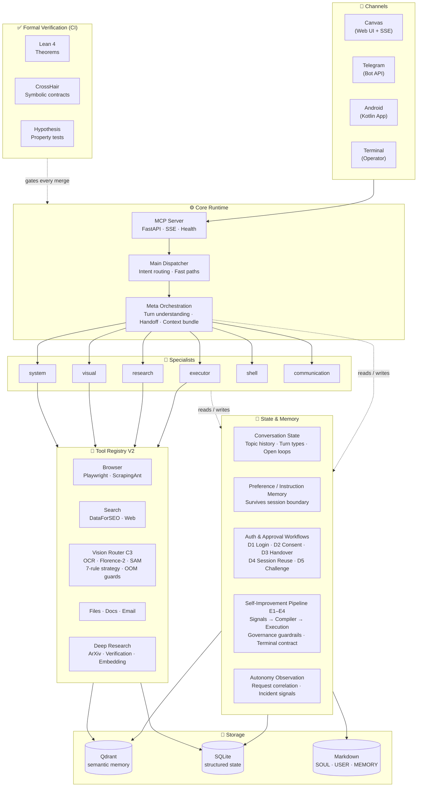

# Timus

<p align="center">
  
</p>

**Self-hosted stateful multi-agent system with a controlled self-improvement loop.**

No SaaS. No cloud dependency. Runs on your machine, remembers context across sessions, routes tasks to specialists, and iteratively improves its own behavior — with formal verification in CI.

---

## Why it's different

Most agent frameworks are stateless request/response wrappers. Timus is a persistent runtime:

- **Stateful conversation** — active topic, open loops, preference memory and historical context survive across sessions and channel switches
- **Specialist orchestration** — Meta layer decomposes intent and hands off to domain specialists (research, visual, executor, shell, communication, ...) with structured context bundles
- **Auth as a state machine** — login, approval, session reuse and challenge handover are first-class workflow states, not loose chat text
- **Controlled self-improvement** — E1–E4 pipeline: signal normalization → weakness-to-task compiler → autonomous execution → terminal contract with governance guardrails
- **Explicit vision routing** — 7-rule strategy router selects OCR\_ONLY / FLORENCE2\_PRIMARY / FLORENCE2\_HYBRID / CPU\_FALLBACK\_ONLY based on VRAM, pixel count and task type; OOM events are caught, logged and recovered without crashing the hot path
- **Formal verification in CI** — Lean 4 theorems + CrossHair symbolic contracts + Hypothesis property tests block every merge

---

## Architecture


```mermaid
flowchart TD
    subgraph CH["📡  Channels"]
        Canvas["Canvas\n(Web UI + SSE)"]
        Telegram["Telegram\n(Bot API)"]
        Android["Android\n(Kotlin App)"]
        Terminal["Terminal\n(Operator)"]
    end

    subgraph CORE["⚙️  Core Runtime"]
        MCP["MCP Server\nFastAPI · SSE · Health"]
        Dispatcher["Main Dispatcher\nIntent routing · Fast paths"]
        Meta["Meta Orchestration\nTurn understanding · Handoff · Context bundle"]
    end

    subgraph SPEC["🤖  Specialists"]
        executor["executor"]
        research["research"]
        visual["visual"]
        system["system"]
        shell["shell"]
        comm["communication"]
    end

    subgraph TOOLS["🔧  Tool Registry V2"]
        Browser["Browser\nPlaywright · ScrapingAnt"]
        Search["Search\nDataForSEO · Web"]
        VisionRouter["Vision Router C3\nOCR · Florence-2 · SAM\n7-rule strategy · OOM guards"]
        Files["Files · Docs · Email"]
        DeepResearch["Deep Research\nArXiv · Verification · Embedding"]
    end

    subgraph STATE["🧠  State & Memory"]
        ConvState["Conversation State\nTopic history · Turn types · Open loops"]
        PrefMem["Preference / Instruction Memory\nSurvives session boundary"]
        AuthFlow["Auth & Approval Workflows\nD1 Login · D2 Consent · D3 Handover\nD4 Session Reuse · D5 Challenge"]
        ImpPipe["Self-Improvement Pipeline E1–E4\nSignals → Compiler → Execution\nGovernance guardrails · Terminal contract"]
        Obs["Autonomy Observation\nRequest correlation · Incident signals"]
    end

    subgraph STORAGE["💾  Storage"]
        Qdrant[("Qdrant\nsemantic memory")]
        SQLite[("SQLite\nstructured state")]
        MarkdownMem[("Markdown\nSOUL · USER · MEMORY")]
    end

    subgraph VERIFY["✅  Formal Verification (CI)"]
        Lean["Lean 4\nTheorems"]
        CrossHair["CrossHair\nSymbolic contracts"]
        Hypothesis["Hypothesis\nProperty tests"]
    end

    CH --> MCP
    MCP --> Dispatcher --> Meta
    Meta --> executor & research & visual & system & shell & comm
    executor & research & visual & system --> TOOLS
    Meta -. "reads / writes" .-> STATE
    SPEC -. "reads / writes" .-> STATE
    STATE --> Qdrant & SQLite & MarkdownMem
    TOOLS --> Qdrant & SQLite
    VERIFY -. "gates every merge" .-> CORE
```

---

## Quick start

### Docker (recommended)

```bash
curl -fsSL https://raw.githubusercontent.com/fatihaltiok/Agentus-Timus/main/install.sh | bash
```

This clones the repo, copies `.env.example` → `.env`, starts Qdrant + Timus via Docker Compose, and prints the health check URL.

Fill in your API keys in `.env`, then restart:

```bash
docker compose restart timus
```

### Manual

```bash
git clone git@github.com:fatihaltiok/Agentus-Timus.git && cd Agentus-Timus
python -m venv .venv && source .venv/bin/activate
pip install -r requirements.txt
cp .env.example .env   # fill in API keys
```

Start services:

```bash
python server/mcp_server.py   # MCP API on :5000
python main_dispatcher.py     # Dispatcher
```

Health check:

```bash
curl -sS http://127.0.0.1:5000/health
```

---

## What's implemented

| Layer | Status | Notes |
|---|---|---|
| Multi-agent routing | live | Meta + 6 specialists + Tool Registry V2 |
| Conversation state | live | topic, open loops, turn types, rehydration |
| Preference / instruction memory | live | thematic, survives session boundary |
| Historical context recall | live | time anchors: `yesterday`, `last week`, `3 months ago` |
| Approval / auth workflows | live | D1–D5 incl. Chrome Credential Broker |
| Improvement pipeline E1–E4 | live | signal → compiler → execution → terminal contract |
| Vision router + OOM guards | live | 7-rule strategy, telemetry ring buffer |
| ScrapingAnt social fetch | live | JS-heavy and paywalled pages |
| Formal verification (CI) | live | Lean 4 + CrossHair + Hypothesis |
| Canvas SSE streaming | live | C4 transport, longrunner status |
| Telegram channel | live | mobile, feedback buttons |
| Android app | partial | Chat + Voice + GPS; operator control in progress |

---

## Tech stack

- **Runtime**: Python 3.11, FastAPI, uvicorn
- **Memory**: Qdrant (semantic), SQLite (structured), Markdown (soul/user)
- **Vision**: Florence-2, EasyOCR, PaddleOCR, SAM segmentation
- **Browser**: Playwright, ScrapingAnt
- **Verification**: Lean 4, CrossHair, Hypothesis
- **Channels**: Canvas (custom web UI), Telegram Bot API, Android (Kotlin)
- **Infra**: systemd services, Docker Compose, GitHub Actions quality gates

---

## Code entry points

1. `server/mcp_server.py` — HTTP API, SSE, health, observation hooks
2. `main_dispatcher.py` — frontdoor routing, fast intent paths
3. `agent/agents/meta.py` + `orchestration/meta_orchestration.py` — turn understanding, handoffs
4. `orchestration/conversation_state.py` — stateful context
5. `orchestration/approval_auth_contract.py` — auth state machine
6. `orchestration/improvement_candidates.py` + `orchestration/improvement_task_execution.py` — E1–E4 pipeline
7. `tools/engines/vision_router.py` — strategy routing

---

## Docs

- [Dev Changelog](docs/CHANGELOG_DEV.md)
- [Architecture Blueprint](docs/TIMUS_ARCHITEKTUR_BLUEPRINT_FUER_FOLGEPROJEKTE_2026-04-11.md)
- [Phase E Plan](docs/PHASE_E_SELF_IMPROVEMENT_PLAN.md)
- [Phase D Plan](docs/PHASE_D_APPROVAL_AUTH_PREP.md)
- [Multi-step Planning](docs/ZWISCHENPROJEKT_ALLGEMEINE_MEHRSCHRITT_PLANUNG_2026-04-12.md)
