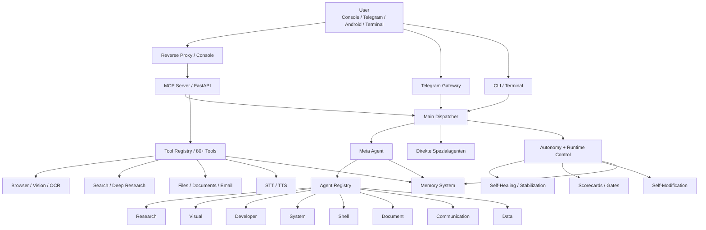

# Timus: Architektur- und Systemdokumentation

Stand: 13.03.2026

## Zweck dieses Dokuments

Dieses Dokument ist die zentrale Beschreibung von Timus als System. Es soll drei Dinge leisten:

1. Timus in wenigen Sätzen beschreibbar machen
2. die technische Architektur verständlich erklären
3. den aktuellen Reifegrad und die wichtigsten Systemgrenzen ehrlich einordnen

## Timus in einem Satz

Timus ist ein selbstgehostetes, autonomes Multi-Agenten-System mit Gedächtnis, Orchestrierung, Browser-/Desktop-Automatisierung, Deep Research, Voice, Self-Healing und kontrollierter Selbstmodifikation.

## Timus in fünf Sätzen

Timus ist kein einzelner Chatbot, sondern ein System aus spezialisierten Agenten, Tools, Speicher- und Autonomie-Schichten. Anfragen kommen über Konsole, Telegram, Browser oder mobile App hinein und werden vom Dispatcher grob eingeordnet. Komplexe Aufgaben gehen an den Meta-Agenten, der Arbeitsschritte plant, Agenten kombiniert und Ergebnisse zusammenführt. Der MCP-Server stellt die Werkzeuge, Statusendpunkte und Echtzeitkanäle bereit; Gedächtnis, Self-Healing, Scorecards, Runtime-Gates und Self-Stabilization halten den Betrieb zusammen. Aktuell ist Timus produktionsnah und deutlich fortgeschritten, aber noch nicht vollständig 24/7-ausgereift.

## Was Timus ist

Timus ist aus Sicht der Architektur am ehesten eine Kombination aus:

- persönlichem Operator
- Multi-Agenten-Orchestrator
- Desktop-/Browser-Automatisierungssystem
- Research- und Dokumentenmaschine
- autonomem Runtime-System mit Governance

Timus ist ausdrücklich mehr als:

- ein einzelner LLM-Chat
- ein Browser-Bot
- ein Research-Skript
- ein Task-Runner ohne Selbstmodell

## Systembild

## Hauptschichten

### 1. Zugangsschicht

Nutzerzugriffe kommen heute über mehrere Kanäle:

- Browser-Konsole auf `console.fatih-altiok.com`
- Telegram
- Terminal/CLI
- Android-App-Prototyp unter `android/`

Diese Ebene ist nicht die Intelligenz, sondern nur der Einstieg.

### 2. MCP- und API-Schicht

Der technische Kern für Werkzeuge und Webzugriff ist:

- [server/mcp_server.py](/home/fatih-ubuntu/dev/timus/server/mcp_server.py)

Der MCP-Server stellt bereit:

- JSON-RPC-Toolzugriff
- `/health`
- `/status/snapshot`
- `/events/stream`
- `/chat`
- `/upload`
- `/voice/*`
- Datei-/Console-Endpunkte

Diese Schicht ist das Werkzeug-Backend für den Rest des Systems.

### 3. Dispatcher-Schicht

Die erste grobe Routing-Entscheidung trifft:

- [main_dispatcher.py](/home/fatih-ubuntu/dev/timus/main_dispatcher.py)

Der Dispatcher ist bewusst nicht der tiefe Orchestrator. Seine Rolle ist:

- Anfrage grob klassifizieren
- klar einfache Fälle direkt routen
- komplexe mehrstufige Fälle an `meta` übergeben
- Handoffs und Runtime-Kontext vorbereiten

### 4. Agentenschicht

Timus arbeitet mit spezialisierten Agenten. Zentral sind:

- `meta`: Orchestrierung, Planung, Delegation
- `research`: Recherche, Synthese, Berichte
- `visual`: Web-/UI-Interaktion
- `developer`: Code und technische Änderungen
- `system`: Diagnose, Logs, Services
- `shell`: Kommandopfad mit Policy
- `document`: PDF, DOCX, XLSX, CSV, TXT
- `communication`: E-Mail, Nachricht, Formulierung
- `data`: Analyse strukturierter Daten

Die Agenten liegen hauptsächlich unter:

- [agent/agents](/home/fatih-ubuntu/dev/timus/agent/agents)

### 5. Toolschicht

Timus hat 80+ Tools, u. a. für:

- Browser und Navigation
- Vision, OCR, Screenshot, Grounding
- Suche, Deep Research, Faktenkorroboration
- Dateien und Dokumente
- Voice
- Memory
- Delegation und Selbstverbesserung

Die Tools liegen unter:

- [tools](/home/fatih-ubuntu/dev/timus/tools)

### 6. Gedächtnisschicht

Timus besitzt ein mehrschichtiges Gedächtnis:

- Session Memory
- SQLite-basiertes Langzeitgedächtnis
- semantischer Store
- Markdown-Wissensspeicher
- Soul-/Persönlichkeitsdaten
- Agent-Blackboard

Hauptpfade:

- [memory/memory_system.py](/home/fatih-ubuntu/dev/timus/memory/memory_system.py)
- [memory/soul_engine.py](/home/fatih-ubuntu/dev/timus/memory/soul_engine.py)
- [memory/agent_blackboard.py](/home/fatih-ubuntu/dev/timus/memory/agent_blackboard.py)

### 7. Autonomie- und Runtime-Schicht

Autonomie lebt vor allem in:

- [orchestration/autonomous_runner.py](/home/fatih-ubuntu/dev/timus/orchestration/autonomous_runner.py)

Wichtige Bausteine:

- Zielgenerierung
- Langzeitplanung
- Replanning
- Self-Healing
- Scorecard-/Gate-Steuerung
- Self-Stabilization
- Feedback- und Outcome-Lernen
- Self-Improvement

### 8. Self-Modification-Schicht

Timus besitzt inzwischen eine echte, kontrollierte Pipeline für Selbstmodifikation:

- Change Policy
- Risk Classifier
- isolierte Patch-Pipeline
- Hard Verification Gate
- Canary + Rollback
- Change Memory
- Autonomous Apply Controller

Wichtige Dateien:

- [orchestration/self_modifier_engine.py](/home/fatih-ubuntu/dev/timus/orchestration/self_modifier_engine.py)
- [orchestration/self_modification_policy.py](/home/fatih-ubuntu/dev/timus/orchestration/self_modification_policy.py)
- [orchestration/self_modification_risk.py](/home/fatih-ubuntu/dev/timus/orchestration/self_modification_risk.py)
- [orchestration/self_modification_patch_pipeline.py](/home/fatih-ubuntu/dev/timus/orchestration/self_modification_patch_pipeline.py)
- [orchestration/self_modification_verification.py](/home/fatih-ubuntu/dev/timus/orchestration/self_modification_verification.py)
- [orchestration/self_modification_canary.py](/home/fatih-ubuntu/dev/timus/orchestration/self_modification_canary.py)
- [orchestration/self_modification_controller.py](/home/fatih-ubuntu/dev/timus/orchestration/self_modification_controller.py)

## Wie ein normaler Task durch Timus läuft

### Standardfall

1. Nutzer stellt eine Anfrage
2. Dispatcher klassifiziert grob
3. einfacher Fall:
   Agent bekommt Aufgabe direkt
4. komplexer Fall:
   `meta` übernimmt
5. `meta` plant Agentenkette und delegiert
6. Spezialagenten nutzen Tools
7. Ergebnisse kommen zurück
8. `meta` bündelt das Ergebnis
9. Status, Memory, Feedback und Runtime-Signale werden aktualisiert

### Komplexer Web-/YouTube-Fall

Beispiel:

`Durchsuche YouTube und hole mir Infos aus einem Video`

Typischer Soll-Ablauf:

1. Dispatcher erkennt: mehrstufige Web-/Content-Aufgabe
2. Übergabe an `meta`
3. `meta` erkennt Rezept wie:
   - `visual_access`
   - `research_synthesis`
   - optional `document_output`
4. `visual` öffnet Seite oder Video und beschafft Kontext
5. `research` extrahiert, vergleicht und verdichtet Inhalt
6. `document` erzeugt optional Bericht/PDF
7. `meta` liefert das Endergebnis

## Meta-Orchestrierung

Der größte neuere Ausbau betrifft `meta`.

Aktuell kann `meta`:

- Fähigkeitsmodell der Agenten verwenden
- strukturierte Handoffs vom Dispatcher übernehmen
- Rezepte und Alternativrezepte nutzen
- Stages nacheinander ausführen
- Recovery-Handoffs einsetzen
- nach Recovery oder schwachen Signalen adaptiv konservativer werden
- Outcomes über Sessions hinweg in die Rezeptwahl einfließen lassen

Wichtige Dokumente dazu:

- [BERICHT_2026-03-12_META_ORCHESTRATION_R1_R2_M6.md](/home/fatih-ubuntu/dev/timus/docs/BERICHT_2026-03-12_META_ORCHESTRATION_R1_R2_M6.md)

Einfach gesagt:

Der Dispatcher ist der Router. `meta` ist der Orchestrator.

## Visual- und Browser-System

Für Browser-/UI-Aufgaben ist Timus nicht mehr nur ein Klick-Agent. Das System besteht aus:

- internem Browserpfad
- Vision/OCR
- Browser-Workflow-Plänen
- State-Evidenz
- Recovery-Strategien
- Site-Profilen für schwierige Klassen

Wichtige Pfade:

- [agent/agents/visual.py](/home/fatih-ubuntu/dev/timus/agent/agents/visual.py)
- [agent/visual_nemotron_agent_v4.py](/home/fatih-ubuntu/dev/timus/agent/visual_nemotron_agent_v4.py)
- [orchestration/browser_workflow_plan.py](/home/fatih-ubuntu/dev/timus/orchestration/browser_workflow_plan.py)
- [orchestration/browser_workflow_eval.py](/home/fatih-ubuntu/dev/timus/orchestration/browser_workflow_eval.py)

Wichtige Aussage:

Timus browsed im Produktivpfad headless. Sichtbare Browserfenster sind bewusst nicht der normale Betriebsmodus.

## Deep Research

Deep Research ist ein eigener Schwerpunkt von Timus. Es ist nicht nur Websuche, sondern eine Research-Engine mit:

- Claim/Evidence/Verdict
- Guardrails
- Konflikt- und Unsicherheitsdarstellung
- mehreren Ausgabeformaten
- PDF-/Dokumenterzeugung

Wichtige Pfade:

- [tools/deep_research](/home/fatih-ubuntu/dev/timus/tools/deep_research)
- [tools/deep_research/tool.py](/home/fatih-ubuntu/dev/timus/tools/deep_research/tool.py)
- [tools/deep_research/pdf_builder.py](/home/fatih-ubuntu/dev/timus/tools/deep_research/pdf_builder.py)

Wichtig:

Der Berichtspfad wurde inzwischen answer-first und lesefreundlicher gebaut, nicht nur evidenzstark.

## Voice

Timus hat Voice auf mehreren Ebenen:

- Web-Konsole
- Android-App-Prototyp
- Serverseitige Voice-Endpunkte

Der Voice-Stack ist funktional vorhanden, aber noch nicht in allen Modi vollständig flüssig. Voice ist aktuell einer der wichtigsten Produktblöcke mit weiterem Reifegradbedarf.

Wichtige Pfade:

- [tools/voice_tool/tool.py](/home/fatih-ubuntu/dev/timus/tools/voice_tool/tool.py)
- [server/canvas_ui.py](/home/fatih-ubuntu/dev/timus/server/canvas_ui.py)
- [android](/home/fatih-ubuntu/dev/timus/android)

## Betrieb und Deployment

Timus läuft typischerweise mit zwei systemd-Diensten:

- `timus-mcp.service`
- `timus-dispatcher.service`

Zusätzlich:

- Reverse Proxy / HTTPS für die Konsole
- SQLite und lokale Datenablagen
- lokale oder externe Modellprovider

Wichtige Dateien:

- [timus-mcp.service](/home/fatih-ubuntu/dev/timus/timus-mcp.service)
- [timus-dispatcher.service](/home/fatih-ubuntu/dev/timus/timus-dispatcher.service)
- [deploy/console/Caddyfile.example](/home/fatih-ubuntu/dev/timus/deploy/console/Caddyfile.example)

## Produktionsreife: ehrliche Einordnung

Timus ist aktuell:

- deutlich fortgeschrittener als ein typisches Hobby-Agentenprojekt
- produktionsnah in Architektur und Governance
- stark in Orchestrierung, Research, Browser-Strategie und Selbstüberwachung

Timus ist aktuell noch nicht:

- vollständig 24/7-ausgereift
- vollständig latenzarm im Voice-Betrieb
- vollkommen selbstständig ohne Aufsicht vertrauenswürdig

Kurz eingeschätzt:

- Orchestrierung: hoch
- Autonomie: mittel bis hoch
- Selbstmodell: mittel bis hoch
- Betriebsreife: mittel
- Mobile/Voice-Polish: mittel

## Was Timus heute besonders macht

Die Besonderheit von Timus ist nicht ein einzelnes Modell, sondern die Kombination aus:

- Multi-Agenten-System
- Rezept-Orchestrierung
- Gedächtnis
- Deep Research
- Self-Healing und Self-Stabilization
- Runtime-Gates
- kontrollierter Self-Modification
- eigener Konsole und Mobile-App

Genau diese Kombination macht Timus zu einem persönlichen, selbstgehosteten Operator-System statt nur zu einem Chatbot.

## Wie du Timus beschreiben kannst

### Kurzbeschreibung

Timus ist ein selbstgehostetes autonomes Multi-Agenten-System, das planen, delegieren, recherchieren, browsen, dokumentieren und sich kontrolliert selbst verbessern kann.

### Technische Beschreibung

Timus besteht aus einem FastAPI/MCP-Kern, einem Dispatcher, einem Meta-Orchestrator, spezialisierten Agenten, einer großen Toolschicht, einem mehrschichtigen Gedächtnis, mehreren Autonomie- und Stabilisierungsmotoren sowie einer kontrollierten Self-Modification-Pipeline.

### Produktbeschreibung

Timus ist dein persönlicher, selbstgehosteter KI-Operator: Er recherchiert, bedient Webseiten, erstellt Dokumente, überwacht seinen eigenen Zustand, lernt aus Outcomes und kann sich innerhalb klarer Governance-Regeln selbst weiterentwickeln.

## Die wichtigsten Dateien für den Einstieg

Wenn man Timus technisch verstehen will, sind das die wichtigsten Einstiegspunkte:

- [README.md](/home/fatih-ubuntu/dev/timus/README.md)
- [main_dispatcher.py](/home/fatih-ubuntu/dev/timus/main_dispatcher.py)
- [server/mcp_server.py](/home/fatih-ubuntu/dev/timus/server/mcp_server.py)
- [agent/agents/meta.py](/home/fatih-ubuntu/dev/timus/agent/agents/meta.py)
- [agent/agents/visual.py](/home/fatih-ubuntu/dev/timus/agent/agents/visual.py)
- [memory/memory_system.py](/home/fatih-ubuntu/dev/timus/memory/memory_system.py)
- [orchestration/autonomous_runner.py](/home/fatih-ubuntu/dev/timus/orchestration/autonomous_runner.py)
- [orchestration/self_modifier_engine.py](/home/fatih-ubuntu/dev/timus/orchestration/self_modifier_engine.py)
- [docs/BERICHT_2026-03-12_META_ORCHESTRATION_R1_R2_M6.md](/home/fatih-ubuntu/dev/timus/docs/BERICHT_2026-03-12_META_ORCHESTRATION_R1_R2_M6.md)
- [docs/BERICHT_2026-03-10_SELF_STABILIZATION_S1_S6.md](/home/fatih-ubuntu/dev/timus/docs/BERICHT_2026-03-10_SELF_STABILIZATION_S1_S6.md)

